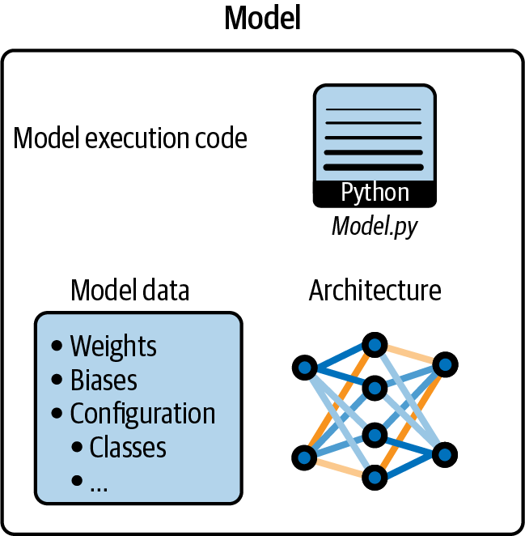
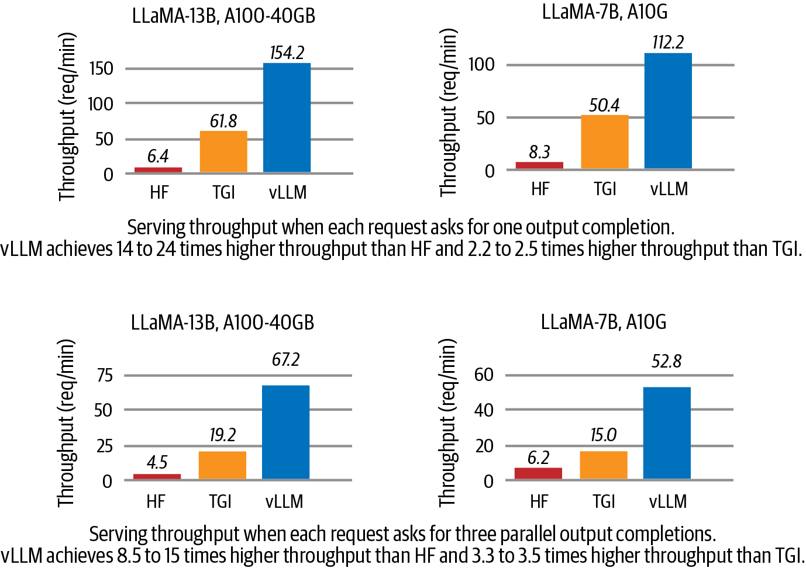
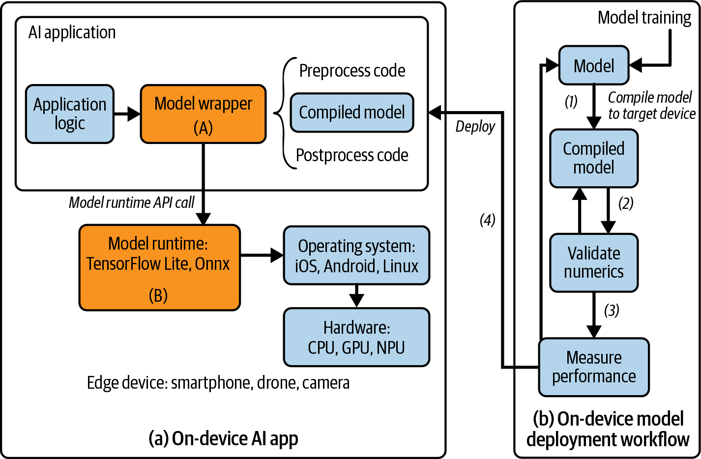
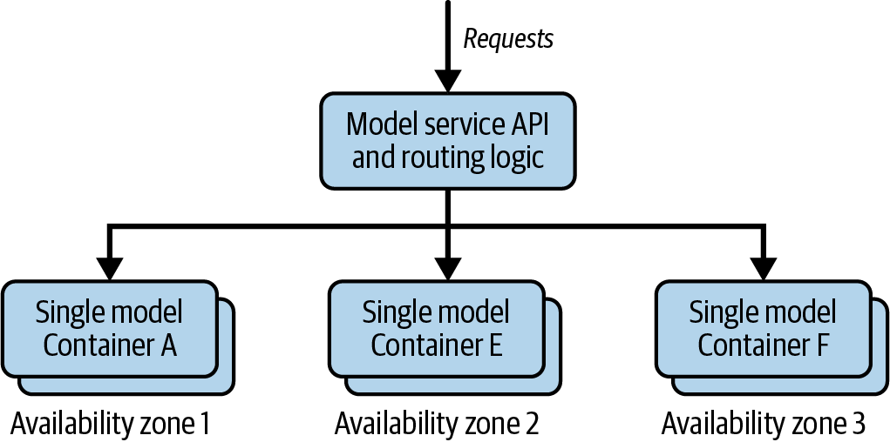
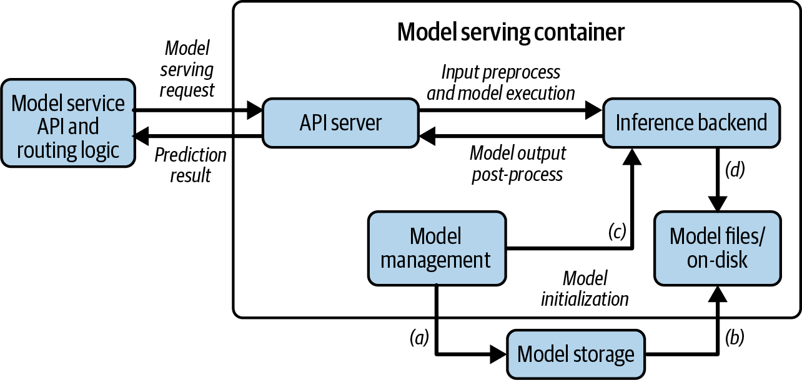
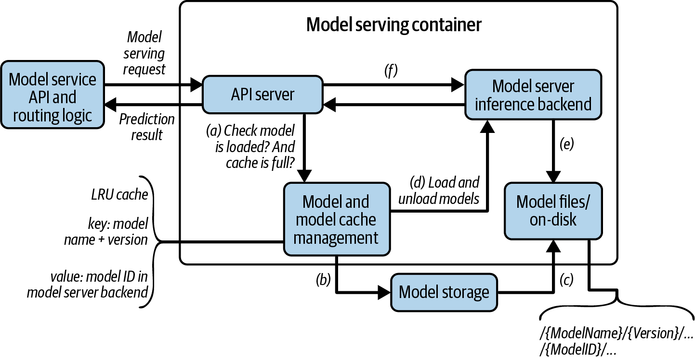
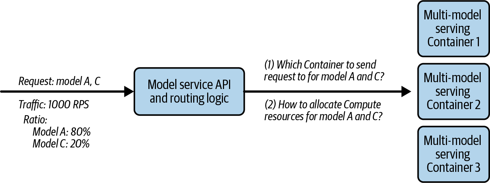
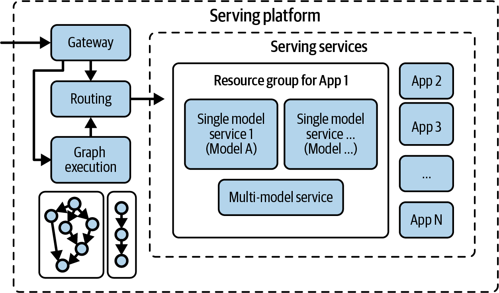

# 模型服务基础认知：从"训练完的模型"到"可用的服务"

本文是「LLM服务和优化：从入门到优化实战」系列的第一篇。作为开篇，本篇建立LLM模型服务的核心认知：模型的"三位一体"工程构成、训练与推理的工程差异、模型服务的七个维度、四种服务范式的演进，以及最关键的命题：为什么LLM优化不是锦上添花，而是生存问题。

---

AI行业有一个有趣的现象：绝大多数讨论都聚焦在模型训练上。收集什么数据、设计什么架构、评测榜单上的名次怎么冲，这些话题吸引了几乎全部注意力。可你想过没有，一个在实验室里拿了SOTA的模型，和它在真实世界里让一万个用户同时使用、每个请求都在几百毫秒内返回结果、每个月还不烧掉太多GPU预算：这之间的鸿沟有多大？

这本书正是为填平这道鸿沟而写的。它讨论的领域叫做**模型服务**（Model Serving）。

不妨把模型服务想象成制造业的供应链。工厂研发出了一款好产品（相当于训练出一个好模型），值得庆祝。但如果物流延迟、仓储混乱、配送成本失控，那款产品就永远到不了消费者手里，或者在送达的路上亏掉了所有利润。AI行业面临完全一样的处境：模型能力越来越强，但**如何高效、可靠、低成本地把模型能力交付给每一个用户**，这个问题的难度被远远低估了。

---

# 一、模型的"解剖"：它不是一个文件，它是一个可执行程序

很多人拿到的模型文件是 `.pt` 或 `.safetensors` 格式的，看起来像是一个静态的数据文件。但这个理解忽略了一个关键事实：**一个能工作的模型，从来不是单一个文件构成的**。一个模型在工程上到底是什么？

从工程角度看，一个模型由三个独立的组成部分拼合而成。

<center>



图1 一个模型由模型架构、模型执行代码和模型数据组成</center>

**模型架构（Model Architecture）**：是一段代码，定义了模型的"骨架"：有哪些层、每层怎么连接、数据按什么路径流转。拿一个简单的图像分类模型来说，它的架构代码大概长这样

```python
class TheModelClass(nn.Module):
    def __init__(self):
        super().__init__()
        self.conv1 = nn.Conv2d(3, 6, 5)
        self.pool = nn.MaxPool2d(2, 2)
        self.conv2 = nn.Conv2d(6, 16, 5)
        self.fc1 = nn.Linear(16 * 5 * 5, 120)
        self.fc2 = nn.Linear(120, 84)
        self.fc3 = nn.Linear(84, 10)
```

这段代码告诉你输入数据要经过卷积 → 池化 → 再卷积 → 三个全连接层，最终变成10个类别的预测分数。**没有这段代码，你拿到一堆权重数字也不知道该把它们填在什么位置。** 想象有人递给你一箱汽车零件，却不给你装配图纸，这就是只有权重文件没有架构代码的处境。

**模型数据（Model Data）**：是训练过程中学到的"知识"：权重（weights）+ 偏置（biases）+ 元数据配置（Config）。训练结束后，这些数据被保存为文件：

```python
torch.save(model.state_dict(), "model_weights.pt")
```

**模型执行代码（Execution Code）**：把前两者结合起来，初始化架构、加载权重，让模型真正跑起来的"启动脚本"：

```python
model = TheModelClass()
model.load_state_dict(torch.load("model_weights.pt", weights_only=True))
model.eval()
pred = model(inputs)
```

三部分合在一起才是一个可工作的模型。**模型本质上是可执行程序**：它有结构逻辑（架构）、有运行时数据（权重）、有执行入口（推理代码）。它不是躺在硬盘上的一堆数字，而是一个按特定方式读取数据、施加变换、产出结果的动态程序。

把架构和数据分开保存，还有一层实战的价值。模型迭代很频繁：有时候多加一层、有时候微调了最后一层，新版本的checkpoint里，有些参数能和旧架构对上（兼容的），有些对不上（nonmatching keys）。PyTorch允许你加载时遇到不匹配的key直接跳过、只加载兼容的部分。这在增量更新模型、对已有模型快速实验新结构时，远比每次全量重训要高效。

---

# 二、从训练到服务：一个完整的生命周期

理解了模型的"解剖结构"后，把它放在AI产品的完整生命周期中去看，才能理解服务到底处于什么位置。

模型从训练到服务的完整路径是：

**数据收集 → 训练/微调 → 评估 → 部署 → 服务（Serving）→ 优化与迭代**

- **数据收集**：从用户行为、传感器、日志等来源获取原始数据并清洗标注。
- **训练与微调**：在大规模语料上预训练基础模型，再在特定领域数据上微调。
- **评估**：用离线Benchmark验证模型是否达到生产标准。
- **部署**：把模型打包为软件制品，做版本管理，集成到系统中。
- **服务**：让模型通过API对外提供实时推理，处理真实用户的请求。
- **优化与迭代**：根据生产环境的反馈持续调优性能，同时反馈数据驱动模型重训，形成闭环。

训练和推理是两个完全不同的约束域。训练时你关心的是收敛速度和最终精度。推理时你关心的是：每个请求的延迟能不能接受？并发能撑到多少？每百万token的成本是多少？这些维度彼此trade-off，没有一个"最优解"。只有适合你业务的平衡点。

训练和服务虽然都涉及运行模型，但核心目标截然不同。把训练框架直接拿来做推理服务，就像用法拉利在田间拉货，不是不能跑，但完全不是为这个设计的。两者的根本差异：

| 维度 | 模型训练 | 模型服务 |
|------|----------|----------|
| 生命周期位置 | 准备模型 | 部署到生产 |
| 目标 | 最小化损失函数，学习参数 | 在新输入上高效生成预测 |
| 计算内容 | 前向+反向传播+梯度更新 | 仅前向传播，无梯度计算 |
| 吞吐/延迟 | 偏好高吞吐，大批量并行 | 追求低延迟，常处理单样本或小批量 |
| 资源需求 | 强大GPU/TPU集群（如Llama3 405B用16384张H100训练） | 优化低延迟执行，可在CPU、边缘设备或专用推理GPU上运行 |

---

# 三、模型服务的七个维度

在工程术语中，模型服务就是在生产环境中部署一个模型，建立必要的软件和硬件基础设施，让它能接收输入、执行推理、返回结果，并且要高效、可扩展、可靠。

服务工程师关注的始终是七个维度。
- **部署**：为模型选择合适的硬件和部署方式。
- **可扩展性与可用性**：从几千到几百万的并发请求，系统要自动扩缩容而不断服。
- **延迟**：实时场景需要在毫秒级完成推理。
- **监控**：追踪模型性能、数据漂移和系统健康。
- **版本管理**：模型更新和回滚不能影响已经连上的客户端。
- **安全**：敏感数据必须保护，访问必须受控。
- **服务成本**（Cost-to-Serve），这也许是所有维度中最有决定性的一项。不管你服务的模型多大、用什么硬件、部署在哪里，最终都要回到一个问题：每个请求的成本是多少？这个数字决定了商业模式能不能成立。

对于大部分深度学习模型（图像分类、推荐系统），服务工程师可以放心地把模型当"黑盒"处理。框架帮你管好了模型加载、推理执行和批处理调度。**但LLM是个例外。LLM的推理特性（自回归生成、KV Cache增长、变长序列）太过独特：所有的服务优化技术都在于克服这些特性带来的瓶颈。不懂LLM的内部机制，你调框架参数就只能是盲人摸象**。这就是后续要深入拆解的问题。

---

# 四、用现成的不就行了？为什么要花时间学到能自己搭建的程度

当有人第一次听说"学模型服务要学到能自己搭建的程度"，反应通常都是"有必要吗"。书里针对三个最常见的疑问做了直接回应。

**"云厂商的托管服务不是已经够用了吗？"**

快速验证想法时确实够了。云厂商帮你管硬件、做弹性伸缩，省心省力。但云厂商设计的是通用方案，AWS SageMaker光是部署选项就有单模型端点、多模型端点、异步推理、批量转换等近十种，每种有不同的定制程度、性能特征和计费方式。不理解这些选项背后的设计原理：单模型和多模型在资源分配上有何本质区别？什么场景异步推理比同步划算，你就会在菜单上随便选一个"看起来最像"的，然后祈祷它是正确答案。即便选对了方案，云厂商的通用配置也需要根据你的流量模式、延迟要求和成本结构来微调，这同样依赖底层原理的理解。

**"OpenAI/DeepSeek的API已经很强了，直接调不就完了？"**

早期用API是最佳路径：省掉所有基础设施的麻烦，专注产品逻辑。但规模上去之后，三个问题会浮出来。成本最先显现：把开源LLM部署在EC2实例上自建，比全托管API便宜30%到60%，预留实例能拿到70%左右的折扣。数据隐私是硬约束：处理医疗数据、金融记录时你很可能根本没有"发到外部API"的选项。微调模型的服务费用更贵：OpenAI在2025年初对微调模型的收费比基础模型高出50%，而微调后的小模型在很多场景下性价比远超通用大模型。从API出发完全没问题，但当业务规模化后，有自己的一套服务方案能带来成本优势、数据控制权和灵活的技术选型空间。

**"自建那么贵，什么时候能收回成本？"**

一家教育创业公司用LLM批改作业，早期调API验证产品，用户从几百涨到几万后API成本吃掉大部分毛利，迁移到开源模型加优化框架后成本大幅下降。一家CRM公司用LLM分析邮件、通话和销售数据生成销售建议：推理量极高、数据又是商业机密，全外包既不安全、成本也无法承受，自建是必需而非选项。这两个场景指向同一个结论：**外包和自建不是开关，是光谱。** 项目早期留在云上，规模大了逐步混合，自建优势够大时再完全迁移。作者在Salesforce、NVIDIA和Microsoft的十多年经验浓缩为一句话：没有永远正确的架构，算法在变、技术在变、成本结构在变，掌握底层原理意味着你能理解创新、评估优劣、做出适合当下的决策，不被任何框架或厂商锁住。

---

# 五、LLM的优化：不是锦上添花，是生存问题

做AI的人习惯盯着训练看：更大的模型、更多的数据、更多的GPU卡。训练完成了，模型上线了，故事似乎结束了。

**但实际花钱的地方，是推理。**

正如Alphabet主席John Hennessy 2023年对路透社讲过的一句话：运行一次LLM请求的成本，大约是传统关键词搜索的 **10 倍**。但在模型的整个生命期中，**推理成本远超训练成本**，例如一个几百万日活的AI产品，推理成本可以轻松占到运营支出的 70% 以上。而在许多团队里，推理基础设施的预算往往只有训练预算的一个零头。

> 训练和推理跑的是"同一个模型"，但它们是**完全不同的工程问题**。用训练框架做推理，相当于让一架满载乘客的客机在跑道上滑行——引擎开着、油烧着，但座位全是空的。

模型服务优化就是应对这个问题的过程：降低延迟、提升吞吐量、最大化资源利用率。

为了让你有更直观的理解，来看vLLM团队在2023年做的一个对比实验：
- Llama-7B跑在A10G上：vLLM的吞吐是Hugging Face Transformers的 8.5 倍。
- Llama-13B跑在A100 上：差距扩大到 15 倍。
- 和Hugging Face的专用推理库TGI比，vLLM仍然快了 3.3-3.5 倍。

<center>



图2 vLLM相比HF实现了8.5-15倍更高吞吐量，相比TGI实现了3.3-3.5倍更高吞吐量</center>

书里还有一个更贴近当下的案例。作者在实验DeepSeek R1模型时，仅做了两件看似微小的事：启用FP8 MLA内核、增大batch size，吞吐量就从38 TPS一路飙到600 TPS，**15倍的跃升**。

这两个例子指向同一个事实：不优化意味着GPU成本可能吃掉所有利润，或者在竞争对手更快更便宜的服务面前失去竞争力。

vLLM启动时那一串配置参数，每一个背后都是一项优化技术：

```bash
python -m vllm.entrypoints.openai.api_server \
    --model openai/gpt-oss-20b \
    --dtype bf16 \
    --gpu-memory-utilization 0.9 \
    --max-num-seqs 16 \
    --max-num-batched-tokens 16384 \
    --tensor-parallel-size 2
```

`gpu-memory-utilization` 限制KV Cache可用显存比例，`max-num-seqs` 控制并发请求数上限，`max-num-batched-tokens` 是Token级的批次总量控制，`tensor-parallel-size` 指定跨GPU的张量并行度。这些参数现在对你还很陌生，没关系。这个系列的文章，本质上就是在逐一拆解它们背后的原理。

---

# 六、四种服务范式：从简单到复杂的进化

模型服务不是"一种模式打天下"。随着业务从零到一再到规模化，服务范式也在逐步演进。这四种范式不是相互排斥的：它们是叠加的关系，每种解决了前一种在特定场景下的短板。

## 6.1 端侧服务：把模型放在用户设备上

这是离用户最近的方式。模型直接运行在手机、无人机、机器人、VR头显甚至智能音箱上。数据从采集到处理始终不离开设备。

端侧服务为什么重要？四件事。
1. **成本**：不需要云服务器，不需要持续支付API调用费。
2. **效率**：本地计算、零网络延迟。
3. **隐私**：帮Apple Watch分析你的心率数据的模型就在手表上运行，生物信息不会上传到任何地方。
4. **个性化**：键盘输入法在你的手机上持续学习你的打字习惯，你的每一次按键不出设备，却能让建议越来越准。

端侧服务依赖两个关键组件。
- 模型运行时（Model Runtime）：模型和硬件之间的中间层，负责把训练好的模型转化为设备硬件能高效执行的格式。主流的运行时包括Google的LiteRT、微软的ONNX Runtime、Apple的Core ML。它们还支持**delegate**机制：把计算密集的部分从CPU卸载到GPU或NPU上执行。
- 模型包装器（Model Wrapper）：应用开发者实现的一层封装，负责把输入数据预处理成模型要求的格式、调用运行时执行推理、再对输出做后处理。

<center>



图3 端侧(a) AI应用设计和(b) 模型部署工作流</center>

把模型部署到端侧的流程是：

`训练好的模型 → 转换为运行时格式（比如PyTorch模型转成LiteRT的.tflite） → 在目标设备上校验数值精度 → 测量性能是否满足业务要求 → 打包到应用安装包中发布`

## 6.2 单模型服务：微服务架构在AI领域的直接应用

一个模型 = 一个独立的Web服务。每个版本的模型有自己专属的Docker容器（或Kubernetes Pod），通过HTTP或gRPC暴露预测API。这就像微服务架构中的每个Service：独立部署、独立扩缩容、独立监控。

<center>



图4 单模型服务架构</center>

每个服务容器内部有三个核心组件。
- **API Server**：负责接收HTTP请求并返回预测结果。
- **Model Management**：负责模型的完整生命周期：从云端存储下载模型包、解压到本地、加载到推理后端、检测新版本并自动更新。
- **Inference Backend**：实际执行模型推理的组件，通常对接vLLM或TensorRT-LLM这类推理框架。

<center>



图5 单模型服务容器设计</center>

容器化是现代模型服务的基础。把模型、依赖库、配置文件全部打包进一个容器中，保证从开发者笔记本到测试环境到生产集群的行为完全一致。Docker是目前最主流的容器方案，本书的所有代码示例也都基于Docker。

单模型服务面对的一个关键问题是**路由**：多个容器实例在前，用户的推理请求怎么被高效地分配？最简单的Round Robin轮询策略有一个致命缺陷：它不感知请求处理时间的差异。一个5000 tokens的长Prompt和一个100 tokens的短请求放在同一个轮询循环里，长请求还没处理完，轮到的短请求只能干等。实际生产环境中需要用更智能的策略：加权轮询（给大服务器更多请求）、最少连接（发给当前负载最轻的实例）、最少响应时间、或者基于实时指标的动态负载均衡（综合CPU、GPU、队列长度来判断）。

流量增长怎么办？两个方向。
- **水平扩展（横向）**：增加服务实例的数量。在Kubernetes上HPA监控CPU、内存、延迟等指标，自动增减Pod数量。
- **垂直扩展（纵向）**：用更强大的GPU，或者用多GPU分布式推理。现代框架像vLLM把分布式推理的复杂性封装得很好，加个`--tensor-parallel-size 4`就能让模型跑在4张GPU上。

一个重要的经验法则：**尽可能在单机多GPU（节点内）搞定，避免跨机器（节点间）推理。** 节点内NVLink的带宽高达900GB/s，而跨节点InfiniBand只有50GB/s。跨节点通信的开销往往抵消掉多GPU并行带来的收益。后续第8篇文章会详细讨论这个topic。

单模型服务是最常用、最可靠的模式。隔离性好（一个模型崩溃不影响其他）、扩缩容简单、部署和调试清晰。但当模型数量爆炸时：比如100个客户各部署了10个微调模型，1000个独立服务，运维噩梦就降临了。很多模型根本没人用，却一直占着GPU。

## 6.3 多模型服务：共享GPU，按需加载

多模型服务的思路直截了当：**多个模型共用一个GPU，谁收到请求就加载谁，没人用的就踢掉。** 它让你用100张GPU服务1000个模型：因为不是所有模型都在同时被使用。

<center>



图6 多模型服务容器设计</center>

和单模型容器对比，多模型容器有两个新组件。
- **模型服务器推理后端**：取代单一框架后端，用一个统一的服务器（如NVIDIA Triton Inference Server）加载和运行不同框架训练的模型（PyTorch、TensorFlow、ONNX、TensorRT）。对外暴露统一的推理API，不管底层是哪个框架。
- **模型缓存管理器**：用LRU（最近最少使用）维护模型缓存。当新请求到达时：模型已在缓存→直接推理；模型不在→下载→加载→推理；缓存已满（比如显存利用率超过80%）→驱逐最久未使用的模型→腾出空间→加载新模型。

多模型服务引入了两个新痛点。
1. 第一个是路由：你不知道哪个容器实例里加载了你需要的模型。如果把请求发到一个"冷"实例（没加载该模型），用户就要承受模型加载的冷启动延迟。解决方案是维护一个`Model ↔ Hosts`映射表，路由时优先选择已加载该模型的实例。
2. 第二个是热点模型的扩缩容：某个模型突然爆火，需要动态增加它的副本数，同时更新路由表让新请求能找到新副本。这有点像装箱问题（bin packing）：如何把新增的模型副本装到最合适的容器中。

<center>



图7 多模型服务中的服务和扩缩容挑战</center>

多模型服务在几种情况下不太适用：模型太大单GPU放不下、某些模型的流量高到需要独立GPU保证延迟、不同模型有不同的安全策略、以及运维复杂度过高（模型缓存的调试、跨框架的依赖管理都很头痛）。单模型和多模型不是互斥的：实际平台中两者根据业务需求混合使用。

## 6.4 模型服务平台：统一管理

当业务规模大到一定程度，简单把单模型和多模型服务拼在一起就不够用了。两个新挑战出现了。

第一个挑战：很多任务现在需要多个模型协作。Apple Siri处理一次语音指令的背后，是语音识别模型→NLP理解模型→推荐模型→TTS合成模型依次接力。这些多模型之间的交互需要被编排成一个推理工作流：用Airflow或Ray这类图执行引擎来定义"先调哪个、后调哪个、哪个步骤的输出是下个步骤的输入"。

第二个挑战：当一个平台上跑着越来越多的AI应用，怎么分配GPU/CPU/内存才能不互相争抢？答案是资源组：把不同应用和业务场景的计算资源隔离开来，每个资源组有独立的配额。

<center>



图8 模型服务平台设计</center>

在生产实际中，一个完整的服务平台还需要安全认证、监控告警、CI/CD集成等外围组件。图1-10只展示了核心的服务概念，让焦点保持在"怎么高效服务模型"这条主线上。

---

# 七、小结

这一章建立了一个核心认知：模型服务关心的是**怎么把已训练好的模型高效、可靠、低成本地交付给真实用户**，它不是训练算法的延伸，而是一个独立的工程领域。

"模型 = 架构代码 + 权重数据 + 执行代码"这个视角，决定了你在部署和优化时的所有决策。训练框架不能替代服务框架，因为两者目标相反：训练求大批量和高吞吐，服务求低延迟和单样本效率。vLLM在同样GPU上跑出HuggingFace 24倍的吞吐量，说明优化程度直接决定了商业模型能否成立。

四种服务范式（端侧、单模型、多模型、平台）是从简单到复杂的演进过程，每种解决特定阶段的问题，生产环境中它们混合使用。技术一直在变，但理解每种范式背后的工程权衡、不被任何特定框架或厂商锁住，这种能力不会过时。

---

**「LLLM服务和优化：从入门到优化实战」系列共 10 篇文章，基于《Hands-On LLM Serving and Optimization》(O'Reilly 2026, Chi Wang & Peiheng Hu)：**

- **【第 1 篇】01-模型服务基础认知：从训练完的模型到可用的服务**
- 【第 2 篇】02-LLM推理的内核与部署：从Token生成机制到vLLM实战
- 【第 3 篇】03-从零搭建LLM推理服务：Batching、Streaming与多模型架构
- 【第 4 篇】04-Agent时代的LLM服务架构：RAG、企业部署与Build-or-Buy
- 【第 5 篇】05-LLM推理瓶颈：GPU内存墙、算术强度与模型加载拆解
- 【第 6 篇】06-推理效率三件套：Continuous Batching、注意力内核优化与Prefix Caching
- 【第 7 篇】07-模型压缩实战：量化、蒸馏与剪枝
- 【第 8 篇】08-进阶优化：Speculative Decoding、多GPU并行与Prefill-Decode分离
- 【第 9 篇】09-四大框架深度对比：vLLM、TensorRT-LLM、SGLang、Llama.cpp
- 【第 10 篇】10-收官：一次完整的优化实战，以及下一站

---

**参考资料**：《Hands-On LLM Serving and Optimization》, Chi Wang & Peiheng Hu, O'Reilly 2026
