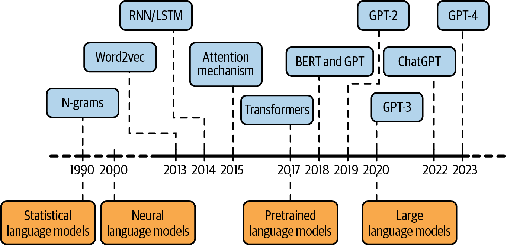
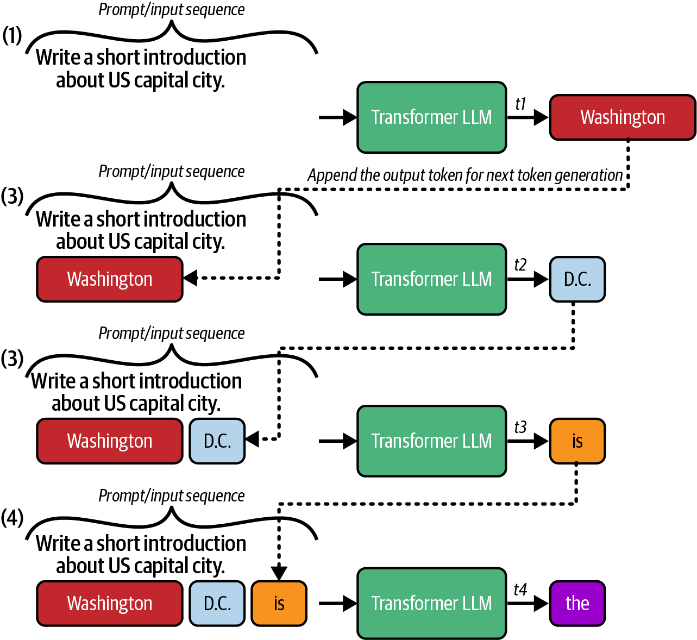
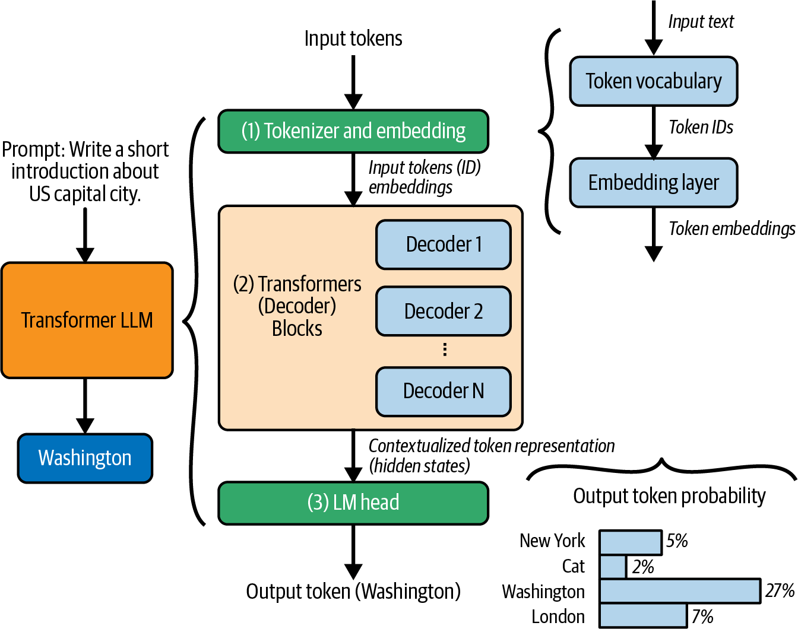
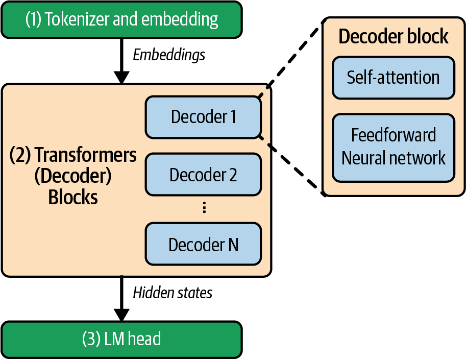
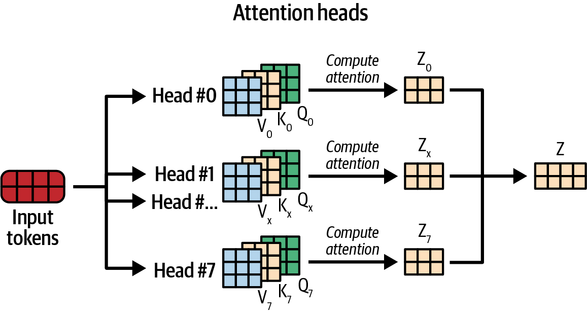
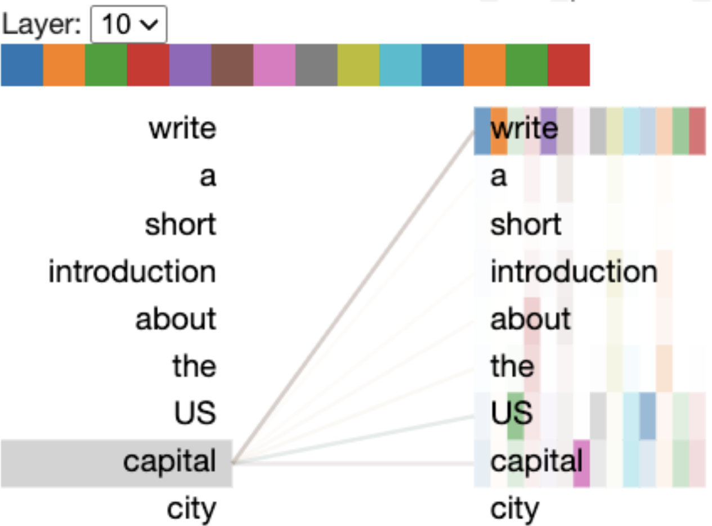
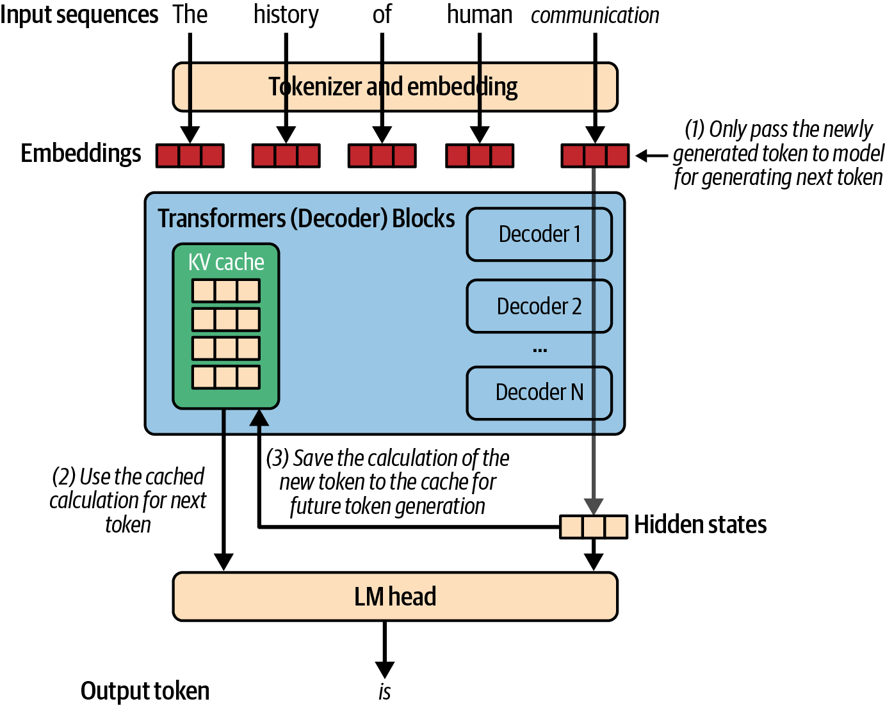
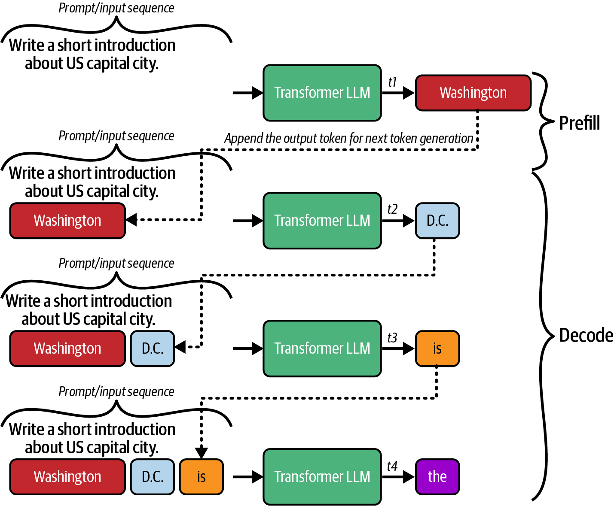
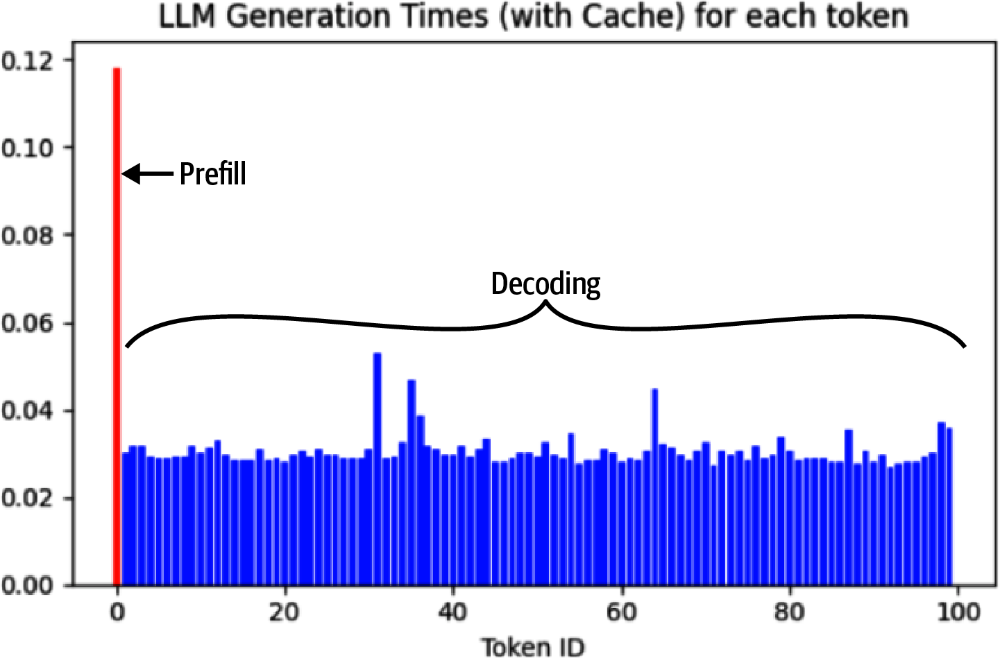
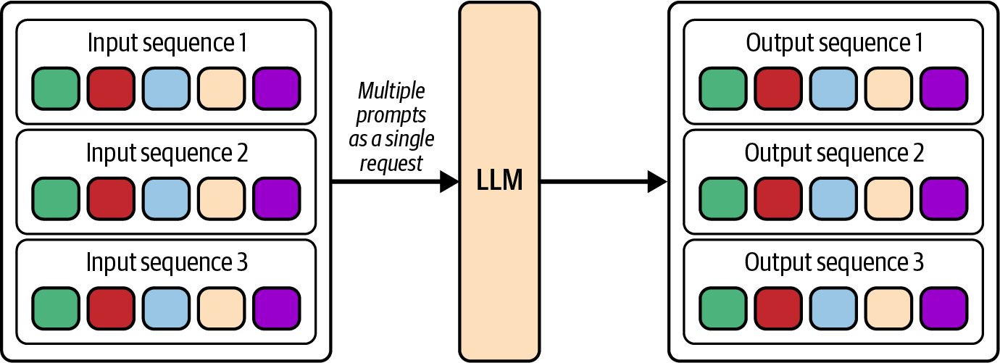

# LLM推理的内核与部署：从Token生成机制到vLLM实战

本文是「LLM服务和优化：从入门到优化实战」系列的第二篇。上一篇建立了模型服务的基础认知，本篇钻进LLM推理内部：从自回归生成机制到KV Cache的显存换时间，从Prefill/Decode两个计算阶段到vLLM相比HF 17倍的实测差距。读完你会理解后续所有优化技术在攻什么瓶颈。

---

上一篇文章我们建立了一个基础认知：模型服务是把训练好的模型高效交付给用户的工程实践，LLM因为推理成本极高，优化不是锦上添花而是生存必需。

要回答这个问题，得先钻进LLM的内部，看清每一次推理到底发生了什么。

---

# 一、从RNN到Transformer：为什么今天的LLM都"长这样"

2017年之前，处理文本的主流方案是RNN和它的变体LSTM、GRU。它们的工作方式很符合直觉：从左到右逐词阅读，每读一个词更新一次"记忆状态"，用累积记忆理解后续内容。

但RNN有一个致命缺陷：**无法并行化**。每个时间步依赖前一步的隐藏状态，你只能一个词接一个词处理，GPU里几千个计算核心大半时间闲着。而且随着文本变长，读到末尾时模型已经"忘记"了开头：长距离依赖的捕捉能力严重退化。

Google在2017年发表的"Attention Is All You Need"论文用Self-Attention机制替代了循环连接。Self-Attention让序列中每个词能直接"看向"任意位置的任何其他词，不需要逐词传递信息。**整个输入序列可以同时处理，高度并行化。**

Transformer随后分化出两条路线。BERT用双向Encoder同时利用上下文两侧信息理解每个词，适合文本分类和实体识别，但不擅长文本生成。GPT用单向Decoder只根据前面的Token预测下一个，这种设计天然适配文本生成，是ChatGPT、Claude、DeepSeek等主流LLM的共同架构。

<center>



图1 语言模型的历史与发展</center>

# 二、走进Transformer：一个token的完整旅程

先看最原始的代码怎么跑LLM，看清每一步的输入输出，再理解框架帮你隐藏了什么。

## 2.1 自回归：一步一步来，急不得

<center>



图2 Transformer模型一次生成一个令牌：输出令牌将被附加到输入序列中，作为生成下一个令牌的提示词</center>

LLM生成文本的方式是自回归的。给定prompt "Write a short introduction about the US capital city"：

- 第 1 步：模型读入整个prompt，预测下一个token → `Washington`
- 第 2 步：把 `Washington` 拼回prompt尾部，变成 "Write...US capital city **Washington**"，再跑一次模型，预测 → `D.C.`
- 第 3 步：拼成 "...Washington **D.C.**"，预测 → `is`
- 第 4 步：拼成 "...D.C. **is**"，预测 → `the`
- ...

一直循环到吐出EOS（终止符）或达到最大长度限制。

这个过程的核心特征是：第 100 步的计算，依赖第 1-99 步产生的所有内容。没有捷径，没有并行。这就是LLM推理慢的根本原因：它天生是序列化的。

## 2.2 三个组件：Tokenizer → Decoder Blocks → LM Head

用Qwen 2.5-0.5B作为教学模型，把Transformer拆成三层：

<center>



图3 仅解码器的Transformer模型架构：模型由一个分词器和嵌入层、一系列Transformer块以及一个LM头组成</center>

第一层：Tokenizer + Embedding。原始文本先被切分成token。举个具体例子："Write a short introduction about the US capital city" 被OpenAI的tokenizer切成 11 个token：`["\"", "Write", "a", "short", "introduction", "about", "US", "capital", "city", "\""]`。注意首尾各有一个引号token，"US" 是一个token而不是两个字母。每个token映射到一个唯一的整数ID（比如 "Write" → ID 10930），然后每个ID通过Embedding层映射成一个高维向量。Qwen 2.5-0.5B的词表有 151,936 个token，隐藏维度是 896。

第二层：Transformer Blocks（Qwen 2.5-0.5B有 24 层）。这是LLM的核心计算所在：

<center>



图4 一个Transformer（解码器）块由一个自注意力层和一个前馈层组成</center>

每一层包含两个子层：

- Self-Attention（自注意力）：计算当前token和序列中所有token的关系，回答"前面哪个词对理解当前词最重要？"
- FFN（前馈网络）：对每个token做逐位置的非线性变换，融入训练时学到的知识

外加LayerNorm做归一化。输出是hidden states，形状为 `[N, d]` 的张量，N = 序列长度，d = 隐藏维度。

第三层：LM Head。把最后一层的hidden state（只取最后一个位置的）映射回词表空间，一个 151,936 维的logits向量。经过softmax得到概率分布，选概率最高的token输出。在Figure 2-3 的例子里，"US capital city" → 概率最高的是 `Washington`，其次是 `London`、`New York`。

## 2.3 注意力机制：Q、K、V到底在做什么

注意力是Transformer的灵魂。用这样一个例子来建立直觉：

> "I saw a dog chasing a squirrel, and **it** climbed up the tree."

**it** 指的是dog还是squirrel？人类需要上下文来判断（大概率是squirrel，因为松鼠会爬树）。注意力机制做的就是类似的事：**让模型在计算一个token时，能"回看"整个序列，给不同位置的token分配不同的关注度**。

技术上，对于序列中每个位置的token，模型计算三个向量：

- **Query（Q）**："我在找什么？" 表示当前token的"搜索意图"
- **Key（K）**："我是什么？" 表示序列中每个token的"标签"
- **Value（V）**："我包含什么？" 表示序列中每个token的"实际信息"

实际模型不是只用一组Q/K/V，而是用**多组并行计算，称为多头注意力**。不同头捕捉不同类型的语言特征：句法结构、位置关系、语义指代。所有头的输出拼接后经过线性层产出最终结果。

<center>



图5 多头自注意力计算的概念图</center>

书里用BertViz库做了一个可视化实验：在Qwen模型第10层的注意力图中，"capital"对"US"和"write"展现了最强的注意力连接，模型在这一层已经建立了"capital指涉的是US的首都，这和'写简介'这个任务有关"的理解。

<center>



图6 Transformer第10层中token “capital”的多头注意力可视化</center>

对于服务工程师来说，不需要深究注意力公式的推导过程。需要记住的核心事实是：**注意力计算在Prefill阶段极其昂贵：每对Token之间都要算，计算量随序列长度的平方增长。** 这直接引出了KV Cache的动机。

---

# 三、KV Cache：用显存换时间

## 3.1 冗余从何而来

回到自回归的过程。当模型在生成第 100 个token时，前 99 个token的Key和Value向量在第 1-99 步早就完整计算过了。但如果你不做任何优化，第 100 步会把前 99 个token的K和V重新计算一遍，算出来的结果和上一轮完全一样。

在短序列（几十个token）时，这点冗余不算什么。但当序列长度是 4096、32768 甚至 128K时，每一步都重算之前所有token的K和V，**计算量以平方级增长，根本无法接受。**

KV Cache的解法很简单：**把每一层、每个token已经算好的K和V存起来，每次只算新token的Q、K、V，新K和V追加到缓存。用显存换计算。**

<center>



图7 使用KV缓存加速LLM生成：仅处理新token，同时重用先前计算的键值对，减少冗余计算</center>

## 3.2 KV Cache到底有多大？

```
KV Cache大小 = 2 × L × H × D × N × precision_bytes
```

- L = 层数
- H = 注意力头数
- D = 每头维度
- N = 当前序列长度
- precision_bytes = 精度（BF16 = 2 字节）

给一个具体例子：以Llama 2-7B（L=32, H=32, D=128, BF16精度）为例，每个token的KV Cache需要：

> 2 × 32 × 32 × 128 × 2 ≈ **0.5 MB**

单看一个token不多，但乘上序列长度和batch size就很吓人了：batch_size=16、序列长度4096时，KV Cache总量约 **32 GB**，而7B模型权重本身才约14 GB。**KV Cache轻松反超模型权重。** 而且随着不断有新请求进入、旧请求完成，KV Cache的内存管理变得极其复杂。如果不精心设计，会出现严重的内存碎片（就像操作系统的内存管理如果没有虚拟内存和分页机制一样）。

**这就是为什么vLLM的PagedAttention如此重要。** 它把KV Cache切分成固定大小的"页"（block），按需分配、按需回收，几乎消除内存碎片。这个我们在第 8 篇讲框架时会详细展开。

---

# 四、Prefill和Decode：一切优化技术的源头

理解了这个区分，你就拿到了理解后续一切优化技术的钥匙。

LLM的单次推理其实由两个性质完全不同的阶段构成。

<center>



图8 LLM文本生成中的Prefill和Decode阶段</center>

**Prefill阶段（提示处理阶段）**。用户首次提交Prompt时，模型对全部输入Token做一次完整前向传播：并行计算N×N的自注意力矩阵、生成第一组KV Cache、预测第一个输出Token。因为一次性处理大量Token，矩阵乘法规模大、GPU计算单元被充分利用。**这个阶段瓶颈在GPU算力（FLOPS）。**

**Decode阶段（逐Token生成阶段）**。Prefill完成后模型拥有KV Cache，进入逐Token循环。每轮只处理一个新Token，利用缓存计算注意力。每次Decode加载全部模型权重（几十GB），但只做极小的矩阵乘法（输入仅一个Token）。算术强度极低。**这个阶段瓶颈在显存带宽（HBM Bandwidth）。**

<center>



图9 Prefill和Decode阶段的Token生成时间（启用KV缓存）</center>

上图直观展示了差异：第一个Token（Prefill）耗时最长，后续所有Token（Decode）时间几乎均等且远低于Prefill。

区分这两个阶段为什么至关重要？因为它们对应完全不同的资源瓶颈和优化方向。处理500页PDF→Prefill瓶颈（输入Token极多）。聊天对话→Decode瓶颈（在几百上千次Token生成中，Prefill只发生一次）。认准你卡在哪个阶段，再选对应的优化手段。

# 五、简单的vLLM调用实践

## 5.1 使用vLLM提供服务

```python
from vllm import LLM, SamplingParams

llm = LLM(model="Qwen/Qwen2.5-0.5B", dtype="float16")
inference_params = SamplingParams(temperature=0.8, top_p=0.95, max_tokens=128)
outputs = llm.generate([prompt], inference_params)
```

`LLM()`加载模型并初始化推理引擎，`generate()`接收Prompt和采样参数，返回生成结果。两行代码就完成了从模型加载到推理的全部过程。

vLLM真正的价值不在于简化的API，而在于它暴露的配置项：几乎每个配置参数背后都是一项优化技术。

```python
model = LLM(
    model="Qwen/Qwen-7B",
    swap_space=16,                    # CPU交换空间(GB)，GPU显存不够时交换到CPU
    max_model_len=4096,               # 最大上下文长度
    block_size=16,                    # PagedAttention的KV Cache块大小
    enable_prefix_caching=True,       # 启用前缀缓存复用
    max_num_sequences=256,            # 最大并发序列数
    enable_chunked_prefill=True,      # 长Prompt分块处理
    enable_cuda_graph=True,           # CUDA图优化，减少kernel launch开销
    worker_use_ray=False,             # 单节点不启用Ray分布式
)

sampling_params = SamplingParams(
    temperature=0.7, top_p=0.9, top_k=50,
    max_tokens=100, stop=["\n", "###"],
    frequency_penalty=0.1, presence_penalty=0.1,
    repetition_penalty=1.1, skip_special_tokens=True,
)
```

`swap_space`控制KV Cache写满时交换到CPU的能力，`block_size`调整PagedAttention的分块粒度，`enable_prefix_caching`决定是否复用历史前缀。这些参数现在对你可能还陌生，它们恰好对应后续要逐一展开的核心优化技术。vLLM遵循OpenAI API的参数命名规范，从OpenAI SDK迁移的学习成本极低。

## 5.2 17倍的差距：vLLM vs HuggingFace实测

同一个Qwen2.5-0.5B模型，同一个Prompt，同一台机器。

```python
# HuggingFace方式
tokenizer = AutoTokenizer.from_pretrained("Qwen/Qwen2.5-0.5B")
model = AutoModelForCausalLM.from_pretrained("Qwen/Qwen2.5-0.5B", device_map="auto")
generator = pipeline('text-generation', model=model, tokenizer=tokenizer)
outputs_basic = generator(prompt, max_length=128, temperature=0.8, top_p=0.95)
```

**HF耗时19.58秒。vLLM耗时1.12秒。单Prompt场景就是17倍差距。**

为什么差这么多？HuggingFace Transformers本质上是训练框架：`pipeline()`和`model.generate()`主要为研究和实验设计，KV Cache管理、内存分配、请求调度几乎没有优化。vLLM从设计之初就把KV Cache视为一等公民：PagedAttention消灭碎片、Continuous Batching动态调度，这才产生了量级差异。而且这还只是单请求，并发增大时差距会进一步拉大。

实践路径很清晰：原型阶段HuggingFace快速迭代，模型效果确认后用vLLM上生产。

vLLM支持两种部署模式。库模式：`llm = LLM(...)`把框架嵌入你的应用进程，适合离线任务和自定义控制。API服务器模式：`vllm serve Qwen/Qwen3-7B-Instruct`启动一个OpenAI兼容的HTTP服务，支持流式和并发，是生产环境的标准姿势。两种模式切换时调用接口一致。

# 六、LLM流式输出服务基础：别让用户盯着空白屏幕

标准的`llm.generate()`等所有Token生成完才返回结果。聊天场景下用户盯着空白屏幕几秒甚至几十秒，体验极差。

流式输出就是每产出一个Token就立即返回。vLLM通过`AsyncLLMEngine`实现：

```python
engine = AsyncLLMEngine.from_engine_args(engine_args)
results_generator = engine.generate(prompt=prompt, sampling_params=params,
                                     request_id=request_id)

async for request_output in results_generator:
    for chunk in request_output.outputs:
        print(chunk.text, end="", flush=True)  # Token逐字出现在屏幕上
```

`AsyncLLMEngine`替代同步的`LLM`，`generate()`返回异步流对象，`async for`逐Token拉取。流式还有一个被低估的价值：**中途取消**。调用`engine.abort(request_id)`直接中断生成。模型开始胡言乱语了、用户已经得到想要的答案了、或者Agent工作流中上游步骤的LLM输出触发了终止条件，省下的是GPU算力和真金白银，而不仅仅是用户体验。

# 七、LLM批处理服务基础：别让GPU只为一个人工作

Decode阶段的根本矛盾是"读全部模型权重→只生成一个Token"。批处理的思路很直接：**一次读权重→给B个请求各生成一个Token。** 算术强度从0.5 FLOPS/B提升到B×0.5 FLOPS/B。

vLLM中批处理就是传一个Prompts列表：

```python
prompts = [
    "What is the meaning of life?",
    "Write a short story about a robot learning to love.",
    "Explain quantum physics in simple terms.",
    "Translate 'Hello, world!' into Spanish."
]
outputs = llm.generate(prompts, sampling_params)
```

书里的实验数据：4个Prompts批处理总共耗时**1.06秒**，逐个处理累计耗时**2.39秒**，约2.2倍吞吐量提升。

<center>



图10 LLM批量推理：并行处理输入序列和生成输出序列</center>

Transformer的矩阵乘法和自注意力天然适合批处理：跨序列可并行计算，模型权重只需读取一次。

但这是"离线批处理"：四个Prompt同时可用。真实的在线服务中，请求随机到达、长度各不相同、完成时间差异巨大。等凑够一批再一起处理，先到的请求可能等很久；同一批里长请求拖慢所有短请求。这就是为什么生产需要**Continuous Batching**：不等、不凑批，一个完成立刻换下一个。Anyscale的一项研究表明，Continuous Batching最高可将吞吐量提升**23倍**，同时显著降低p50延迟。vLLM已内置这项技术，详细调度机制在第6篇展开。

---

# 八、小结

LLM推理有三个核心机制。自回归生成决定了"序列越长、每步越重"的底层行为，这是所有推理开销的源头。KV Cache以显存换时间，实现约3倍加速，代价是显存占用随Token数和并发数增长，压缩和管理Cache是后续优化的主题。Prefill（计算密集）和Decode（内存带宽密集）是两个性质完全不同的工作负载，识别瓶颈在哪个阶段是选对优化策略的首要条件。

理解了内部机制再看vLLM：它把KV Cache管理、批处理调度、流式分发封装为API，同样的硬件上跑出HuggingFace 17倍的性能。流式输出改善TTFT感知并支持中途取消；批处理通过"一次权重读取服务多个请求"提高了Decode的算术强度。

---

**「LLLM服务和优化：从入门到优化实战」系列共 10 篇文章，基于《Hands-On LLM Serving and Optimization》(O'Reilly 2026, Chi Wang & Peiheng Hu)：**

- 【第 1 篇】01-模型服务基础认知：从训练完的模型到可用的服务
- **【第 2 篇】02-LLM推理的内核与部署：从Token生成机制到vLLM实战**
- 【第 3 篇】03-从零搭建LLM推理服务：Batching、Streaming与多模型架构
- 【第 4 篇】04-Agent时代的LLM服务架构：RAG、企业部署与Build-or-Buy
- 【第 5 篇】05-LLM推理瓶颈：GPU内存墙、算术强度与模型加载拆解
- 【第 6 篇】06-推理效率三件套：Continuous Batching、注意力内核优化与Prefix Caching
- 【第 7 篇】07-模型压缩实战：量化、蒸馏与剪枝
- 【第 8 篇】08-进阶优化：Speculative Decoding、多GPU并行与Prefill-Decode分离
- 【第 9 篇】09-四大框架深度对比：vLLM、TensorRT-LLM、SGLang、Llama.cpp
- 【第 10 篇】10-收官：一次完整的优化实战，以及下一站

---

**参考资料**：《Hands-On LLM Serving and Optimization》, Chi Wang & Peiheng Hu, O'Reilly 2026
