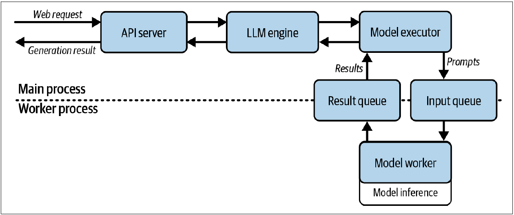
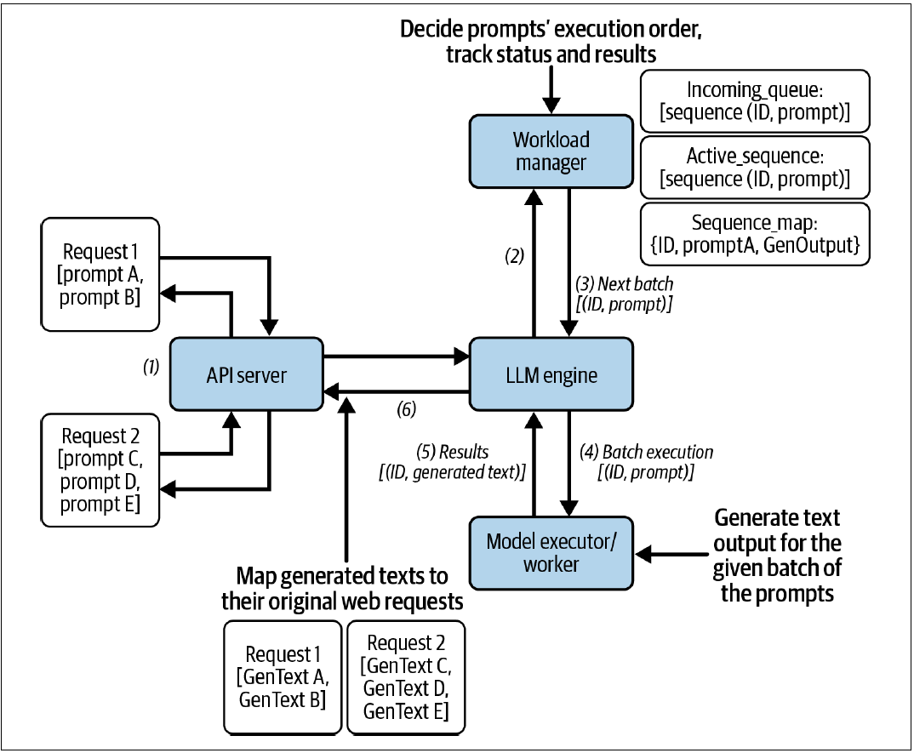
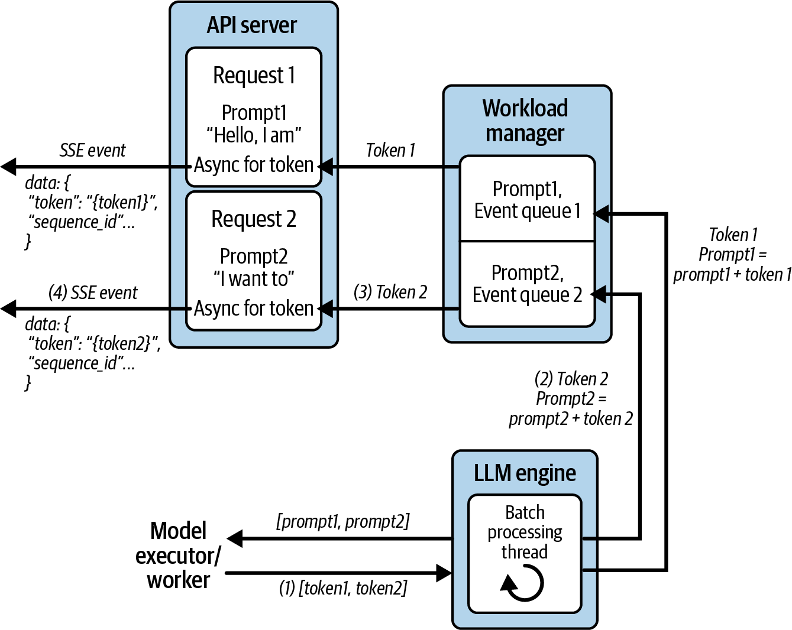
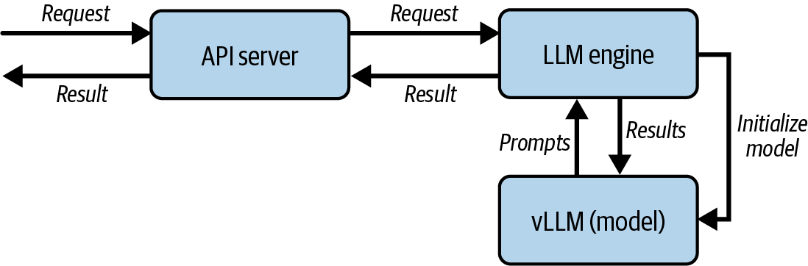
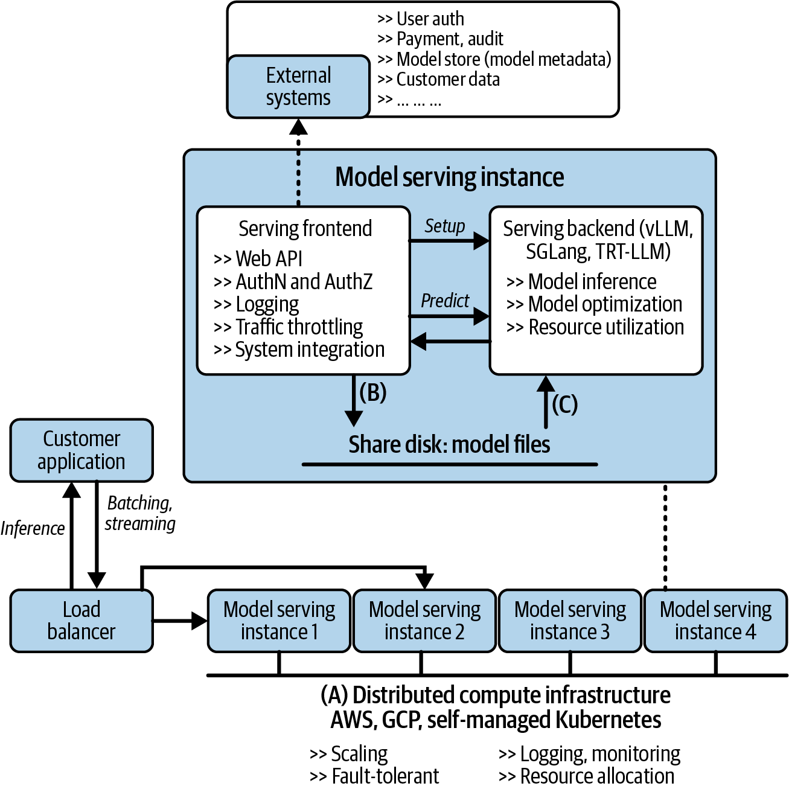
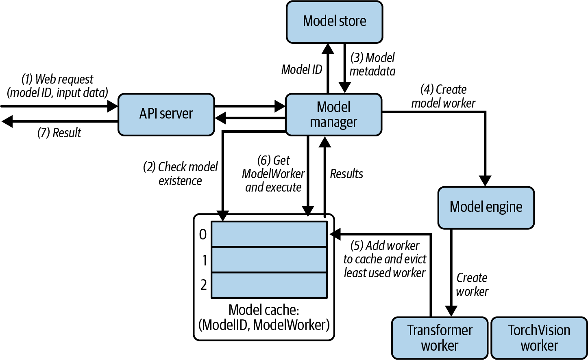
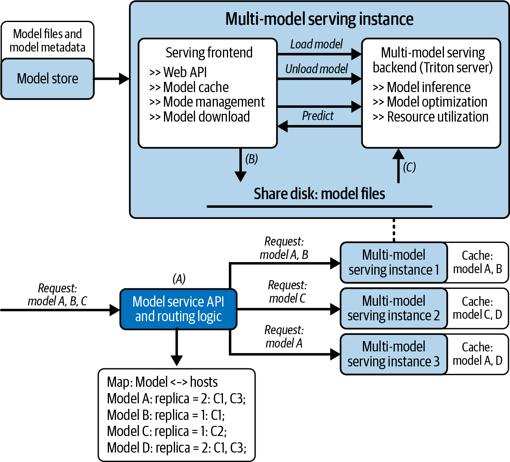
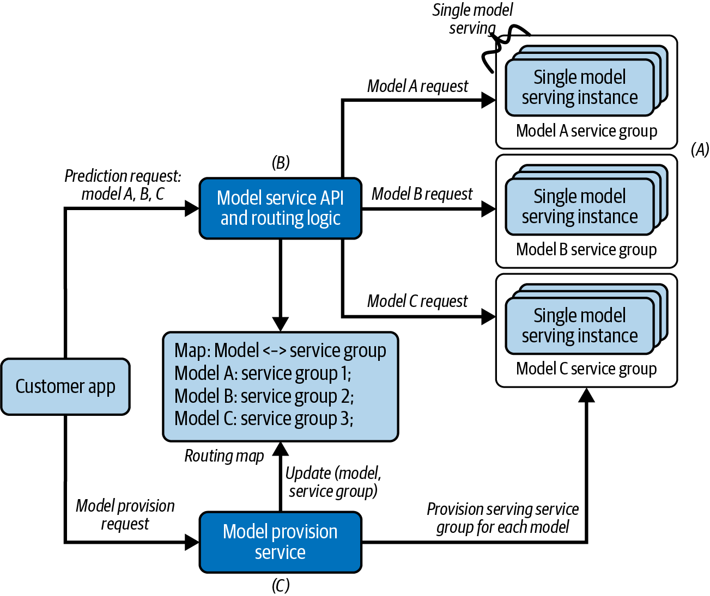
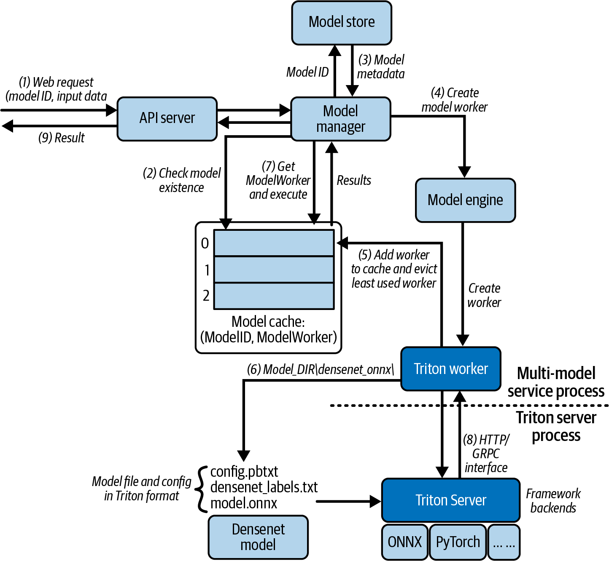

# 从零搭建LLM服务：Batching、Streaming与多模型架构

本文是「LLM服务和优化：从入门到优化实战」系列的第三篇。上一篇看清了GPU内部的推理旅程，本篇将其"包装"成生产可用的在线服务。从最朴素的Python代码出发，发现串行阻塞、无流式输出、单模型绑定三个致命缺陷，逐一引入Dynamic Batching、双循环Streaming和多模型LRU缓存来修复。读完你会理解vLLM每个配置参数背后在调度什么。

---

# 一、先建再买：为什么需要从零写一遍

在搭服务之前，我想先解释一个看起来"反直觉"的选择。

《Hands-On LLM Serving and Optimization》中讲系统设计的那一章，标题是"Model Serving System Design: A Deep Dive"。但它的写法不是你想象中的"架构图 + 框架推荐 + 最佳实践"。它花了整章带你从零写一个在线LLM推理服务：从单请求处理开始，一步一步加上batching、streaming、多模型支持。**每一轮都先让你写出一个可以跑但有缺陷的版本，再让你亲手修好它。**

> "Why knowing how to build helps—even if you won't build."

翻译过来就是：你大概率不会在生产环境里手写batching逻辑。但如果你不理解batching的trade-off，你在vLLM里就不会调 `max_num_seqs` 和 `max_num_batched_tokens`，而这两个参数直接决定你的吞吐和延迟。**每一个框架参数背后，都藏着一个设计决策。你不知道那个决策是什么，就必然要么盲调参数，要么永远只跑默认配置。**

下面我们从头走一遍这个"从零到框架"的旅程。

---

# 二、最朴素的版本：5 行代码，三个致命缺陷

## 2.1 能跑就行

最基础的LLM推理服务，概念层面极其简单。这里先用伪代码把核心流程说清楚：

```python
# 加载模型（冷启动：几十秒到几分钟，取决于模型大小）
model = load_model("Qwen2.5-7B")

# 处理请求
def handle_request(prompt: str) -> str:
    tokens = tokenize(prompt)
    for _ in range(max_new_tokens):
        next_token = model.forward(tokens)  # 一次前向传播
        tokens.append(next_token)
        if next_token == EOS_TOKEN:
            break
    return detokenize(tokens)
```

看起来没什么问题。但把它放到生产环境里，三个缺陷会立刻暴露。

**缺陷一：串行阻塞**

Request A正在decode时，Request B已经在队列里排了半天了。但GPU在decode阶段大部分时间在等数据从HBM搬运，计算资源大量闲置。**GPU完全有闲余去同时处理B，但你的服务设计不允许。**

**缺陷二：没有流式输出**

用户必须盯着空白页面，等整个response生成完毕，才能看到第一个字。在聊天场景下这不可接受，用户会以为系统卡住了。

**缺陷三：一次只能加载一个模型**

真实系统很少有只跑一个模型的。Agent工作流可能需要：一个大模型做规划、一个小模型做意图分类、一个embedding模型做向量检索。单模型架构意味着三套独立服务，管理复杂度和硬件成本翻三倍。

---

# 三、加入Batching：让GPU不再"一个人干活"

## 3.1 Static Batching的困境

传统ML推理的batching做法是：攒够一批请求，一次性送入模型，等全部处理完再全部返回。这对传统模型（固定输入输出长度）工作得很好。

<center>



图1 单个生成请求的模型服务工作流</center>

但LLM的问题是：不同的请求，输出长度完全不同。 有人问"1+1=？"（回复 5 个token），有人问"解释量子力学"（回复 500 个token）。如果static batching，短回复的请求会被长回复的请求拖着，等它全部完成才能一起返回。

## 3.2 Dynamic Batching

请求到了就进来，完了就出去Dynamic Batching的解法：每次模型前向传播后，检查哪些请求已经完成了（吐出EOS或达到max_tokens），**立刻释放它们的槽位，让新请求进来。**

批处理要解决两个问题。

**第一个问题：怎么拼。** 不同用户的请求在不同时间到达、有不同的Prompt长度。每轮推理时，哪些Prompts凑在一起作为一批？在我们的实现中，Workload Manager用FIFO策略，从`incoming_queue`中抽取Prompts填充`active_sequences`，直到达到`batch_size`上限。

这里有一个贯穿整个系统的关键设计：**每个Prompt被封装为一个Sequence对象。** Sequence不只是存一段文本：它有唯一ID、有状态（等待中/处理中/已完成）、有输出缓冲区和事件队列。它把用户层面的"一个请求"和系统层面的"一个执行单元"解耦了开来：请求和Session由API层管理，但在推理引擎内部，系统看到的是独立的Sequence，可以自由重组成最优批次。

**第二个问题：怎么映射回来。** 批量推理产出的是一堆生成文本：怎么确保每个文本回到正确的原始请求？答案就在Sequence的ID。每个生成结果都携带其对应Sequence的ID，LLM Engine用这个ID做映射：Prompt A → GenText A属于Request 1，Prompt C → GenText C属于Request 2。

FIFO只是最简单的方式。它没有考虑请求长度的巨大差异：一个5 Token的短请求早就完成了，却要等同一个批次里500 Token的长请求。这引出了Continuous Batching等更高级的调度策略，我们会在后面的优化文章展开。

<center>



图2 服务设计中批处理的处理方式</center>

核心架构由三个组件构成：

**WorkloadManager**：管理所有活跃请求。维护一个"活跃序列"列表和一个"等待队列"列表。每次调度时，从等待队列里取请求填充到活跃列表的空槽位。

**LLMEngine**：调度循环的核心。一个后台线程不停执行"组装batch → 送给模型 → 收结果 → 更新序列"的循环。

**ModelWorker**：底层模型执行器。封装了对模型框架（PyTorch/HF/vLLM）的调用。

整个调度循环长这样：

```python
class LLMEngine:
    def requests_processing_loop(self):
        while True:
            # 1. 从WorkloadManager拉下一批活跃请求
            active_seqs = self.workload_manager.get_next_batch()
            
            # 2. 组装所有请求的prompt
            prompts = [{'prompt': seq.prompt, 'request_id': seq.id} 
                       for seq in active_seqs]
            
            # 3. 跑一次batch前向传播，每个请求生成一个token
            tokens = self.model_executor.execute_forward_batch(prompts)
            
            # 4. 把token写回各自的序列，完成者移出，新请求补入
            for token_info in tokens:
                seq = self.workload_manager.get_sequence(token_info['request_id'])
                seq.append_token(token_info['token'])
                if token_info['is_finished'] or seq.token_count >= self.max_tokens:
                    self.workload_manager.remove_finished_sequence(seq.id)
```

注意第 3 步：每次循环只生成一个token。这不是低效，恰恰相反，这是LLM推理的精髓。因为decode阶段每一步都要读整个模型权重和KV Cache，模型已经在GPU里了，每步只多做一点点计算，但能同时服务多个请求。这种"每次一个token，但服务整批"的模式，让你更容易理解后面要讲的Continuous Batching为什么有效。

---

# 四、加入Streaming：两个事件循环的精密协作

## 4.1 矛盾在哪？

Dynamic Batching解决了"GPU不空转"的问题。但一个新矛盾出现了：

batch处理是同步的、集中式的：一个后台线程按固定节奏拉batch、跑模型、回写结果。但streaming要求异步的、分布式的：不同请求的token在不同时间点生成，需要立刻推送给各自的客户端，顺序不能乱。

## 4.2 解法：event_queue

<center>



图3 异步词元流式传输工作流</center>

每个请求在创建时被分配一个独立的 `asyncio.Queue`，即一个异步事件队列。架构上形成了两个并行的循环：

**调度循环（后台线程）**：负责batch的组装和模型执行。每生成一个token，通过 `asyncio.run_coroutine_threadsafe()` 把它推到对应请求的event_queue里。

**事件循环（每个请求的异步处理线程）**：负责等待event_queue上的token、封装成SSE格式、推送给客户端。如果收到 `None`，表示该请求已经完成，关闭SSE连接。

代码实现：

```python
# 调度循环中：token生成后推送到请求队列
def requests_processing_loop(self):
    while True:
        active_seqs = self.workload_manager.get_next_batch(is_streaming=True)
        tokens = self.model_executor.execute_forward_batch(prompts)
        
        for token in tokens:
            seq = self.workload_manager.get_sequence(token['request_id'])
            if token['is_finished'] or seq.token_count >= self.max_tokens:
                # 推送终止信号
                asyncio.run_coroutine_threadsafe(
                    seq.client_stream.put(None), seq.loop
                )
                seq.finished = True
                self.workload_manager.remove_finished_sequence(token['request_id'])
            else:
                # 推送新token
                asyncio.run_coroutine_threadsafe(
                    seq.client_stream.put(
                        json.dumps({"token": token['token'], 
                                    "sequence_id": token['request_id']})
                    ), seq.loop
                )
```

```python
# API层：异步事件生成器，把队列内容转成SSE
async def event_generator(self, loop, prompt: str):
    queue = asyncio.Queue()
    seq_id = self.workload_manager.add_streaming_request(prompt, queue, loop)
    
    while True:
        data = await queue.get()  # 等待新token
        if data is None:          # 终止信号
            break
        yield f"data: {data}\n\n"  # SSE格式
```

```python
# FastAPI端点
@app.post("/generate_stream")
async def generate_stream(request: GenerateRequest, llm: LLMEngine = Depends(get_llm)):
    async def event_generator():
        loop = asyncio.get_event_loop()
        async for token in llm.event_generator(loop, request.prompt):
            yield token
    return StreamingResponse(event_generator(), media_type="text/event-stream")
```

这个设计的精巧之处在于：调度循环不知道也不关心HTTP和SSE的细节，它只管往队列里塞token；API层不知道也不关心batch的组装和调度，它只管从队列里取token并转发。**两条线索通过event_queue完全解耦。**

一张自解释的时序图，你可以一步步跟着走。核心思想就是一句话：每个请求都有一条属于它自己的"管道"（event queue），**集中式的batch处理线程往管道里灌水，异步的API线程从管道另一头接水。**

---

# 五、换成vLLM：同样的架构，10 行代码

手写完核心逻辑后，带你用vLLM重写同样的事情：

<center>



图4 使用vLLM架构的单模型LLM服务</center>

```python
class LLMEngine:
    def __init__(self):
        self.vllm_model = VLLM(model="facebook/opt-125m")
    
    def generate_vllm(self, prompts: List[str]) -> List[str]:
        sampling_params = SamplingParams(
            temperature=0.7, top_p=0.95, max_tokens=self.max_tokens
        )
        outputs = self.vllm_model.generate(prompts, sampling_params)
        return [output.outputs[0].text for output in outputs]
```

极简的几行代码，替代了刚才的手写实现。所有batching、scheduling、KV cache management、streaming全被vLLM内部消化了。

这恰恰印证了前面反复强调的观点：你不需要在生产里手写batching，但你需要知道 `max_num_seqs` 是控制并发请求数的（调大了吞吐高但延迟可能上升），`max_num_batched_tokens` 是限制每次batch的token总数的（太小了GPU利用不充分，太大了延迟不可控），`gpu_memory_utilization` 是限制KV Cache和权重可以占用多少显存的（太高可能触发OOM，太低浪费资源）。

**不理解内部机制，这些参数就是天书。**

---

# 六、通用单模型LLM推理架构：三层分离

手写版和vLLM版都跑过后，从这些具体实现中抽象出一个通用架构。这个架构的核心设计原则是：**把变化的东西和不变的东西隔离开。**

<center>



图5 单模型服务的通用设计</center>

**第一层：基础设施管理（Part A）**

进程编排、水平扩缩容、健康检查、资源分配，这些是每个生产级服务都需要的东西，和LLM无关。这一层交给Kubernetes或云平台的Auto Scaling等成熟组件。每个模型服务实例被封装成一个Docker容器或K8s Pod。

**第二层：业务逻辑（Part B）**

鉴权、限流、日志、和客户系统集成、模型配置管理、请求预处理和验证，这些是"你的业务特有的东西"。这一层作为前台组件存在于每个推理服务实例中。

**第三层：推理后端（Part C）**

这是模型实际执行的地方。以独立进程的方式运行，只和业务逻辑层通信。它不关心客户是谁、请求从哪来，只关心**以最高的吞吐和最低的延迟跑模型**。这一层通常由vLLM、SGLang、TensorRT-LLM等框架实现。

三层分离的核心价值在于：当模型架构变化（比如从Llama换到DeepSeek，KV cache的行为完全不同）、当业务需求变化（比如加了新的鉴权方式）、当基础设施升级（比如从自建机房迁到AWS），**任何一层的修改都不需要重写另外两层。**

---

# 七、多模型服务：从"一对一"到"多对多"

单模型服务是基础，但当业务规模变大，你需要同时服务多个模型：不同大小、不同版本的LLM，加上embedding模型、reranker模型、分类模型。每个模型都独立部署一套服务，很快就会撞到运维成本的天花板。

举一个具体场景：假设你运维一个Agent平台，有 100 个客户，每个客户部署 10 个自定义模型。**1000 个独立的模型服务，部署、监控、打补丁、扩缩容的运维负担是灾难级的。** 而且很多模型可能一天只用几次，但GPU一直被占着。

这就是多模型服务的用武之地。

## 7.1 核心机制：模型缓存 + 按需加载

<center>



图6 多模型服务架构</center>

五个核心组件各司其职。**API Server**接收请求，**Model Manager**用LRU策略维护模型缓存，**Model Store**存储模型元数据（框架类型、模型名称、版本），**Model Engine**根据元数据创建对应类型的Worker，**Model Worker**加载模型并执行推理。

多模型服务在一个容器内同时管理多个模型。关键机制是 **LRU模型缓存**：

- 收到对新模型A的预测请求时，Model Management从模型存储中下载、加载A到推理后端
- 如果模型已加载，直接转发请求
- 如果显存/磁盘超过阈值（比如 80%），卸载最久未使用的模型

这个机制让你**不需要所有 1000 个模型同时常驻显存**，只有真正被使用的模型才占据资源。

## 7.2 但多了两个棘手问题

**问题一：冷启动延迟**

请求到达未加载的模型时，需下载模型文件、加载至内存，缓存满时还可能驱逐其他模型，引入数秒至数十秒延迟，降低用户体验。高流量下，大量模型处于冷状态会导致请求超时和下游级联故障。

**问题二：热模型的独立扩缩容。**

不是所有模型的流量都一样。Router维护每个模型的 `replica`（副本数），根据实时流量动态调高或调低。这本质上是一个bin packing问题：在有限的GPU池里，把不同模型的副本分配到不同容器上，最大化资源利用率。

## 7.3 设计选择：成本vs. 延迟

多模型服务的设计分成两种策略：

**成本优先型**：所有模型共享GPU池，按需加载/卸载。配置简单，GPU利用率高。但用户可能遇到冷启动延迟：一个几周没用过的模型，被请求时需要从磁盘重新加载到GPU（几十秒到几分钟）。

<center>



图7 针对成本效率优化的多模型服务设计</center>

**延迟优先型**：高频模型常驻专用GPU，低频模型走共享池。用户永远碰不到冷启动，但需要更多GPU，成本更高。

<center>



图8 针对延迟优化的多模型服务设计</center>

没有哪个是"对"的，取决于你的业务是更关心每token成本还是用户体验延迟。

## 7.4 生产方案：NVIDIA Triton Inference Server

NVIDIA Triton是多模型服务的生产级方案。它原生支持统一仓库管理不同框架（TensorFlow、PyTorch、ONNX等）的模型，提供统一的HTTP/gRPC预测API，并集成Dynamic Batching、多模型并发管理、模型仓库与版本管理等功能。

<center>



图9 将Triton作为服务后端集成到多模型服务中</center>

在实践中，团队通常在每个容器内部署一个Triton实例，再由上层的模型缓存管理组件（自研或云厂商的）来调度加载和卸载。

---

# 八、小结：一个推理服务 = 三个问题的解法

从零搭建一个LLM推理服务，本质上是在解决三个问题：

**1. 怎么让GPU不空转？**

→ Batching。从Static Batching → Dynamic Batching **→** Continuous Batching（第 5 篇会详细展开）。每一步都在更细粒度地利用GPU的闲置周期。

**2. 怎么在批处理下保持流式输出的实时性？**

→ 双循环架构。调度循环管batch和模型执行，事件循环管SSE推送。两者通过每个请求独立的event_queue解耦。

**3. 怎么支持多模型而不指数级增加成本？**

→ LRU模型缓存 + Route Map路由。成本优先（共享池，有冷启动）和延迟优先（常驻专用GPU，成本高）是两种合理的取舍。

下一篇文章，我们将跳出"纯推理引擎"的视角，看看LLM推理服务在企业级系统中如何和Agent、RAG、CAG深度耦合，以及Build vs. Buy的根本性决策。

---

**「LLLM服务和优化：从入门到优化实战」系列共 10 篇文章，基于《Hands-On LLM Serving and Optimization》(O'Reilly 2026, Chi Wang & Peiheng Hu)：**

- 【第 1 篇】01-模型服务基础认知：从训练完的模型到可用的服务
- 【第 2 篇】02-LLM推理的内核与部署：从Token生成机制到vLLM实战
- **【第 3 篇】03-从零搭建LLM推理服务：Batching、Streaming与多模型架构**
- 【第 4 篇】04-Agent时代的LLM服务架构：RAG、企业部署与Build-or-Buy
- 【第 5 篇】05-LLM推理瓶颈：GPU内存墙、算术强度与模型加载拆解
- 【第 6 篇】06-推理效率三件套：Continuous Batching、注意力内核优化与Prefix Caching
- 【第 7 篇】07-模型压缩实战：量化、蒸馏与剪枝
- 【第 8 篇】08-进阶优化：Speculative Decoding、多GPU并行与Prefill-Decode分离
- 【第 9 篇】09-四大框架深度对比：vLLM、TensorRT-LLM、SGLang、Llama.cpp
- 【第 10 篇】10-收官：一次完整的优化实战，以及下一站

---

**参考资料**：《Hands-On LLM Serving and Optimization》, Chi Wang & Peiheng Hu, O'Reilly 2026
