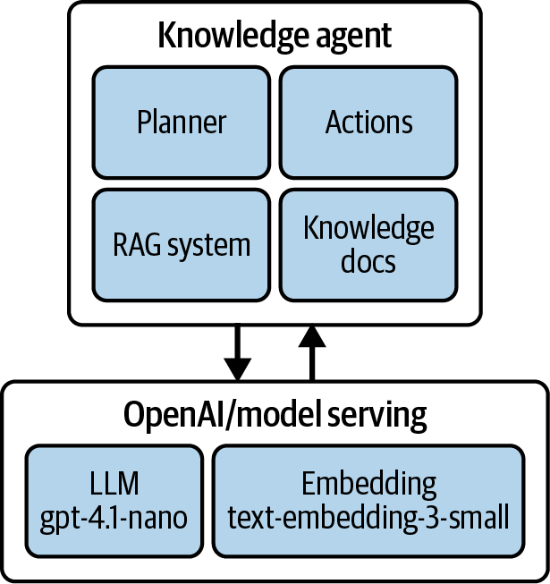
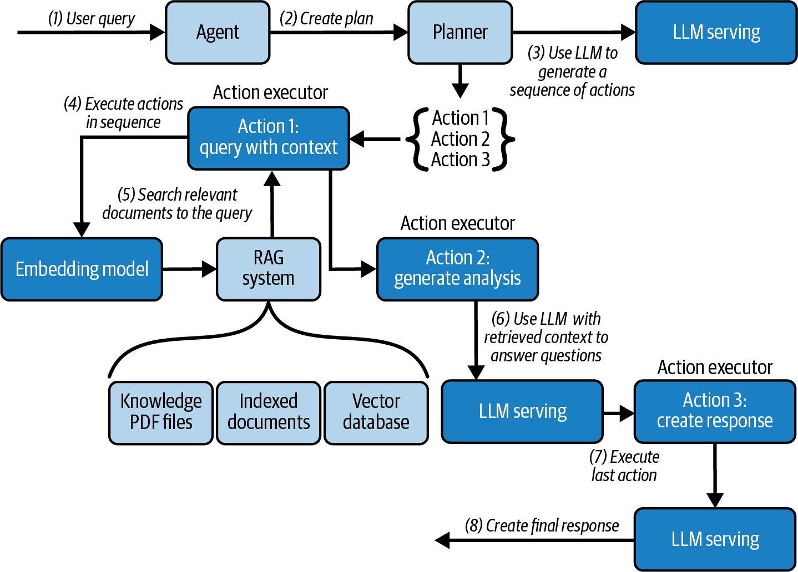
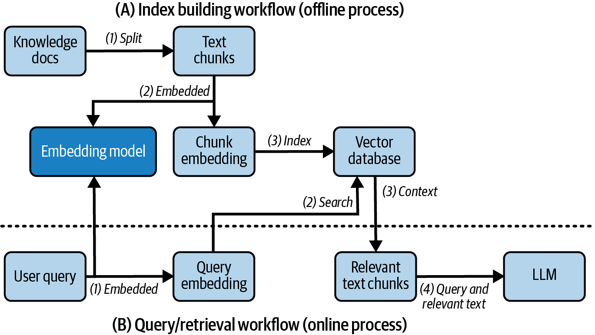
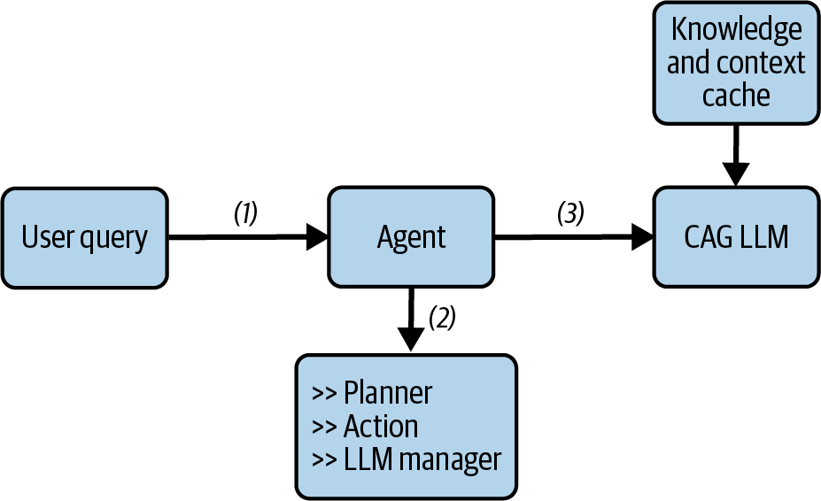
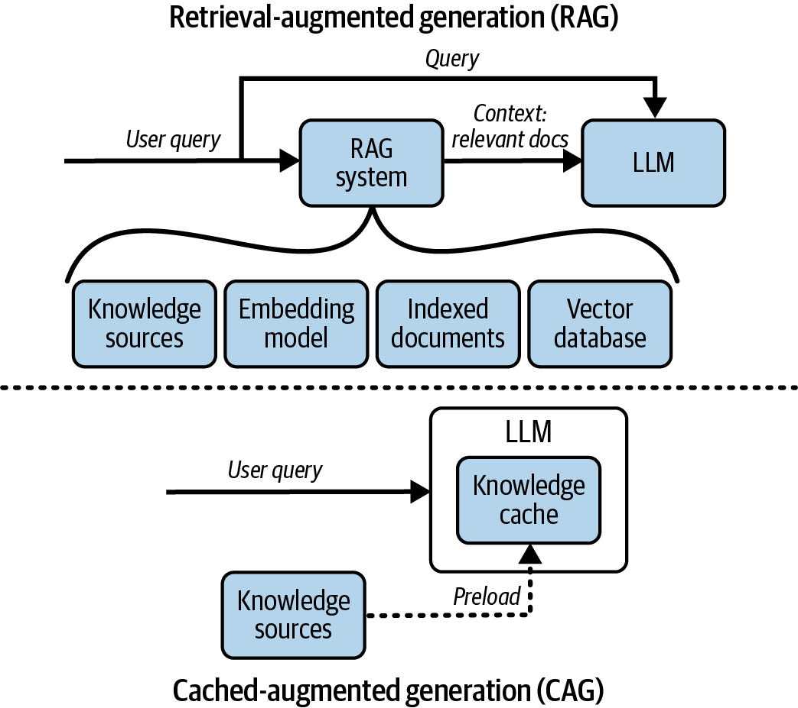
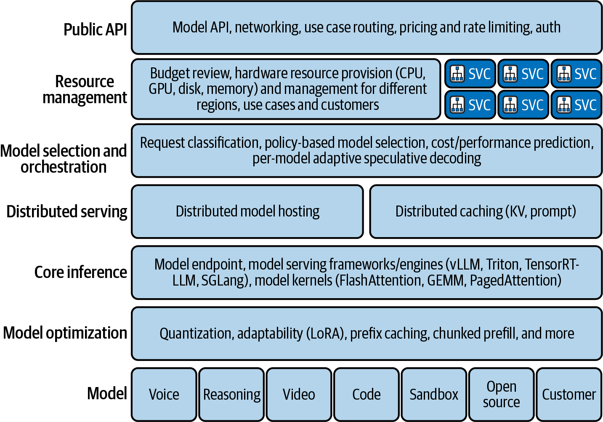

# Agent时代的LLM服务架构：RAG、企业部署与Build-or-Buy

本文是「LLM服务和优化：从入门到优化实战」系列的第四篇。前三篇聚焦"推理服务怎么跑"，这一篇往外跳一层：当LLM被嵌入Agent循环、RAG管道、企业架构时，服务设计逻辑发生什么变化？本篇拆解Agent多模型协作、Tool Calling有状态循环、RAG与CAG的优化策略、企业七层服务架构，以及绕不开的Build-or-Buy决策。

---

# 一、Agent来了：推理服务不只是"跑一个模型"

前两篇我们讨论的推理服务，本质上是一个"输入prompt → 输出response"的单次调用模型。但现实中的LLM使用场景，正在快速从"对话式"转向"代理式"。

《Hands-On LLM Serving and Optimization》在讨论Agent推理服务时，这样定义了当前正在发生的转变：

> "An agentic world is coming, and in many ways it's already here: a new wave of 'tokenization' where more and more applications are built on top of LLM infrastructure rather than traditional APIs and services."

Agent不是简单的"聊天机器人"。Agent是一个能**自主规划、调用工具、根据中间结果调整策略**的系统。这对底层的推理服务提出了全新的要求。

## 1.1 一个知识Agent长什么样

此处，以简单的知识Agent为例，来说明模型服务如何为一个旨在查询和分析PDF文件中信息的知识智能体赋能。

如下图，一个知识Agent由两个模型驱动，一个支撑检索和内容匹配，一个负责推理和语言生成。在此之上，它由三个核心组件构成：协调器（Agent）统筹全局，规划器（Planner）用LLM将用户查询分解为执行计划，动作执行器（Action Executor）负责查询、摘要、分析等具体任务，同时集成了一套RAG系统处理PDF、生成嵌入并执行向量搜索。

<center>



图1 Knowledge Agent系统概览</center>

一个具体的实战示例："知识Agent"的工作流如下：

<center>



图2 Knowledge Agent响应用户查询的内部工作流</center>

1. 用户问："最新的销售数据是什么？"
2. Agent调用 **embedding模型** 把问题向量化
3. 在向量数据库中检索相关文档
4. 把检索到的文档作为上下文拼到prompt前面
5. 把增强后的prompt发给LLM生成回答
6. 同时，Agent可以调用其他工具：查询CRM获取客户记录、调用计算引擎跑统计，而每一步的中间结果都可能改变下一步的决策

一个Agent需要的模型远远不止一个LLM。它需要embedding模型做检索、可能需要reranker模型做精排、可能需要视觉模型做多模态感知、可能需要轻量分类模型做意图识别。推理服务必须同时支持所有这些模型的低延迟调用。

## 1.2 Tool Calling：Agent的核心动作

Agent区别于普通聊天机器人的一个关键能力是 **tool calling**。Tool calling遵循一个四步循环：

1. LLM对用户请求和可用工具做推理
2. LLM生成结构化输出（通常是JSON），指定要调用的工具和参数
3. Agent执行工具调用
4. 结果传回LLM，LLM迭代直到任务完成

这个过程天然是多轮、有状态、依赖中间结果的。每轮LLM调用都可能需要不同的上下文窗口和不同的调度策略。传统的"一条请求一条响应"的推理模型，在面对Agent循环时，需要在调度层面做更多的事情。比如在同一个会话中保持KV Cache的连续性，或者利用前缀缓存在Agent重复调用同一个系统prompt时避免重复计算。

---

# 二、RAG和CAG

## 2.1 RAG：解决"知识不够"的问题

RAG的做法是：用户提问 → embedding模型向量化 → 向量数据库检索相关文档 → 拼到prompt里 → 喂给LLM生成回答。

<center>



图3 由索引构建和查询（检索）工作流组成的基本RAG系统</center>

RAG解决的是 **知识时效性和覆盖度** 的问题。LLM的训练数据有截止日期，RAG让它可以访问最新的外部知识。但RAG的代价是：在调用LLM之前需要额外的检索步骤（embedding编码 + 向量检索），这会引入额外的延迟。

## 2.2 CAG：解决"重复计算"的问题

CAG（Cache-Augmented Generation）走的是另一条路。它的核心思路是：**如果很多用户请求共享相同的前缀（比如同一个系统prompt，或者同一批检索文档），为什么要每次都重新计算它们的KV Cache？**

<center>



图4 使用CAG的代理工作流</center>

RAG和CAG不是互斥的，它们解决不同层次的问题：

> RAG通过检索相关外部知识并扩展提示上下文来提升回答质量。CAG通过复用先前计算的上下文并减少冗余的KV缓存计算来提升服务效率。

简单来说：RAG是"让答案更准"，CAG是"让推理更快更便宜"。两者的关系不是二选一，而是叠加：一个典型的生产系统会同时用RAG丰富输入、用CAG优化执行。

<center>



图5 RAG与CAG对比</center>

CAG的核心机制我们会在第 5 篇（Prefix Caching）和第 8 篇（vLLM的Automatic Prefix Caching）中详细展开。这里先建立的直觉是：LLM的自回归特性决定了前缀token的KV Cache一旦算好就不会变，**同一个前缀在多个请求之间共享，绝对划算。**

---

# 三、企业级LLM推理架构：七层蛋糕

书里最有价值的观点之一是，它没有停在"推理引擎"这个层面，而是往上画了一个完整的企业七层架构。这个架构被OpenAI、Anthropic、Together AI等顶级LLM服务提供商广泛采用。

<center>



图6 企业级模型服务系统架构</center>

从顶到底：

## 第一层：Public API（公共接口层）

这是客户、开发者和内部服务与LLM系统交互的唯一入口。它要做的事情远不止"接收请求然后转发"：**鉴权、定价、限流、地域路由、安全防护。**

关键挑战：支持**数百万并发连接**的同时，保证每个租户的隔离和计费准确性。这通常依赖Nginx/Envoy做ingress proxy + JWT/API Key双重认证 + Kubernetes的HPA做自动伸缩。

以下是一个具体的实现示例：

```python
@app.post("/v1/chat/completions")
async def chat(req: ChatReq, idp=Depends(require_auth)):
    await rate_limit(idp["tenant"])
    # 根据租户信息选择模型、路由流量
    ep = choose_endpoint(req.model, idp["tenant"])
```

配合Kubernetes HPA配置：

```yaml
apiVersion: autoscaling/v2
kind: HorizontalPodAutoscaler
metadata: { name: enterprise-model-api-hpa }
spec:
  minReplicas: 3
  maxReplicas: 15
  metrics:
  - type: Resource
    resource: { name: cpu, target: { type: Utilization, averageUtilization: 70 } }
```

和Nginx限流配置：

```yaml
annotations:
  nginx.ingress.kubernetes.io/limit-rps: "50"
```

## 第二层：Resource Management（资源管理层）

管理跨地域的CPU、GPU、内存、磁盘和网络资源。核心是做**容量规划**：预测需求、避免过度分配。同时要支持**客户优先级**（关键任务走预留资源，低优先级任务走抢占式调度）。

## 第三层：Model Selection & Orchestration（模型选择与编排层）

这是企业架构中**最被低估的一层**。它的核心职责是：对每个请求，决定用哪个模型。

不是所有请求都需要最大的模型。OpenAI默认用gpt-4o-mini而非gpt-4o，就是这个逻辑。这一层还可以做更高级的编排，比如同时调用草案模型和目标模型做 **Speculative Decoding**（第 7 篇会详细展开）。

关键挑战：**成本-质量trade-off**，选便宜的模型可能答不准，选贵的模型可能成本翻倍。这一层需要根据请求的复杂度、历史数据和业务规则做动态路由。

## 第四层：Distributed Serving（分布式推理层）

当模型大到一张GPU放不下时，这一层负责多GPU/多节点的分布式部署。同时管理分布式缓存：KV缓存、前缀缓存、语义缓存，减少不必要的冗余计算。

## 第五层：Core Inference（核心推理层）

就是我们第 2、3 篇文章讲的东西：vLLM、Triton、TensorRT-LLM等框架以高性能方式执行模型。

## 第六层：Model Optimization（模型优化层）

量化、蒸馏、剪枝、Kernel融合等，在不重新训练的情况下提升推理效率。这是第 5、6、7 篇的核心内容。

## 第七层：Model Layer（模型层）

管理模型从训练pipeline到生产环境的完整流动，包括版本控制、能力分类（对话 / 推理 / 视觉 / 代码）、状态追踪（沙盒 / 实验 / 生产）。

每一层可以独立演进，不需要因为换了一个推理框架就去改动API层的鉴权逻辑。**这个分层思想，是整个企业架构设计的精髓。**

---

# 四、六种构建方式：从"一键部署"到"裸机自建"

从最简单到最复杂，共有六种部署选项：

| 选项 | 描述 | 适用场景 |
|------|------|---------|
| **1. 全托管Foundation Model** | 直接调OpenAI/Anthropic的API | 快速验证、不确定用量的早期阶段 |
| **2. 一键部署Foundation Model** | 云厂商帮你部署，但你有自己的实例 | 用量变大、需要更好成本控制 |
| **3. 自带模型（BYOM）** | 上传你自己的模型，云厂商帮你跑 | 需要定制模型但不想管基础设施 |
| **4. 自带代码（BYOC）** | 上传推理代码，自定义预处理和后处理 | 有特殊推理逻辑 |
| **5. 自带推理镜像（BYOI）** | 你控制完整的Docker镜像 | 团队有能力管理推理栈 |
| **6. 自建推理基础设施** | 从头构建，完全控制 | 规模足够大、有专门团队 |

一个务实的建议：大多数团队不需要一开始就选最复杂的那个。选项 1 快速上线验证产品，选项 3-4 在规模变大后迁移，选项 5-6 是当成本优化成为核心竞争优势时的终局状态。

---

# 五、Build or Buy？一个持续演变的决策

这不是一次性的决定。随着业务的成熟度和规模变化，最优解也会变。

作者自己的经验是：

> "While outsourced solutions can be a great starting point, businesses must continuously assess whether in-house serving provides a long-term competitive advantage in terms of cost savings, security, and flexibility."

一个Series A的教育创业公司，用OpenAI API快速验证产品，每月的推理费用在几千美元，完全合理。

一个CRM巨头，处理海量敏感的客户数据，每天几百万次推理请求。全外包不仅成本不可控，而且存在数据合规风险（GDPR、HIPAA）。自建推理栈是必然选择。

**决策的核心变量是三个：规模 × 数据敏感度 × 团队能力。** 三个中的任何一个变了，最优选择都可能跟着变。

---

# 六、性能指标：用正确的尺子量LLM推理

## 你在量正确的东西吗？

## 6.1 延迟指标

- **TTFT（Time To First Token）**：从发送请求到收到第一个token的时间。这是用户感知到的"响应速度"。Prefill阶段的效率直接决定TTFT。
- **TPOT / ITL（Time Per Output Token / Inter-Token Latency）**：后续每个token生成之间的平均间隔。Decode阶段的效率决定TPOT/ITL。
- **Total Latency**：从请求开始到最后一个token生成的总时间。公式是 **E2E Latency = TTFT + ITL × (N − 1)**。

TTFT和TPOT反映的是完全不同的瓶颈：TTFT卡Prefill（算力），TPOT卡Decode（带宽）。**把它们混在一起看"平均延迟"，会隐藏真正的优化目标。**

## 6.2 吞吐指标

- **QPS（Queries Per Second）**：每秒处理的请求数
- **TPS（Tokens Per Second）**：每秒生成的token数TPS通常更能反映LLM推理的效率，因为不同请求的输出token数差异巨大。

## 6.3 测量方法

几条实战原则：

- **用真实的数据分布做benchmark**，不要用均匀分布的合成数据：真实流量有高峰低谷、有长序列和短序列的混合
- **测end-to-end延迟**，不要只测模型执行时间：网络传输、tokenization/detokenization、调度等待都要算进去
- **在饱和状态下测**，而不是在轻负载下：很多性能问题只在接近容量上限时才暴露
- **同时关注P50、P95、P99**，平均值会掩盖长尾延迟，而长尾延迟正是用户体验的杀手

---

# 七、小结

这篇覆盖的内容跨度较大，从Agent到RAG/CAG到企业七层架构到Build-or-Buy到性能测量。但它们都围绕一个核心问题：**LLM不是一个"被调用的函数"，而是一个"需要被设计、被运营、被优化的生产系统"。**

- **Agent正在改变推理服务的设计需求**：多模型协作、工具调用、有状态会话，这些都不是简单的stateless API能搞定的
- **RAG和CAG解决的是不同层次的问题**：RAG让答案更准，CAG让推理更快，两者叠加是王道
- **企业七层架构的核心是分层解耦**：每层解决自己的问题，不拖其他层的后腿
- **Build-or-Buy不是一次性选择**：规模、数据敏感度、团队能力三者的变化会持续改变最优解
- **性能测量要量对东西**：区分TTFT和TPOT、区分P50 和P99、用真实流量做benchmark前三篇文章讲完了"是什么"和"怎么建"。下一篇开始，我们进入这个系列最硬核的部分：**LLM推理的物理瓶颈。** GPU的内存墙到底卡在哪？算术强度是什么？模型加载的过程中，哪个环节最慢？

---

**「LLLM服务和优化：从入门到优化实战」系列共 10 篇文章，基于《Hands-On LLM Serving and Optimization》(O'Reilly 2026, Chi Wang & Peiheng Hu)：**

- 【第 1 篇】01-模型服务基础认知：从训练完的模型到可用的服务
- 【第 2 篇】02-LLM推理的内核与部署：从Token生成机制到vLLM实战
- 【第 3 篇】03-从零搭建LLM推理服务：Batching、Streaming与多模型架构
- **【第 4 篇】04-Agent时代的LLM服务架构：RAG、企业部署与Build-or-Buy**
- 【第 5 篇】05-LLM推理瓶颈：GPU内存墙、算术强度与模型加载拆解
- 【第 6 篇】06-推理效率三件套：Continuous Batching、注意力内核优化与Prefix Caching
- 【第 7 篇】07-模型压缩实战：量化、蒸馏与剪枝
- 【第 8 篇】08-进阶优化：Speculative Decoding、多GPU并行与Prefill-Decode分离
- 【第 9 篇】09-四大框架深度对比：vLLM、TensorRT-LLM、SGLang、Llama.cpp
- 【第 10 篇】10-收官：一次完整的优化实战，以及下一站


---

**参考资料**：《Hands-On LLM Serving and Optimization》, Chi Wang & Peiheng Hu, O'Reilly 2026
