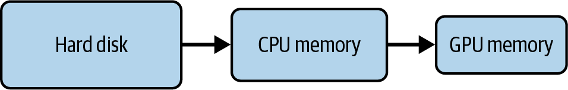
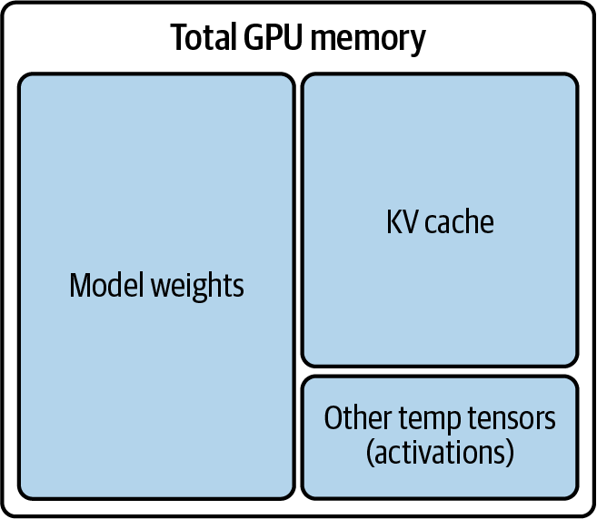

# LLM推理瓶颈：GPU内存墙、算术强度与模型加载拆解

本文是「LLM服务和优化：从入门到优化实战」系列的第五篇。前四篇讲完"是什么"和"怎么建"，从这篇进入硬核优化。所有优化技术都不是凭空产生的，它们是对物理瓶颈的回应。本篇拆解三堵墙：GPU显存带宽墙（HBM）、PCIe数据传输墙和算术强度墙。理解这三堵墙，就拿到了后续所有优化技术的钥匙。

---

# 一、为什么需要"先理解瓶颈"？

作者Chi Wang和Peiheng Hu讲了一段很重要的话。大意是：很多工程师学LLM优化时，上来就跳到"怎么做量化""怎么配Continuous Batching"，但很少有人先问一句：**这个优化的出发点是什么？它攻击的到底是哪个瓶颈？**

不知道瓶颈在哪，你就无法判断一个优化是否适合你的场景。比如量化主要压缩模型权重：如果你的瓶颈是decode阶段的显存带宽（而不是模型本身的大小），量化确实有帮助，但不是因为"模型变小了"，而是因为"每次forward pass从HBM读的数据变少了"。理解这个微妙差别，你才知道在什么场景下量化收益最大。

---

# 二、GPU到底是什么？一张"看懂GPU的说明书"

## 2.1 不是所有"核"都一样

**读GPU规格表时，你真正需要关心的只有几个数字。**

<!-- Table 5-4: GPU Spec Comparison -->
以NVIDIA H100 为例，关键指标：

| 指标 | H100 (SXM) | A100 (SXM) | L40S |
|------|-----------|------------|------|
| FP16 Tensor Core TFLOPS | ~1979 | ~312 | ~362 |
| HBM容量 | 80 GB | 80 GB | 48 GB |
| HBM带宽 | ~3.35 TB/s | ~1.94 TB/s | ~0.86 TB/s |

三个指标对应三个瓶颈：

- **FP16 TFLOPS** → 计算能力上限（Prefill阶段的限制因素）
- **HBM容量** → 模型能装多大（权重 + KV Cache不能超过这个值）
- **HBM带宽** → 数据搬运速度上限（Decode阶段的限制因素）

## 2.2 GPU显存 ≠ CPU内存

| 存储介质 | 带宽 |
|---------|------|
| SSD（固态硬盘） | 0.5-14 GB/s |
| CPU内存（DRAM） | 50-200 GB/s |
| GPU显存（HBM） | 300 GB/s - 3 TB/s |

差距是数量级的。SSD和CPU内存的速度，在实时推理场景中根本不够用。**模型权重必须常驻GPU显存（HBM）中。** 如果每次推理都要从CPU内存搬运权重到GPU，那延迟就没法看了。

这就解释了为什么"模型加载"是一个需要认真设计的过程：后面会展开。

---

# 三、模型加载：从磁盘到GPU的漫漫征途

<center>



图1 加载模型权重时的数据流</center>

1. 模型权重文件存储在 **SSD/HDD** 上
2. 加载时，先通过PCIe总线搬运到 **CPU内存**
3. 再从CPU内存通过PCIe搬运到 **GPU显存（HBM）**

每一步都是一个带宽瓶颈。PCIe 4.0 x16 的理论带宽是约 32 GB/s，而GPU的HBM带宽是 3000+ GB/s，差了两个数量级。

模型越大，加载越慢。以一个 70B参数的模型（BF16 ≈ 140 GB）为例，从SSD通过PCIe搬运到GPU至少需要几十秒，这还没算模型初始化等开销。这也是第 2 篇讲的多模型场景中"冷启动延迟"问题的物理根源。

---

# 四、模型有多大？两个公式搞定

## 4.1 模型权重大小

**模型大小 ≈ 参数量 × 每个参数的字节数**

常见精度：

| 精度 | 字节/参数 | 70B模型大小 |
|------|----------|-------------|
| FP32 | 4 | ~280 GB |
| FP16/BF16 | 2 | ~140 GB |
| INT8 | 1 | ~70 GB |
| FP8 | 1 | ~70 GB |
| INT4 | 0.5 | ~35 GB |

H100 有 80 GB显存。一个 70B模型在BF16 下需要 140 GB，**一张卡放不下。** 这就是为什么需要Tensor Parallelism（多卡分片）或量化（INT8 降到 70 GB，勉强能塞进一张H100）。

## 4.2 KV Cache大小（复习 + 深化）

<center>



图2 GPU内存使用细分</center>

```
KV Cache = 2 × 层数 × 头数 × 每头维度 × 序列长度 × 精度字节数
```

对于Llama 2-70B在batch_size=1、序列长度 4096 时：
> 2 × 80 × 64 × 128 × 4096 × 2 ≈ **10.7 GB**

加上模型权重（140 GB）≈ **151 GB**。一张H100（80 GB）根本装不下。这就是为什么你在实际部署中需要**量化 + 张量并行 + 控制batch size和序列长度上限**三管齐下。

而且这个计算揭示了另一个重要事实：**KV Cache是随序列长度线性增长的，而注意力计算量是O(N²) 增长的。** 长上下文场景下，KV Cache的内存压力远大于计算压力。

---

# 五、算术强度：一根线分出了两个世界

## 5.1 定义

**算术强度（Arithmetic Intensity）**。

```
算术强度 = 计算量（FLOPS）/ 内存访问量（Bytes）
```

单位：FLOP/Byte。它告诉你：**每从显存读取一个字节的数据，能做多少次浮点运算。**

这个值决定了一个操作是compute-bound还是memory-bound：

- **算术强度高** → 计算比数据搬运更多 → **compute-bound**（瓶颈在FLOPS）
- **算术强度低** → 数据搬运比计算更多 → **memory-bound**（瓶颈在带宽）

## 5.2 分析矩阵乘法的算术强度

对于两个N×N矩阵的乘法（C = A × B）：

- 计算量：约 2N³ FLOPs
- 内存访问量：从HBM读取A和B + 写回C ≈ 3N² × 字节/元素

算术强度 ≈ 2N³ / (3N² × 2) = N/3

**N越大，算术强度越高，越偏向compute-bound。** 这就是为什么大矩阵乘法能高效利用GPU：因为有足够多的计算来"覆盖"数据搬运的开销。

## 5.3 应用到Prefill和Decode

**Prefill**：处理整个prompt的所有token并行。注意力矩阵N_prompt × N_prompt，N较大 → 算术强度较高 → **compute-bound。**

**Decode**：每次只生成 1 个token。注意力矩阵 1 × N_total，计算量极小。但每次都需要从HBM读取整个模型权重（140 GB）和全部KV Cache → 算术强度极低 → **memory-bound。**

横轴是算术强度，纵轴是能达到的FLOPS。曲线有一个拐点：拐点左边（低算术强度）是memory-bound区域，加多少算力都没用；拐点右边（高算术强度）是compute-bound区域，加算力直接提升性能。

**Decode坚定地站在拐点的左边。**

这就是为什么：
- Decode阶段的性能瓶颈在HBM带宽，而不是TFLOPS。升级HBM对Decode性能改善直接有效
- 量化对Decode有效，因为把每个权重的字节从 2 降到 1（或 0.5），减少了从HBM读取的数据总量
- Speculative Decoding有效，因为它让每次forward pass处理多个token而非一个，提高了算术强度

---

# 六、AI加速器之外的趋势

GPU以外的AI加速器趋势：Google TPU、AWS Inferentia等自研芯片的兴起。这些芯片的共同特征是：**专为特定工作负载优化，在能耗和成本上寻求突破。**

但对推理工程师来说，核心原则不变：**无论用什么硬件，理解它的计算能力和内存带宽之比，以及你的工作负载落在哪个区间，是判断它是否适合你的任务的关键。**

---

# 七、小结

这一篇的核心是一个字：**墙。**

- **内存墙**：GPU HBM带宽（~3 TB/s）远低于计算能力（~1000 TFLOPS）。Decode阶段撞的就是这堵墙。
- **PCIe墙**：模型从磁盘到GPU要走SSD → CPU → GPU，每个环节都有带宽瓶颈。冷启动延迟的根源。
- **算术强度墙**：低于拐点的操作是memory-bound，你再堆算力也没用。

理解这三堵墙，你就拿到了开启后续所有优化技术的钥匙：

- 量化 → 减少每次forward pass的HBM读取量（攻内存墙）
- Continuous Batching → 让多个请求共享同一轮模型的HBM读取（攻内存墙）
- Speculative Decoding → 每次forward pass处理多个token，提高算术强度（翻过算术强度墙）
- Chunked Prefill → 让compute-bound和memory-bound操作交替进行（翻过算术强度墙）

下一篇，我们开始逐一拆解这些优化技术。

---

**「LLLM服务和优化：从入门到优化实战」系列共 10 篇文章，基于《Hands-On LLM Serving and Optimization》(O'Reilly 2026, Chi Wang & Peiheng Hu)：**

- 【第 1 篇】01-模型服务基础认知：从训练完的模型到可用的服务
- 【第 2 篇】02-LLM推理的内核与部署：从Token生成机制到vLLM实战
- 【第 3 篇】03-从零搭建LLM推理服务：Batching、Streaming与多模型架构
- 【第 4 篇】04-Agent时代的LLM服务架构：RAG、企业部署与Build-or-Buy
- **【第 5 篇】05-LLM推理瓶颈：GPU内存墙、算术强度与模型加载拆解**
- 【第 6 篇】06-推理效率三件套：Continuous Batching、注意力内核优化与Prefix Caching
- 【第 7 篇】07-模型压缩实战：量化、蒸馏与剪枝
- 【第 8 篇】08-进阶优化：Speculative Decoding、多GPU并行与Prefill-Decode分离
- 【第 9 篇】09-四大框架深度对比：vLLM、TensorRT-LLM、SGLang、Llama.cpp
- 【第 10 篇】10-收官：一次完整的优化实战，以及下一站

---

**参考资料**：《Hands-On LLM Serving and Optimization》, Chi Wang & Peiheng Hu, O'Reilly 2026
