# 推理效率三件套：Continuous Batching、注意力内核优化与Prefix Caching

本文是「LLM服务和优化：从入门到优化实战」系列的第六篇。上一篇定位了三大物理瓶颈，本篇拆解第一类优化：不修改模型，纯粹靠调度和内存管理突破瓶颈。三件套逐一展开：**Continuous Batching**把调度粒度从"请求"降到"token"，让Prefill和Decode在同一batch混跑；**FlashAttention**将HBM读写从O(N²)压到O(N)；**Prefix Caching**让共享前缀的KV Cache只算一次。这三项是vLLM和SGLang吞吐碾压原生HF的核心。

---

# 一、从Static到Continuous：batching的三级进化

在前文，介绍了离线场景下攒了一批请求一起送进模型。但在真实在线服务中，请求随机到达，组batch的方式决定了延迟和吞吐的天平。用一个渡船比喻把整个故事串起来：你经营一条渡船，每次载一批乘客过河，乘客（请求）不断到达码头。

## 1.1 Static Batching：满载，但等不起

设定一个batch size（比如10人），等够10人才开船。offline场景下这是最高效的：每趟满载，GPU利用率拉满。但在线场景，第1个乘客到了，第10个可能半小时后才来，先到的全部干等。**赢在效率，死在延迟。**

## 1.2 Dynamic Batching：不等满也能走，但LLM有致命缺陷

加一个参数 **max delay time**：到了batch size发船，到了时限也发船，不管满没满。设定"最多等5分钟"，来10人发船，只来8人也发船。

传统ML模型（分类、检测）输入输出长度固定，Dynamic Batching效果不错。LLM不一样：请求长度天差地别，"1+1=?"和"解释量子力学"的回复差两个数量级。Dynamic Batching要等整个batch全部完成后才返回，**处理时间由最慢的那个决定。**现在船要把每人送到各自家门口，有人住得近、有人住得远，船必须等最远那个到家才能返航，其他人陪等。

<center>

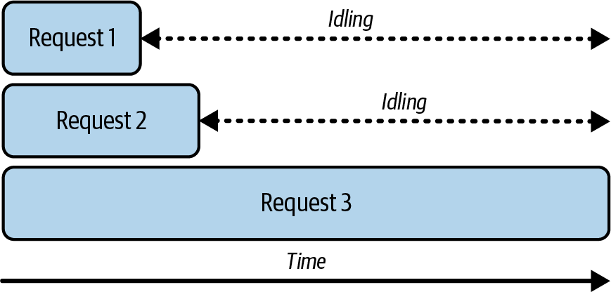

图1 三个请求的长度不均可能导致LLM服务中显著的GPU空闲时间，因为请求1和2要等待请求3完成</center>

请求1和2早做完了，干等请求3，GPU白白空转。

还有一个更根本的推动力。prefill阶段是 **compute-bound**，所有input token并行处理，不需要batching就能跑满GPU。但decode阶段是 **memory-bound**，每次只生成1个token，却要读完整套模型权重。Batching的真正价值在于把多个请求的decode拼成一次forward pass：读一遍权重，同时给多个请求各吐一个token。**对decode是雪中送炭，对prefill只是锦上添花。**

## 1.3 Continuous Batching：不等了，随完随走

Dynamic Batching的根子在"等"：等满、等超时、等最慢的那条船回来。Continuous Batching（inflight batching）换了一个方向：**不等了。每次forward pass后，检查哪些请求吐完了EOS或达到max_tokens，立刻释放槽位，新请求马上补入**。没有"这批做完再换下批"的边界。

<center>

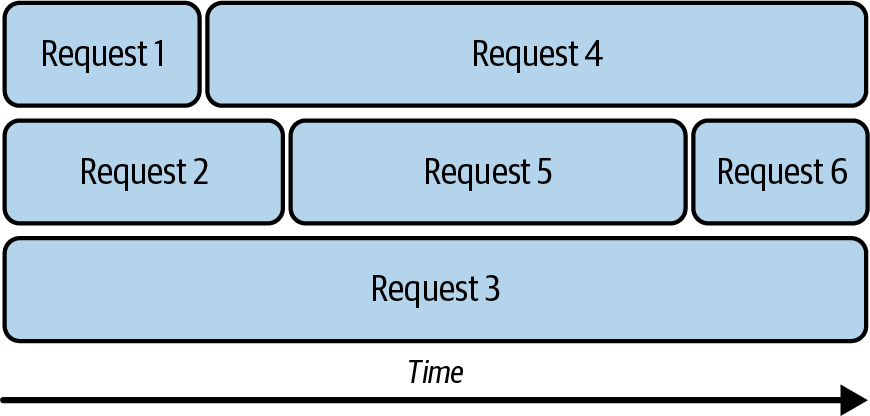

图2 采用连续批处理后，一旦某个请求完成，另一个请求便会立即加入处理，以最大限度地减少GPU空闲时间</center>

请求1完成，请求4立刻加入；请求2完成，请求5补入。渡船终极版：每人一条小船，到了就上、到了就下，谁都不等谁。

Continuous Batching引入了两个参数替代max delay time：

- `--max_num_seqs`：同时跑着的请求数上限，防止batch无限膨胀。
- `--max_num_batched_tokens`：每次forward pass的token总数上限。10个各20 token的请求和2个各100,000 token的请求，计算量天差地别，**单靠数请求数管不住，必须数token。**

```bash
vllm serve Qwen/Qwen2.5-7B-Instruct \
    --max-num-batched-tokens 4096 \
    --max-num-seqs 128
```

两个参数取交集。prefill阶段token上限是主约束（输入长），decode阶段请求数上限是主约束（每人只处理1个token）。

## 1.4 Chunked Prefill：不让长prompt独霸舞台

Continuous Batching解决了请求不等长的问题，但还有一个维度的冲突被忽略了：**prefill和decode是两种完全不同的计算**。

回到第1篇的核心概念：prefill是compute-bound，一次性并行处理所有prompt token；decode是memory-bound，每次只生成1个token。batching对decode是雪中送炭，对prefill只是锦上添花，问题就更清晰了。

理想情况下是这样：三个请求同时到达、prompt等长、prefill一起做完、同步进入decode。这听起来很好，可惜也只是"cherry-picked happy path"。

<center>

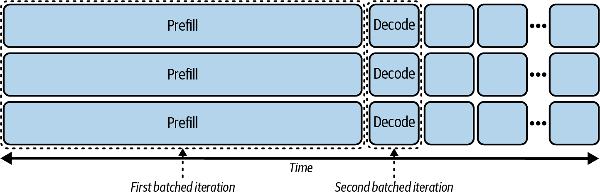

图3 一个精心挑选的“顺利路径”场景，其中所有请求的预填充和解码都完美对齐</center>

但现实中请求随机到达。有的已经在decode了，新来的需要做prefill。调度器面临一个选择：优先prefill还是优先decode？能把它们放在同一个batch里吗？

如果不混跑，通常优先prefill（它决定TTFT），但正在decode的请求就得完全空闲等着。如果新请求prompt很长，ITL暴涨。

<center>

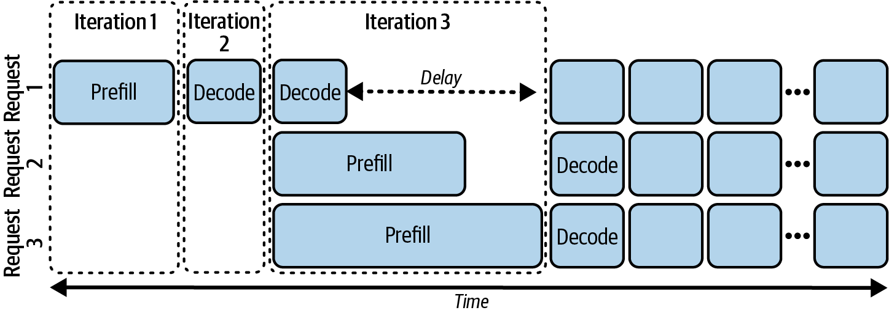

图4 不将预填充和解码批处理在一起的连续批处理，并优先处理预填充</center>

如果把prefill和decode混跑在同一个batch里，一次forward pass同时处理两种计算。可prefill的工作量大得多，几百到几千token的并行计算，decode只有1个token。decode一步转眼做完，还是得等prefill完成。

两种做法都不理想。根源是：**两者的工作量根本不在一个量级，放在一起必然一个等另一个。**

Chunked Prefill的解法很直接：既然prefill太大，那就把它切成多个小块。

<center>

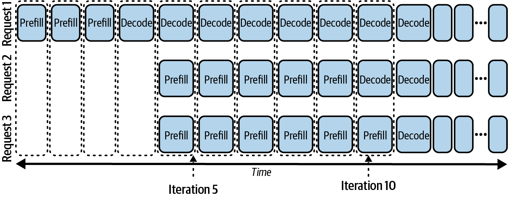

图5 采用分块预填充的连续批处理</center>

对比图上述两图，关键变化一目了然：原来那些长长的prefill色块，现在变成了多个小方块，每块的大小和decode步骤差不多。**它们可以在同一个batch里交替执行，decode不再被长prefill阻塞。**本图中的迭代5，请求1的decode正常运行，请求2和3只做一小块prefill，互不耽误。到迭代10附近，请求2因为prompt短，prefill先做完了，顺滑切换到decode；请求3的prompt更长，继续做prefill，但这期间请求1和2的decode照常进行。

代价也很明确：ITL改善，TTFT变长（切分开销），端到端延迟基本不变，吞吐提升（GPU空闲被填满）。本质是 **"用TTFT换ITL"**，交互式chatbot更需要流式输出的流畅度，值得开；批量任务不需要。chunk大小由`max_num_batched_tokens`间接控制：太小GPU算不满，太大等于没切。

---

# 二、注意力优化：算得更快，存得更省

上面讲的batching和Chunked Prefill，解决的是调度问题：跑哪些请求、按什么节奏跑。接下来的问题更底层：每次forward pass本身怎么跑得更快？KV Cache的内存怎么管才不浪费？

可以拆成三条线：计算效率、内存效率、模型架构。

## 2.1 Kernel Fusion：少搬数据，多干活

GPU的HBM容量大但慢，SRAM快但小。跑一次attention，涉及矩阵乘法、scale、softmax、再加矩阵乘法，几十个操作。如果每个操作单独写成一个小kernel，每执行完一个就得把结果写回HBM，下个kernel再从HBM读出来。HBM带宽是瓶颈，反复读写是最大的浪费。

Kernel Fusion的思路不复杂：把多个操作合并成一个kernel，中间结果留在SRAM里，不写回HBM。**省的不是计算，是数据搬运。**

<center>

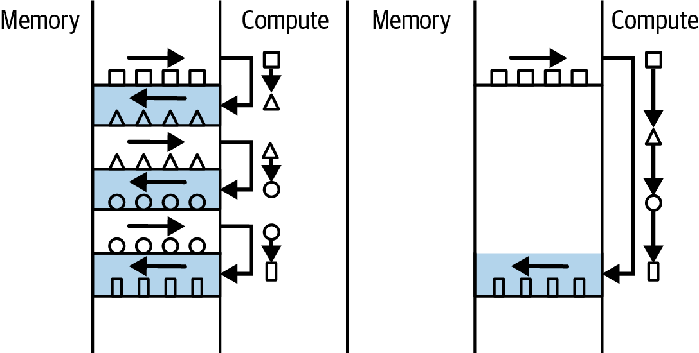

图6 比较无内核融合（左）与有内核融合（右）时的内存与计算交互</center>

举个例子就很直观：做一道菜，如果每切完一种菜就要洗刀洗砧板再擦干，时间全花在来回上了。Kernel Fusion相当于把所有菜一次性切完，中间不洗，反正最后一起洗。

## 2.2 FlashAttention：围绕硬件特性重写注意力算法

Kernel Fusion是通用思路，FlashAttention则是对注意力计算专门做的极致fusion：不止合并操作，而是围绕GPU显存层级的硬约束重新设计了整个算法。核心思想叫 **I/O-aware**，清楚知道HBM带宽多少、SRAM多大，这些数字不是参数，是设计边界。

<center>

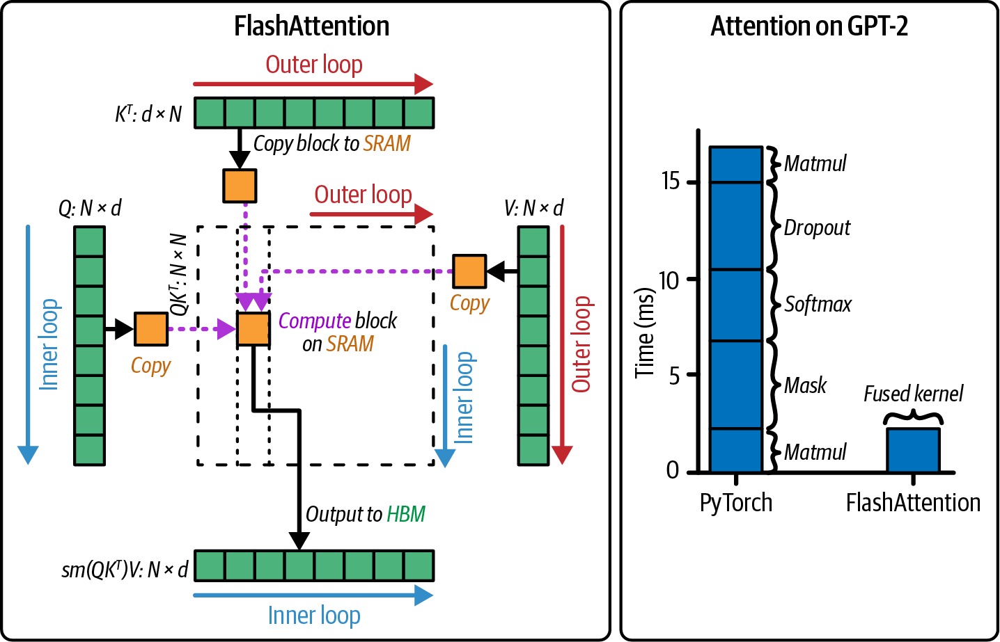

图7 FlashAttention如何利用循环在SRAM中执行QKV计算（左）以及融合FlashAttention带来的性能提升（右）</center>

具体做法是tiling（分块）：把Q、K、V切成小块，每次只加载一小块到SRAM，在SRAM里完成局部的softmax和加权求和，只把最终结果写回HBM。**整个N×N的注意力矩阵从头到尾不会在HBM里完整存在过。**配合online softmax把所有注意力操作融合成单一kernel，一趟完成。

FlashAttention 2和3在此基础上继续压榨硬件，比如把GEMM和softmax的计算流水线重叠起来，在H100等新一代GPU上用得更好。其他高性能kernel还有FlashInfer、xFormers、Triton等。从实用角度，vLLM和SGLang都有内置逻辑自动选kernel，SGLang默认在非Hopper GPU上用FlashInfer，Hopper GPU上用FlashAttention 3。开箱即用即可，换kernel的事等别的优化方向做完了再回头折腾。

## 2.3 PagedAttention：给KV Cache加上分页管理

Kernel Fusion和FlashAttention管的是计算效率，**PagedAttention管的是一条完全独立的事：KV Cache的内存管理**。

<center>

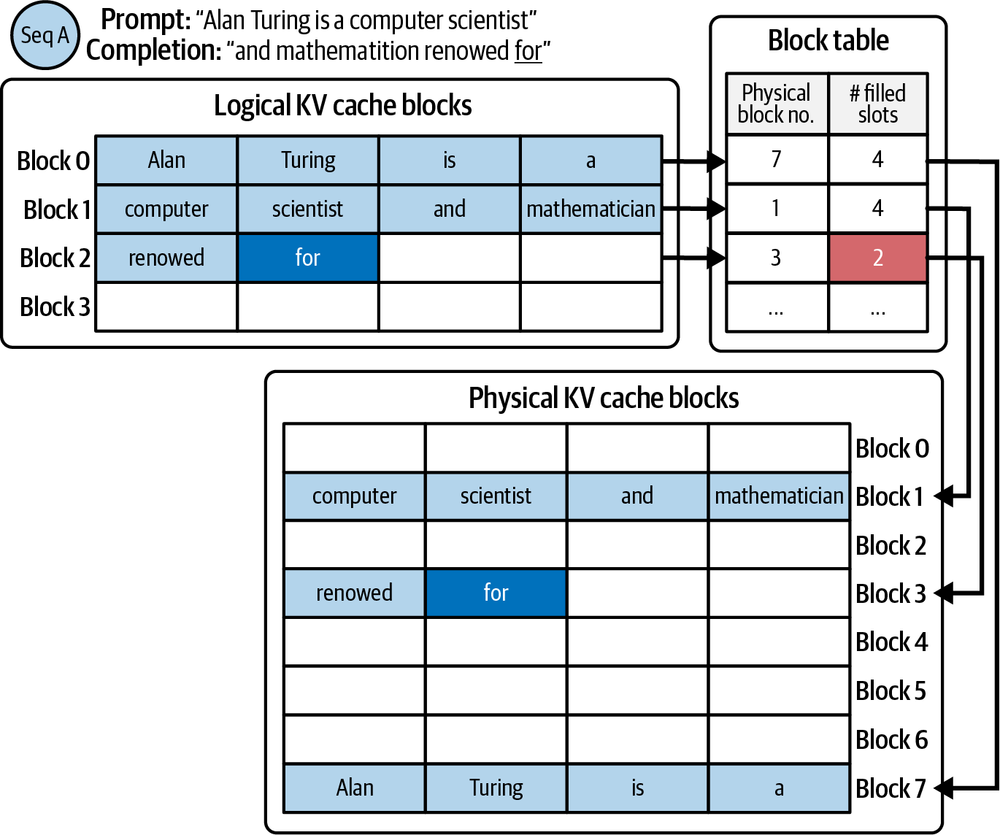

图8 使用PagedAttention的请求在生成过程中的一个步骤</center>

回忆第1篇和第4篇反复讲的事：KV Cache的内存极其头痛。每个请求的输出长度不确定，传统做法是预先分配连续内存空间，但你不知道用户会问什么，实际用量远小于预分配量。结果就是严重的内存碎片。PagedAttention原始论文给了一个数字：不做PagedAttention时，**只有20.4%-38.2%的KV Cache内存存的是真正的token状态**，过半内存是白白占着没用的。

**PagedAttention的灵感直接来自操作系统的虚拟内存分页**：把KV Cache切成固定大小的小块（block），通过一张查找表（block table）来映射逻辑位置到物理位置。KV Cache不需要存在连续内存里。就好像活页笔记本，用到哪页拿哪页，不用了就放回去，不需要整本预占。

结果是 **"near-zero waste in KV cache memory"**。PagedAttention现在和Continuous Batching一样，**已经成为LLM推理默认开启的基础配置。**

## 2.4 MQA、GQA、MLA：从模型设计源头减少KV Cache

计算效率和内存管理都讲完了，还有一条更根本的路线：直接减少KV Cache本身的大小。回顾第4篇的公式，KV Cache的大小和KV head数量成正比。减少head数，Cache等比缩小。

这条进化路线很清楚：

- **MHA（Multi-Head Attention）**：每个query head独立配一组K和V。Cache最大，比如Llama 2（7B）的`num_key_value_heads=32`，等于`num_attention_heads=32`。
- **MQA（Multi-Query Attention）**：所有query head共享一组K和V。Cache缩为1/32，但精度损失太大了。
- **GQA（Grouped-Query Attention）**：折中。query head分成G组，组内共享KV。Llama 3的`num_key_value_heads=8`，32个头分成8组，Cache缩为MHA的1/4，在精度和效率之间找到了好平衡。
- **MLA（Multi-Head Latent Attention）**：DeepSeek的方案。不是简单减少head数，而是用低秩压缩把KV压成更紧凑的表示。声称效果等于GQA的2.25组，但性能超过MHA。

<center>

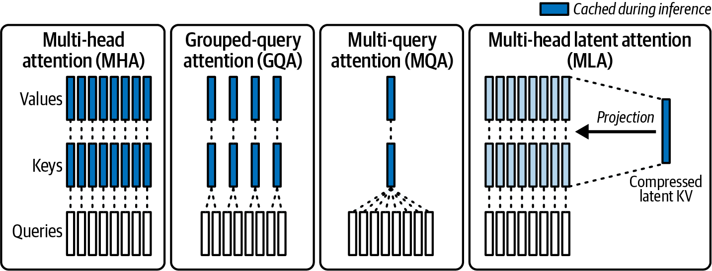

图9 比较多头注意力、多查询注意力、分组查询注意力和多头潜在注意力</center>

这些在模型训练时就定了，推理工程师不能改。但知道自己的模型用哪种机制，能直接回答两个问题：KV Cache大概多大？batch size大概能开到多少？

---

# 三、Prefix Caching：共享等于省钱

上面讲的全是"怎么算得更快、存得更省"，在单次forward pass上做文章。Prefix Caching换了一个维度：能不能让某些forward pass不用做？

## 3.1 为什么前缀缓存是LLM推理的自然推论

回到第一篇的核心概念：**自回归。** 每个token的K和V只依赖它之前的token，而不依赖它之后的token。这个性质意味着：如果两个请求共享相同的前缀（比如相同的system prompt），那么前缀的KV Cache对两个请求来说是相同的，**只需要计算一次。**

普通响应缓存对LLM基本没用。同样的问题可以有一百种问法，hash精确匹配的命中率极低。前缀缓存不同：**它匹配的是"前缀"而不是"整个prompt"**，命中概率高得多。

在实际应用中，大量请求共享前缀：
- **System prompt**：几乎每个请求都有相同的系统指令
- **Few-shot examples**：多个请求共享同样的示例
- **RAG检索到的文档**：不同用户检索到的知识片段经常重叠
- **多轮对话**：同一会话的历史消息完全共享

## 3.2 RadixAttention：SGLang的树状前缀缓存

SGLang提出了 **RadixAttention**：一种基于radix tree（前缀树）的KV Cache管理数据结构。

<center>

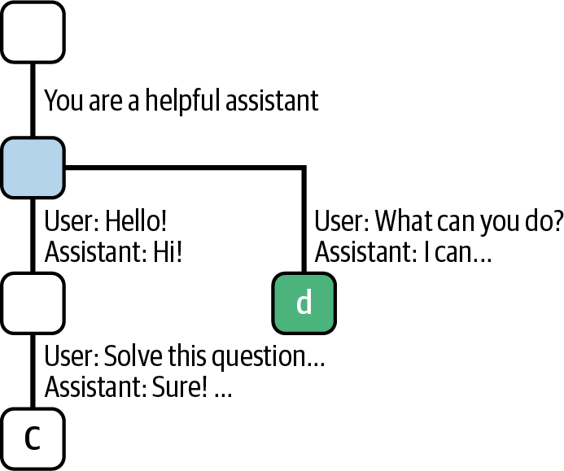

图10 一个针对共享相同前缀的两个请求的基数树示例</center>

所有请求的prompt被解析为token序列，插入到一棵共享的前缀树中。每个节点对应一段token序列的KV Cache。树节点存在CPU内存中，指向GPU内存里对应的KV Cache block。当一个新请求到来时：

1. 在树中搜索它的prompt，找到最长匹配前缀
2. 只需为不匹配的部分做prefill并生成新的KV Cache
3. 匹配部分的KV Cache直接从树中复用

例如，如果请求A的prompt是 "You are a helpful assistant. What is the weather?"，请求B的是 "You are a helpful assistant. Tell me a joke."，那么 "You are a helpful assistant." 这部分的KV Cache可以直接复用，只需分别prefill "What is the weather?"和"Tell me a joke."。

在连续对话场景中（多轮对话的system prompt + 历史消息完全一致），前缀缓存的命中率可能高达 70% 以上，这意味着 **70% 的prefill计算被省掉了。**prompt格式的一致性，**直接决定前缀缓存的命中率。**

## 3.3 场景：多轮对话和长上下文

多轮对话。用户和LLM来回对话时，每次新消息发给模型的实际prompt，是将之前所有历史拼在前面。比如：

```
User: What is the weather like today?
LLM:  The weather is 70F, but with a likelihood of rain.
User: Could you tell me the actual possibility?
```

用户问第二句时，模型实际收到的是全部四行。没有前缀缓存，每次都要重新prefill前面的历史，对话越长TTFT越慢。有了前缀缓存，**历史消息的KV Cache一直保持在GPU内存中，每次只需处理新增的那一句。**

长上下文。LLM的上下文窗口从4K涨到128K甚至1M，可以把大量文档一次性丢进prompt，但这让prefill的TTFT变得极高。前缀缓存的解法：把静态文档放在prompt前缀位置，用户输入放后缀位置。文档不变时prefill完全跳过，TTFT极快。

## 3.4 实践：把prompt设计成"静态前缀 + 动态后缀"

前缀缓存的效果取决于命中率，而命中率取决于prompt怎么设计。核心原则：**把prompt拆成静态前缀+动态后缀，静态部分放最前面。**

```
<system> You are a helpful assistant.
<context> Document: {静态文档内容}
<user> {动态用户问题}
```

这条原则有几个落点。格式一致性是命中的前提，多一个空格、`Document`写成`Documents`，都导致miss。RAG场景要注意文档块的排序和去重，即使检索结果不完全相同，只要前几个chunk排序一致，仍能命中前缀。多租户共用实例时，在prompt中插入`<id> {tenant_id}</id>`做前缀隔离，防止不同客户意外共享缓存。

前缀缓存还有一个优势：**没有副作用。**现代推理引擎开关它几乎零开销。即使命中率只有5%，那5%的请求TTFT极快，值得开。vLLM用`--enable-prefix-caching`，SGLang通过RadixAttention自动启用。

## 3.5 扩展：多实例下的cache-aware routing

流量上升后需要水平扩展到多实例。前缀KV Cache存在本地GPU内存中，请求被随机分发（如round-robin）会导致每次都落到没有缓存的实例，缓存形同虚设。解法是 **cache-aware routing**：类似一致性哈希，**让相同前缀的请求固定路由到同一实例。**

<center>

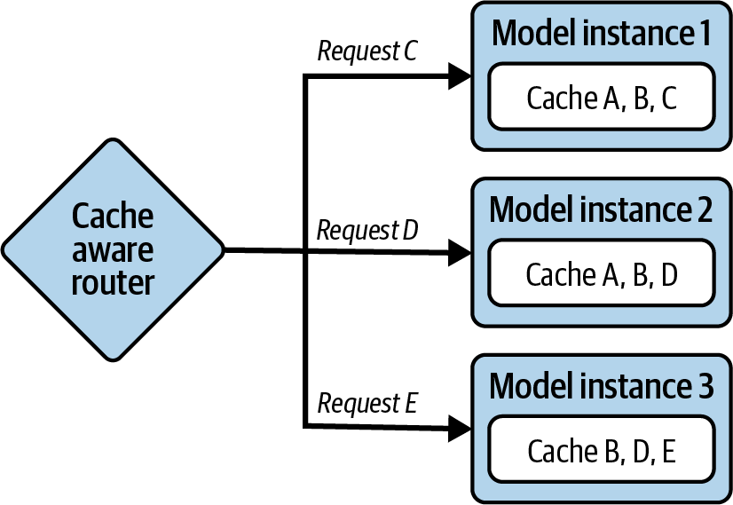

图11 缓存感知路由的简化示意图，路由器根据模型实例的请求前缀和前缀缓存，将请求路由到能实现高缓存命中率的实例</center>

每个实例只需缓存分配给自己的前缀，GPU内存压力反而降低。

---

# 四、三件套的协同效应

这几个优化不是孤立的，而是层层叠加：

1. **Continuous Batching + Chunked Prefill**，确保GPU每个forward pass都在服务尽可能多的活跃请求，prefill和decode交替调度。
2. **Kernel Fusion + FlashAttention**，确保每次forward pass计算本身尽可能快，避免HBM反复读写。
3. **PagedAttention**，确保KV Cache没有内存碎片，利用率推到接近100%。
4. **Prefix Caching**，确保共享的KV Cache只算一次，配合智能路由做横扩展。

叠加起来，同一个GPU、同一个模型，**吞吐可以获得数倍的显著提升，且对输出质量零影响。** 改的只是"怎么算"和"什么不用重算"，模型权重和计算逻辑没碰。

---

# 五、小结

这些技术攻击的都是同一个根本问题：**LLM推理中大量工作是冗余的。**

- Continuous Batching + Chunked Prefill：GPU有闲余，却在等慢请求，动态组批、prefill/decode交替。
- Kernel Fusion + FlashAttention：数据可以在SRAM里做完，却反复写回HBM，融合操作、I/O-aware。
- PagedAttention：预分配整片内存，实际只用一小部分，分页管理，近乎零浪费。
- Prefix Caching：共享前缀却各自算一遍KV Cache，缓存复用，命中一次省一次。

下一篇进入模型压缩（量化、蒸馏、剪枝），不再只改调度和内存管理方式，而是直接改造模型本身。

---

**「LLLM服务和优化：从入门到优化实战」系列共 10 篇文章，基于《Hands-On LLM Serving and Optimization》(O'Reilly 2026, Chi Wang & Peiheng Hu)：**

- 【第 1 篇】01-模型服务基础认知：从训练完的模型到可用的服务
- 【第 2 篇】02-LLM推理的内核与部署：从Token生成机制到vLLM实战
- 【第 3 篇】03-从零搭建LLM推理服务：Batching、Streaming与多模型架构
- 【第 4 篇】04-Agent时代的LLM服务架构：RAG、企业部署与Build-or-Buy
- 【第 5 篇】05-LLM推理瓶颈：GPU内存墙、算术强度与模型加载拆解
- **【第 6 篇】06-推理效率三件套：Continuous Batching、注意力内核优化与Prefix Caching**
- 【第 7 篇】07-模型压缩实战：量化、蒸馏与剪枝
- 【第 8 篇】08-进阶优化：Speculative Decoding、多GPU并行与Prefill-Decode分离
- 【第 9 篇】09-四大框架深度对比：vLLM、TensorRT-LLM、SGLang、Llama.cpp
- 【第 10 篇】10-收官：一次完整的优化实战，以及下一站

---

**参考资料**：《Hands-On LLM Serving and Optimization》, Chi Wang & Peiheng Hu, O'Reilly 2026
