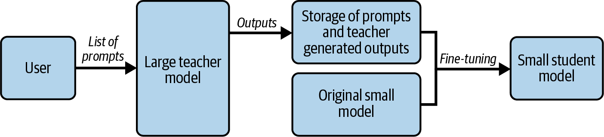
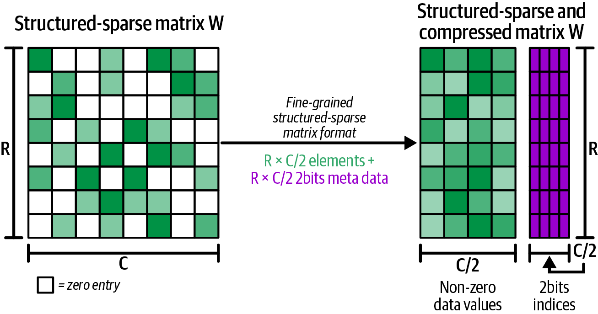

# 模型压缩实战：量化、蒸馏与剪枝

本文是「LLM服务和优化：从入门到优化实战」系列的第七篇。上一篇靠调度和缓存"省"开销，这一篇直接压缩模型：量化让70B模型从两张H100缩到一张，蒸馏让小模型学会大模型的"思维方式"，剪枝去掉沉默的神经元。逐一比较INT8/INT4/FP8的精度与显存trade-off、GPTQ与AWQ的策略差异，以及一个核心判断：为什么量化是LLM部署的第一步，而剪枝优先级远低于量化。

---

# 一、量化：最直接有效的压缩手段

## 1.1 问题：模型太大不是因为参数太多，而是精度太高

按BF16精度，7B模型约14GB，70B模型约140GB。一张H100有80GB显存，70B不量化一张卡根本放不下。即使7B级别的模型，量化也能腾出更多空间给KV Cache和更大的batch size。这是量化最现实的出发点。

量化的核心逻辑很简单：**模型的参数在训练时需要高精度（FP32/BF16）来保证梯度更新的稳定性，但在推理时，前向传播对精度远没有这么敏感。** 这就提供了一个巨大的压缩空间。

## 1.2 量化的两种范式：PTQ vs. QAT

**PTQ（Post-Training Quantization，训练后量化）**：模型训练完成后，一次性把权重从浮点转成低精度整数，不需要任何额外的训练数据或微调。校准数据用于激活量化场景下预先估算scaling factor（静态缩放），纯权重量化不需要。

优点是零训练成本，不需要完整的训练pipeline，精度损失通常很小。当前主流的LLM部署几乎都走PTQ路线。

**QAT（Quantization-Aware Training，量化感知训练）**：在训练过程中就模拟量化效果，让模型"学会"在低精度下工作。精度损失更小，但需要完整的训练流程：数据、GPU、时间。适用于对精度要求极致的高风险场景。

两张路线对比如下：

| | PTQ | QAT |
|------|------|------|
| 需要训练 | 否 | 是（通常在微调阶段进行） |
| 精度损失 | 低（通常 3% 以内） | 极低，4-bit以下唯一可靠选择 |
| 实施难度 | 极低 | 中等 |
| 适用场景 | 绝大多数生产环境 | 精度要求极高的场景 |

## 1.3 精度级别与内存节省

| 精度 | 字节/参数 | 70B模型大小 | 显存节省 |
|------|----------|-------------|---------|
| FP32 | 4 | ~280 GB | — |
| FP16 / BF16 | 2 | ~140 GB | baseline |
| INT8 / FP8 | 1 | ~70 GB | 50% |
| INT4 | 0.5 | ~35 GB | 75% |

INT8量化把70B模型从140GB压到70GB，正好能塞进一张H100的80GB显存。这意味着 **从必须用多卡张量并行到单卡就能跑**，硬件成本直接砍半或更多。

INT4进一步压到35 GB，但精度损失开始显著，通常需要结合更精密的量化方案（如GPTQ、AWQ）来保持输出质量。

## 1.4 主要量化方案：GPTQ、AWQ、FP8

**GPTQ**：一种逐层量化算法，在 4-bit量化时仍能保持较好的质量。

**AWQ（Activation-aware Weight Quantization）**：核心理念是：不是所有权重对模型输出同等重要。那些和"重要激活通道"关联的权重更重要，应该给予更高的精度。AWQ先分析激活值分布找出重要通道，再对重要通道对应的权重保留更高精度，次要通道用更低精度。

**FP8**：NVIDIA Hopper架构支持的 8 位浮点格式。不同于INT8的整数化，FP8保留了浮点的动态范围：E4M3用 1 位符号 + 4 位指数 + 3 位尾数，E5M2 用 1+5+2，前者精度更高、后者动态范围更大。注意FP8 有硬件限制：只有Hopper（H100/H200）和Blackwell架构支持，A100或更老的卡跑不了。

DeepSeek R1 + vLLM启用FP8 MLA kernel后，吞吐从38 TPS飙到 600 TPS（配合更大的batch size），15 倍提升。

三种方案对应的其实是两条路线：W4A16（仅权重量化）和W8A8（权重+激活量化）。W4A16将模型体积压到原来的 1/4，在低并发、decode为主的场景下优势最明显：瓶颈在内存带宽，数据读得越少越快。W8A8体积减半，但激活值也量化了，计算本身加速，在高并发、prefill为主时反超。简而言之：**长输出、延迟敏感 → W4A16；高吞吐、长输入 → W8A8。**

| 对比项            | W4A16                | W8A8                 |
| -------------- | -------------------- | -------------------- |
| 模型大小缩减 / 数据搬运量 | 减少 75%（缩减至原始大小的 1/4） | 减少 50%（缩减至原始大小的 1/2） |
| 计算 FLOPs       | 无变化                  | 增加至 2 倍              |
| 预填充阶段（计算受限）    | 无变化                  | 有所改善                 |
| 解码阶段（内存带宽受限）   | 有所改善（低批量场景效果更好）      | 有所改善（高批量场景效果更好）      |
| 最适用场景          | 长文本生成、延迟敏感、低批量       | 长上下文、高吞吐量、高批量        |

## 1.5 实践：用量化模型

多数主流模型在Hugging Face上已有现成的量化版本，直接用即可。如果需要自己对微调模型做量化，借助GPTQModel、AutoAWQ等工具库也很方便。以下是使用GPTQConfig做 4 位量化的示例：

```python
from transformers import AutoModelForCausalLM, GPTQConfig

gptq_config = GPTQConfig(bits=4, dataset=["calibration data..."])
quantized_model = AutoModelForCausalLM.from_pretrained(
    "Qwen/Qwen2.5-7B-Instruct",
    device_map="auto",
    quantization_config=gptq_config
)
```

启动量化模型只需`vllm serve Qwen/Qwen2.5-7B-Instruct`。在低并发场景下，GPTQ W4A16比原始模型延迟和吞吐提升约 3 倍；高并发时W8A8反超，激活值也量化后计算本身加速了。

## 1.6 量化的代价：精度与延迟的权衡

量化不是免费的午餐。主要trade-off：

- **精度损失**：量化精度损失通常较低（3% 以内），蒸馏的损失远高于量化。
- **延迟影响**：量化主要收益是减少了每次forward pass的HBM读取量（70 GB vs 140 GB），decode阶段（memory-bound）受益最大。但W4A16在高并发下可能出现反效果：计算本身还是 16 位的，没有省FLOPS，反而多了反量化开销，GPTQ W4A16在batch变大时甚至会慢于原始模型。

---

# 二、蒸馏：让小模型"学"大模型

## 2.1 原理

蒸馏本质上是在训练一个全新的小模型，和量化那种"不动架构只降精度"的思路完全不一样。它的核心逻辑是：**让一个小模型去模仿大模型的行为**，而不是从头自己学。

<center>



图1 从教师模型训练学生模型的模型蒸馏流水线</center>

具体做法：用一个"老师"模型（大模型，如70B GPT级模型）的输出来指导"学生"模型（小模型，如 7B）的训练。学生的目标不是直接拟合训练数据，而是模仿老师的输出token（hard label）和输出概率分布（soft labels / logits）。

大模型的输出（soft labels）包含了比原始训练标签更丰富的信息。以DeepSeek R1为例：原始R1有671B参数（MoE架构），蒸馏到Llama-70B后参数量减少了约 10 倍。以下是在三个benchmark上的精度对比：

| Benchmark | DeepSeek-R1-671B | DeepSeek-R1-Distill-Llama-70B |
|------|------|------|
| MATH-500 pass@1 | 97.3 | 94.5 |
| GPQA Diamond pass@1 | 71.5 | 65.2 |
| LiveCodeBench pass@1 | 65.9 | 57.5 |

精度有损，但换来了几个数量级的推理成本下降。直接训练一个同规模的小模型和蒸馏出一个模型，推理成本一样，但蒸馏模型的性能通常显著更好：它从大模型那里学到了更丰富的知识表示。

这里有一条关键限制需要注意：**蒸馏需要完整访问teacher模型的权重和输出logits**，光靠API调用拿到的token输出是不够的。如果你的teacher是GPT-4或Claude这种闭源模型，这条路走不通，只能用量化。

## 2.2 蒸馏的工程成本

蒸馏需要完整的训练流程：有标注或无标注数据 + 老师模型做推理生成输出 + 学生模型做训练 + 验证。如果有现成的蒸馏模型可用（如DeepSeek已发布多个蒸馏版），先评估它是否满足你的精度需求。如果必须自己蒸馏，成本很高：训练费用可能高达原始模型训练费用的 **10%**，且精度损失远高于量化。

量化和蒸馏的对比，一表了然：

| | 量化 | 蒸馏 |
|------|------|------|
| 精度损失 | 低（通常 3% 以内） | 远高于量化 |
| 速度提升 | 1.5x - 3x | 更大（参数量可减 10 倍以上） |
| 易用性 | 极高，只需原始模型权重 | 需要完整训练流程，成本可达原训练的 10% |

---

# 三、剪枝：砍掉"不活跃"的参数

## 3.1 结构化剪枝vs. 非结构化剪枝

**非结构化剪枝**：把权重矩阵中某些元素置零。但稀疏矩阵在GPU上不一定更高效：GPU需要特定模式的稀疏才能加速，随意置零反而可能更慢。

**结构化剪枝**：不剪单个权重，而是剪整个结构（如注意力头、层等）。剪完后的模型仍然可以用密集矩阵乘法执行，但精度损失更大。

一个更实用的折中方案是 **2:4 结构化稀疏**，每4个连续元素中只保留2个非零值（50%稀疏率）。直观来看：

<center>



图2 2:4结构化稀疏模式及压缩</center>

左边是原始矩阵，右边是压缩后的结构：每4个元素精确保留2个（灰色），另外2个被置零（白色）。这正好匹配NVIDIA从Ampere开始内置的**稀疏Tensor Core**，能原生加速这种模式，矩阵乘法直接翻倍。换句话说，不是任何稀疏都有效，必须是 2:4 这种特定模式才行，这就是为什么剪枝领域从unstructured走向了semi-structured。

## 3.2 现状：剪枝在LLM实测中不如量化流行

模型剪枝是三种压缩技术中最不受欢迎的，要让它在生产中发挥作用还需要更多的工作和研究。不过并非没有亮点：Neural Magic的Sparse Llama 3.1（2:4 结构化稀疏）在vLLM上实现了 **98% 的精度恢复、30% 更高吞吐、20% 更低延迟**。这三个数字放在一起很有说服力：精度和原始模型几乎一样，吞吐和延迟都显著改善，而它没换架构，也没做量化，纯靠稀疏化就拿到了这些收益。

一个很自然的想法：剪枝和量化能不能叠加？可以。剪枝后模型变稀疏了，再对非零权重做量化，两条路同时走，收益更大。

---

# 四、三种压缩手段的协同：选哪条路？

| 方法 | 推理加速来源 | 精度影响 | 实现难度 | 适用场景 |
|------|------------|---------|---------|---------|
| **量化 (INT8)** | 减少内存读取量 50% | <1% | 极低（框架自带） | 几乎所有的生产环境 |
| **量化 (INT4)** | 减少内存读取量 75% | 1-5% | 低（需选用特定方案） | 显存极度受限或需要极大batch size |
| **蒸馏** | 直接换更小的模型 | 取决于学生模型质量 | 高（需要训练） | 有训练资源和数据的团队 |
| **结构化剪枝** | 减少模型参数量 | 中等（需fine-tuning） | 中-高 | 特定架构的精简需求 |

**几乎每一个LLM推理部署都应该从INT8量化开始。** 这是成本最低、收益最大的第一步。如果需要进一步压缩，INT4（配合AWQ/GPTQ）是第二步。蒸馏和剪枝在当前的实践中更多是"模型训练阶段"的决策，而非"推理部署阶段"的优化。

---

# 五、小结

三种模型压缩技术的本质，可以用第 4 篇引入的"算术强度"框架来统一理解：

- **量化**在Decode阶段（memory-bound）的收益最大，因为每次forward pass从HBM读取的模型权重字节数直接减半
- **蒸馏**不改变精度，而是直接减少参数量，计算量和内存访问量都按比例缩小
- **剪枝**在内存访问上的收益来自稀疏表示，但缺乏硬件优化支持是目前的主要瓶颈

下一篇，我们进入进阶优化：**Speculative Decoding、多GPU并行与Prefill-Decode分离部署。** 这些技术的共同点是：当单卡优化到头了，怎么办？

---

**「LLLM服务和优化：从入门到优化实战」系列共 10 篇文章，基于《Hands-On LLM Serving and Optimization》(O'Reilly 2026, Chi Wang & Peiheng Hu)：**

- 【第 1 篇】01-模型服务基础认知：从训练完的模型到可用的服务
- 【第 2 篇】02-LLM推理的内核与部署：从Token生成机制到vLLM实战
- 【第 3 篇】03-从零搭建LLM推理服务：Batching、Streaming与多模型架构
- 【第 4 篇】04-Agent时代的LLM服务架构：RAG、企业部署与Build-or-Buy
- 【第 5 篇】05-LLM推理瓶颈：GPU内存墙、算术强度与模型加载拆解
- 【第 6 篇】06-推理效率三件套：Continuous Batching、注意力内核优化与Prefix Caching
- **【第 7 篇】07-模型压缩实战：量化、蒸馏与剪枝**
- 【第 8 篇】08-进阶优化：Speculative Decoding、多GPU并行与Prefill-Decode分离
- 【第 9 篇】09-四大框架深度对比：vLLM、TensorRT-LLM、SGLang、Llama.cpp
- 【第 10 篇】10-收官：一次完整的优化实战，以及下一站

---

**参考资料**：《Hands-On LLM Serving and Optimization》, Chi Wang & Peiheng Hu, O'Reilly 2026
