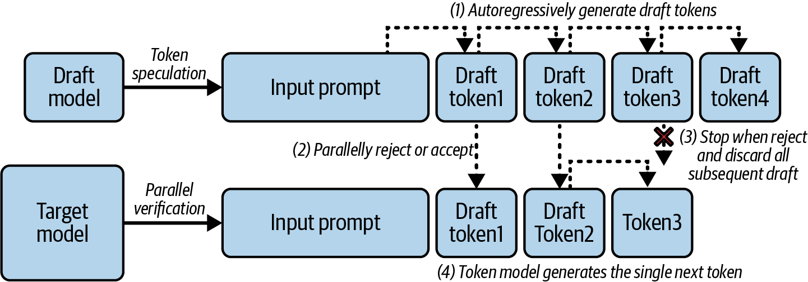
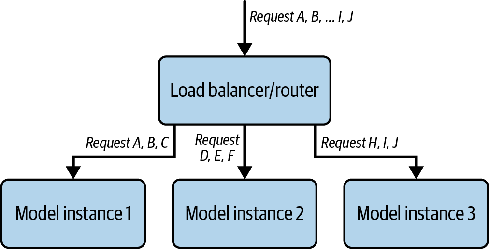
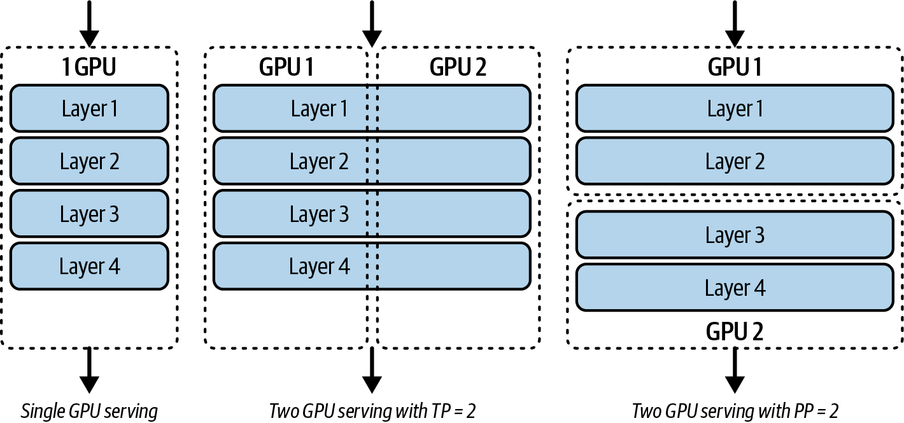
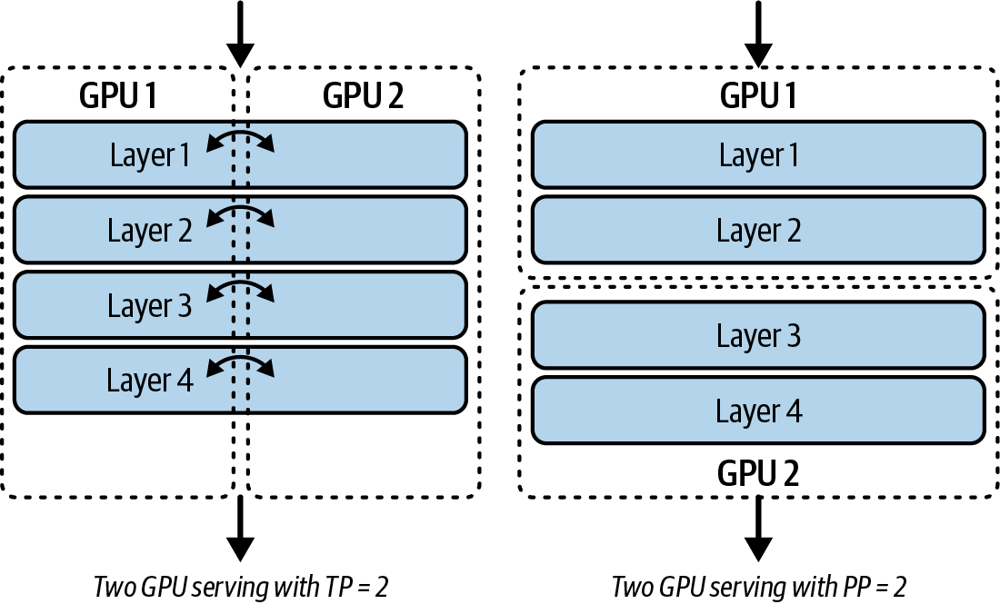
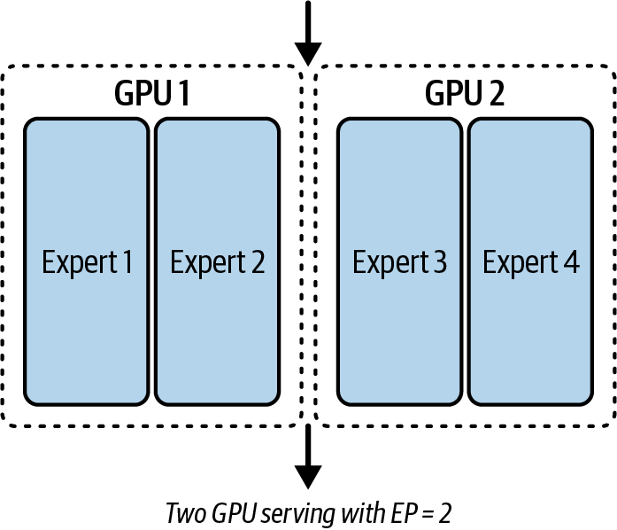
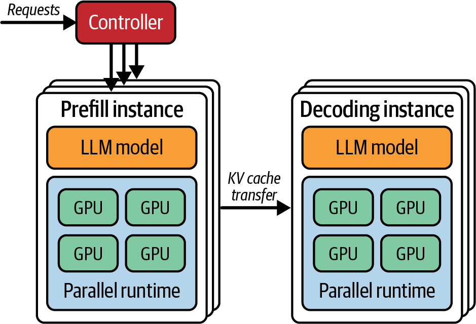
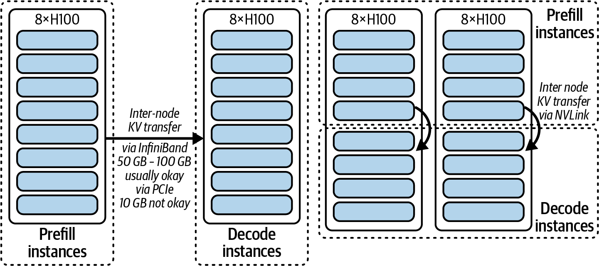
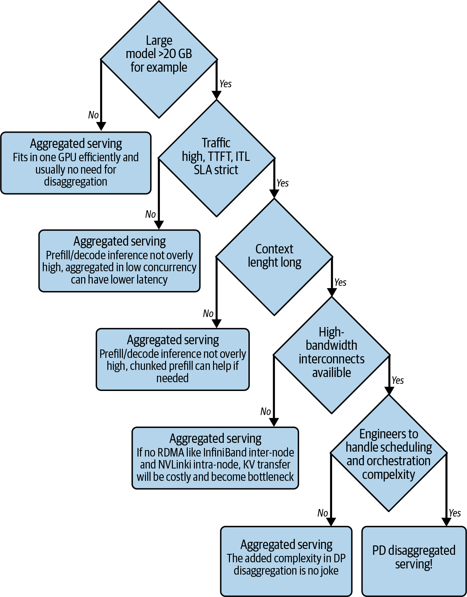
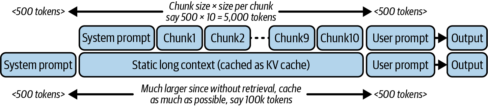

# 进阶优化：Speculative Decoding、多GPU并行与Prefill-Decode分离

本文是「LLM服务和优化：从入门到优化实战」系列的第八篇。前两篇覆盖了调度层面的"省"和模型层面的"缩"，这一篇回答"单卡优化到头了怎么办"。三个方向：Speculative Decoding用小模型猜、大模型审，打破Decode串行瓶颈；Tensor/Pipeline/Expert三种并行范式把超大模型劈到多卡；Prefill-Decode Disaggregation把两种计算拆到不同GPU池。这些技术正从"大厂专用"走向"团队标配"。

---

# 一、Speculative Decoding：让小模型"猜"，让大模型"审"

## 1.1 问题的根源：Decode是顺序的

回到第一篇的核心认知：Decode阶段每一步只生成一个token，但每一次forward pass都要从HBM读整个模型权重和KV Cache。**算力在等内存：GPU算得动，但数据搬不过来。**

如果能一次forward pass生成多个token，算术强度就提高了，内存墙的压迫就小了。但自回归的特性要求"先有当前token，才能算下一个token"，看起来这是一个死锁。

Speculative Decoding用一个巧妙的方法打破了这个死锁。

## 1.2 核心机制：草案 + 验证

<center>



图1 一次推测解码迭代分解为四个独立步骤</center>

1. **Draft（草案阶段）**：一个轻量的"草案模型"（通常为目标模型参数量的几十分之一）以自回归方式快速生成K个候选token。这K步很快，因为草案模型很小。
2. **Verify（验证阶段）**：大模型（目标模型）将这K个候选token和原始prompt一起送入，**一次forward pass** 计算它们的logits，逐一判断接受还是拒绝。如果某个候选token与大模型本会生成的一致，就接受；否则截断并用大模型的token替换。关键一点：**整个过程不损失精度**，最终输出和不用推测解码的标准自回归一致。
3. **效果**：最理想情况下，一次大模型forward pass能接受K个token。实际加速效果取决于草案模型选择、K值和场景。以Qwen3-32B为例的hands-on实验中，EAGLE-3 在低并发下达到vanilla vLLM约 2 倍的token吞吐（56.5 vs 28.9 tokens/s）。

## 1.3 实践Speculative Decoding

以下代码设置了一个示例vLLM命令服务器，包含四种不同的变体：作为基线的普通vLLM、n‐gram、旨在提高接受率并降低开销的改进型n‐gram设置，以及一个EAGLE‐3设置：

```bash
# vanilla vLLM（基线）
vllm serve Qwen/Qwen3-32B --max-model-len 2048 --gpu-memory-utilization 0.95

# n-gram（推测6个token，lookup窗口4-6）
vllm serve Qwen/Qwen3-32B \
    --speculative-config '{"method":"ngram","num_speculative_tokens":6,
      "prompt_lookup_min":4,"prompt_lookup_max":6}' \
    --max-model-len 2048 --gpu-memory-utilization 0.95

# improved n-gram（推测4个token，lookup窗口2-128）
vllm serve Qwen/Qwen3-32B \
    --speculative-config '{"method":"ngram","num_speculative_tokens":4,
      "prompt_lookup_min":2,"prompt_lookup_max":128}' \
    --max-model-len 2048 --gpu-memory-utilization 0.95

# EAGLE-3（self-drafting，推测3个token）
vllm serve Qwen/Qwen3-32B \
    --speculative-config '{"method":"eagle3",
      "model":"RedHatAI/Qwen3-32B-speculator.eagle3",
      "num_speculative_tokens":3}' \
    --max-model-len 2048 --gpu-memory-utilization 0.95
```

在低并发（concurrency=1）下，n-gram约提升 16%，EAGLE-3 接近翻倍（56.5 vs 28.9 tokens/s）。但当并发升到 16 时出现了有意思的变化：n-gram两个变体均慢于vanilla vLLM，推测和验证的额外CPU/GPU负载在高并发下成了负担。EAGLE-3仍领先但优势缩小，且**TTFT明显比vanilla vLLM长**（额外的预测头带来的开销）。这是一种TTFT换ITL的权衡。

## 1.3 关键设计选择

**草案模型的选择**：太小则猜测不准，太大则草案本身抵消加速。选择同模型家族的小版本是最佳起点：共享tokenizer和预训练语料，接受率天然更高。对草案模型做**激进量化**也可以提速，因为目标模型随时兜底。如果有训练条件，**蒸馏一个专用草案模型**比直接选现成小模型更好：对齐度更高，接受率更大。

**两种替代方案**：self-drafting（如Medusa/EAGLE）在目标模型上挂轻量预测头，省掉独立草案模型，省GPU内存、简化部署。EAGLE的做法是预测目标模型未来的内部隐状态（hidden states），而非直接预测token，准确率更高。n-gram查表更简单，从请求的历史token中匹配最近出现的序列，不依赖任何模型。

**生产建议**：推测解码最适合延迟敏感、小batch场景（prefill:decode token比低，GPU memory-bound），用ITL换取TTFT。如果你的请求多是大batch、高吞吐，推测解码在当前阶段可能得不偿失。

---

# 二、多GPU并行：当模型大到一张卡放不下

现代大语言模型的内存占用通常远超单个 GPU 的容量，而要低延迟、规模化地提供推理服务，所需算力也远非单卡能够支撑。为此，推理系统逐步转向跨节点、多 GPU 的分布式策略，其中主要涉及四种并行技术。

## 2.1 Data Parallelism（数据并行）

每个GPU持有模型的完整副本，不同的请求分发到不同的GPU。这不是"拆分大模型"，而是用多GPU提高并发吞吐。

<center>



图2 应用于三个模型实例的数据并行多</center>

优点：实现简单，框架自带；缺点：每个GPU都要装下完整模型 + KV Cache。

## 2.2 Tensor Parallelism（张量并行）

一层内的权重矩阵被切分到多个GPU上。每个GPU计算自己那部分，然后通过NVLink/NVSwitch高速互联做all-reduce通信来合并结果。

<center>



图3 使用单个GPU（左）、使用两个GPU且TP = 2（中）以及使用两个GPU且PP = 2（右）来服务一个四层模型</center>

优点：真正让一张卡放不下的超大模型能在多卡上跑；缺点：每层都需要跨GPU同步，NVLink带宽是瓶颈。同一台机器内的NVLink带宽约900 GB/s，跨机器的InfiniBand降到约 50-100 GB/s，差一个数量级。这就是为什么**intra-node优先**是铁律。

## 2.3 Pipeline Parallelism（流水线并行）

不同层放在不同GPU上。数据像流水线一样从上游GPU流到下游GPU。

<center>



图4 张量并行（左）与流水线并行（右）中的跨GPU通信</center>

优点：通信少：只在层边界交换数据；缺点：存在"流水线气泡"：后面的GPU在等前面GPU完成。micro-batching可以缓解气泡：把大batch切成小micro-batch，前几个micro-batch跑完后下游GPU就不等了。

## 2.4 Expert Parallelism（专家并行）：MoE模型专用

对于Mixture-of-Experts（MoE）架构的模型（如Mixtral 8×7B、DeepSeek-V3），**Expert Parallelism** 是更自然的选择：不同的Expert（FFN子网络）分布在不同的GPU上。每个token在推理时只激活少数Expert，路由到对应的GPU执行。优势是天然的稀疏性，不需要所有GPU同时工作。

<center>



图5 一个四专家模型在EP=2时的简单示意（其他非MoE层未显示）</center>

## 2.5 实践建议

一个务实法则：

> 优先考虑intra-node（单机多卡）而非inter-node（多机）。同一台机器内通过NVLink互联的多GPU做TP，比跨多台机器通过InfiniBand互联快得多。如果模型大到必须跨节点，优先考虑Pipeline Parallelism而非Tensor Parallelism。

vLLM中通过 `--tensor-parallel-size 4` 实现单机 4 卡张量并行。

---

# 三、Prefill-Decode Disaggregation：拆开两个世界

## 3.1 动机

Prefill是compute-bound，Decode是memory-bound。把它们放在同一张GPU上运行意味着：

- Prefill时GPU的算力被充分利用，但Decode请求被阻塞。
- Decode时GPU的算力被浪费，HBM带宽被占满。
- **同一张卡无法同时为两种计算做最优配置**。

## 3.2 分离架构

<center>



图6 DistServe的预填充‐解码分离架构</center>

**Prefill instance**：一组GPU专做prefill。这些GPU可以配置更强的TFLOPS（算力优先），不需要特别在意HBM带宽。

**Decode instance**：另一组GPU专做decode。这些GPU配置高HBM带宽（带宽优先），不需要特别在意TFLOPS。

请求的流程变为：

1. 用户请求到达Prefill Pool → 完成prefill，生成KV Cache
2. **KV Cache被转移到Decode Pool**。这是整个架构中最关键的一步
3. Decode Pool从KV Cache开始逐token生成
4. 完成状态返回给用户

## 3.3 KV Cache Transfer：最难的部分

KV Cache转移是这个架构的核心挑战。一个具体的例子：8B模型 + 1024 token输入，KV Cache约 0.1-0.15 GB。以每秒 16 个请求计算，每秒需传输约 25 GB的KV Cache。用RDMA配合InfiniBand等高速网络（50-100 GB/s），节点间传输才变得可行，PCIe只有约 10 GB/s。

<center>



图7 两种不同的GPU分配对比，左侧为节点间通信，右侧为节点内通信</center>

除了高速网络，还有四项优化可以进一步降低传输开销：

- **分块传输**：不等整个KV Cache完成才发，完成一chunk发一chunk，像视频流一样。
- **计算与传输重叠**：用异步非阻塞操作，prefill GPU还在算的时候传输已经在背后跑了，decode GPU更早开始工作。
- **逐层传输**：KV Cache是每层独立的，一层算完就可以传这层的KV Cache，decode端可以先从已完成层开始工作。
- **KV Cache压缩**：把KV Cache压到更紧凑的格式再传输。

四项优化做足后，PD分离的传输开销可以降到总延迟的**不到 1%**。

那是不是默认就该用PD分离？不。使用规则很简单：**大模型、高负载、有TTFT/ITL精细调优需求的场景用PD分离；小模型用聚合式服务更简单高效。**

<center>



图8 何时选择聚合服务与PD分离服务的决策流程图</center>

---

# 四、成本与延迟：一个RAG vs CAG的算账案例

前面讲了很多技术，但落地时绕不开一个更现实的问题：**自建推理到底划不划算？**

做一个RAG vs CAG的成本推演。假设一个应用每秒 100 个请求，每个请求检索 5 个文档chunk，平均用户问 25 个token，检索到的文档合计 1000 token，系统prompt约 1000 token。模型输出约 200 token。GPU实例成本约 $3/小时。

<center>



图9 RAG服务（上）与长上下文CAG服务（下）的输入令牌对比示例</center>

**RAG模式**：每个请求约 3300 token上下文（system prompt + 检索文档 + 用户问题 + 输出）。每秒 100 请求 = 每秒 330,000 token。输出token 200 × 100 = 每秒 20,000 token。需要约 2 个H100 GPU实例，月成本约 **$4,380**。

**CAG模式**（缓存增强生成）：用前缀缓存把KV Cache常驻GPU内存，省掉对静态上下文（system prompt + 检索文档）的重复prefill。实际每次只需处理用户问题和输出部分，输入token从 3300 降到约 225。同等工作负载下，GPU实例从 2 个降到 1 个，月成本约 **$2,190**，**砍半**。

这个推演的核心启示不是"CAG一定比RAG好"，而是：**即使看起来只是缩短了prefill的输入，实际省钱幅度可以对半开。** 如果你的模型够大、请求量够高，自建推理换成开源模型 + 前缀缓存，相比全托管API（如OpenAI）可能便宜 30%-60%。如果再预留实例（reserved instance），还能再打个三折。

当然，自建意味着需要维护基础设施、处理故障和升级，对于小型团队和早期验证阶段，全托管API依旧是更合理的选择。

---

# 五、长上下文推理：KV Cache的终极压力测试

## 5.1 长上下文的真实成本

一个常见的 8B参数模型，1024 token输入的KV Cache约 0.1-0.15 GB。输入长度延长 10 倍，KV Cache就到 1-1.5 GB。128K上下文的压力可想而知：KV Cache随序列长度线性增长，长上下文场景下的显存压力非常真实。

## 5.2 应对策略

**KV Cache量化**：把KV Cache压到更低精度。传统的KV Cache量化之外，LMCache的CacheGen将KV Cache编码为更紧凑的bitstream，不是简单地降精度，而是用类似压缩算法的方式编码，存储和传输开销大幅减小。

**KV Cache Offloading**：不常访问的KV Cache卸载到CPU内存（更大但更慢），高频片段留在GPU HBM中。LMCache的CacheBlend走得更远：当不同RAG chunk的KV Cache有重叠时，不是各自存一份，而是合并成一份共享缓存，减少重复存储。

---

# 六、三种进阶优化的适用场景总结

| 技术 | 解决什么问题 | 适用场景 | 额外成本 |
|------|------------|---------|---------|
| **Speculative Decoding** | Decode太慢（内存墙） | 有可用的草案模型，解码类任务 | 草案模型训练/部署 |
| **Multi-GPU Parallelism** | 单卡放不下模型 | 大模型（>70B）或需要大batch | 多GPU + NVLink |
| **Prefill-Decode Disaggregation** | Prefill和Decode争抢同一张卡 | 大规模集群、流量模式不一 | KV Cache网络传输 |
| **KV Cache量化/卸载** | 长上下文KV Cache太大 | 超长上下文场景 | 精度可能微降 |
| **自建推理vs全托管** | 推理成本随规模失控 | 请求量足够大、团队有能力维护 | 运维人力 + 硬件投入 |

---

# 七、小结

这一篇讲了五种"单卡不够用了怎么办"的技术。它们解决的是不同的瓶颈：

- **Speculative Decoding**：解决Decode的串行瓶颈，让每次forward pass处理更多token。
- **多GPU并行**：解决容量瓶颈，让超大模型能跑在多卡上。
- **Prefill-Decode分离**：解决异构工作负载瓶颈，让两种不同性质的计算各自独立优化。
- **长上下文优化**：解决KV Cache的膨胀问题，让 128K+ 上下文在可承受的显存下跑。
- **成本与延迟推演**：把技术优化翻译成真实的省钱数字，前缀缓存让GPU实例减半，月费从$4,380砍到$2,190。

下一篇是这个系列最实战的一篇：**四大LLM推理框架（vLLM、TensorRT-LLM、SGLang、Llama.cpp）的深度对比。** 当你了解了前面所有的优化技术后，回到框架选型，每个框架的优势和劣势就有了坚实的直觉基础。

---

**「LLLM服务和优化：从入门到优化实战」系列共 10 篇文章，基于《Hands-On LLM Serving and Optimization》(O'Reilly 2026, Chi Wang & Peiheng Hu)：**

- 【第 1 篇】01-模型服务基础认知：从训练完的模型到可用的服务
- 【第 2 篇】02-LLM推理的内核与部署：从Token生成机制到vLLM实战
- 【第 3 篇】03-从零搭建LLM推理服务：Batching、Streaming与多模型架构
- 【第 4 篇】04-Agent时代的LLM服务架构：RAG、企业部署与Build-or-Buy
- 【第 5 篇】05-LLM推理瓶颈：GPU内存墙、算术强度与模型加载拆解
- 【第 6 篇】06-推理效率三件套：Continuous Batching、注意力内核优化与Prefix Caching
- 【第 7 篇】07-模型压缩实战：量化、蒸馏与剪枝
- **【第 8 篇】08-进阶优化：Speculative Decoding、多GPU并行与Prefill-Decode分离**
- 【第 9 篇】09-四大框架深度对比：vLLM、TensorRT-LLM、SGLang、Llama.cpp
- 【第 10 篇】10-收官：一次完整的优化实战，以及下一站

---

**参考资料**：《Hands-On LLM Serving and Optimization》, Chi Wang & Peiheng Hu, O'Reilly 2026
