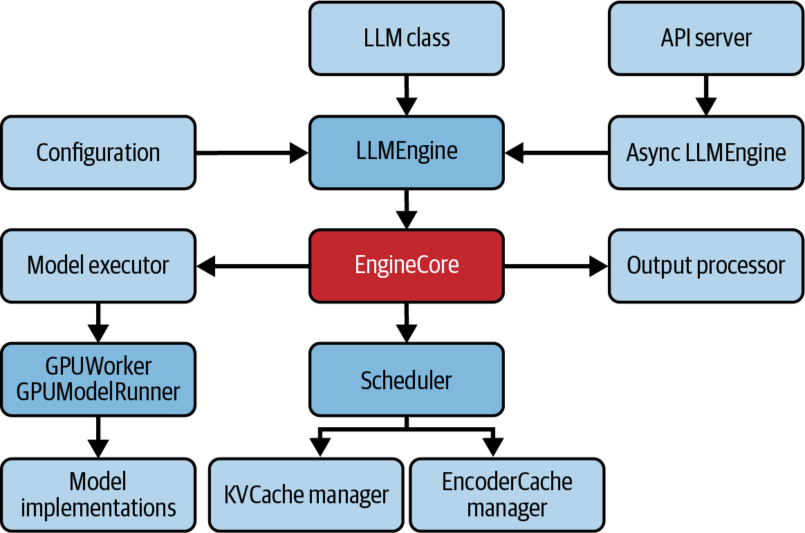

# 四大框架深度对比：vLLM、TensorRT-LLM、SGLang、Llama.cpp

本文是「LLM服务和优化：从入门到优化实战」系列的第九篇。前面八篇掰开揉碎了讲优化技术，这一篇回到最实际的问题：用哪个框架？vLLM的PagedAttention为什么是默认首选？TensorRT-LLM的图编译凭什么追求极致效率？SGLang的RadixAttention在Agent场景为什么更有优势？Llama.cpp凭什么让7B模型跑在MacBook上？本篇给出清晰的选型矩阵和一条起步建议：从vLLM开始。

---

# 一、为什么需要"专门"的LLM推理框架？

在回答"选哪个"之前，先回答"为什么不能用通用ML框架"。

通用ML推理框架（TensorFlow Serving、TorchServe等）的设计假设是：模型输入固定大小、单次forward pass出结果、无状态。但**LLM的推理特点是**：自回归循环、KV Cache的状态管理、可变长度的输入输出、两个计算阶段（Prefill/Decode）的异构资源需求。

这些特征催生了对KV Cache内存管理、Continuous Batching、Token-level调度、前缀缓存复用、量化内核等专用需求。通用框架要么不支持，要么效率极低。

---

# 二、vLLM：开源社区的默认选择

vLLM由UC Berkeley的Sky Lab开发，是目前最广泛使用的开源LLM推理框架。

## 2.1 核心设计

- **PagedAttention**：vLLM的招牌技术。灵感来自操作系统的虚拟内存分页管理：把KV Cache拆成固定大小的"块"（block），按需分配、按需回收，解决KV Cache的内存碎片问题。不做PagedAttention时，KV Cache的显存利用率通常在 20-40%；启用后接近 100%。
- **Continuous Batching**：token级别的调度，prefill和decode可以在同一个batch中混跑。
- **Prefix Caching**：自动检测和复用共享前缀的KV Cache块，减少重复的prefill计算。

量化支持：原生AWQ、GPTQ、FP8。

## 2.2 架构深入

<center>



图1 vLLM系统架构</center>

vLLM的核心组件：

- **Scheduler**：决定哪些请求进入下一个batch。维护两个主要队列：WAITING（等待处理）和RUNNING（正在执行），并支持抢占（preemption）机制
- **KVCacheManager**：管理KV Cache块的分配和回收
- **ModelRunner / Worker**：封装模型执行，支持单GPU和多GPU（Tensor Parallelism）

## 2.3 适合谁

vLLM是 **最"即插即用"的选择**。生态成熟、文档完善、社区活跃、与Hugging Face模型库无缝对接。如果你的团队对推理优化的经验不多，vLLM是最安全的起点。

---

# 三、TensorRT-LLM：NVIDIA的极致性能方案

## 3.1 设计哲学

TensorRT-LLM是NVIDIA基于TensorRT推理引擎构建的LLM专用框架。它的哲学和vLLM完全不同：不是"好用就行"，而是"把硬件榨到极致"。

## 3.2 核心特性

- **图编译与深度优化**：从模型checkpoint构建高度优化的TensorRT engine，编译时做算子融合、内存分配优化、kernel自动调优。对NVIDIA GPU架构有特定的kernel优化路径，追求在NVIDIA硬件上的极致效率（best-in-class efficiency）。
- **In-flight Batching**：TRT-LLM版本的Continuous Batching。
- **量化**：支持FP8、FP4、INT4、INT8等多种精度。
- **NVIDIA生态集成**：与Triton Inference Server和Dynamo深度集成，适合已经标准化在NVIDIA技术栈上的团队。TRT-LLM的高层API非常简洁：

```python
llm = LLM(model="Qwen/Qwen3-7B")
prompts = ["Hello, my name is", "The capital of France is"]
sampling_params = SamplingParams(temperature=0.8, top_p=0.95)
for output in llm.generate(prompts, sampling_params):
    print(output.prompt, output.outputs[0].text)
```

## 3.3 代价

- 仅运行在NVIDIA GPU上，与NVIDIA生态深度绑定
- 与Hugging Face模型的兼容性不如vLLM直接，需借助TensorRT工具链

## 3.4 适合谁

对延迟/吞吐有极致要求的场景，且团队有能力投入编译和调试的时间。典型场景：单模型的高流量API服务（类似OpenAI的后端），硬件和模型架构相对固定。

---

# 四、SGLang：结构化生成为核心

## 4.1 设计哲学

SGLang的特点是同时兼顾高性能推理和结构化生成：作为"high-performance serving framework"，它在内核、缓存、调度层面做足优化，同时在Agent、多步工作流、结构化输出（structured generation：函数调用、代码生成、JSON/Regex约束）场景中有独特优势。

## 4.2 核心特性

- **RadixAttention**：基于前缀树结构的KV Cache管理。所有请求的prompt被插入到一棵共享树中，匹配到最长复用段后只需为不匹配的部分做prefill。
- **SGLang DSL**：一种Python领域特定语言，允许你声明式地描述LLM调用、分支、并行、循环，对于Agent工作流中复杂的调用模式很方便。
- **Continuous Batching + Chunked Prefill**：和vLLM类似，支持prefill与decode在同一batch中混跑。
- **多硬件支持**：不仅限于NVIDIA，还支持AMD Instinct、CPU、TPU、Jetson Orin、Ascend。

一个简单的用法示例：

```python
llm = sgl.Engine(model_path="Qwen/Qwen3-7B")
prompts = ["Hello, my name is", "The capital of France is"]
sampling_params = {"temperature": 0.8, "top_p": 0.95}
outputs = llm.generate(prompts, sampling_params)
for prompt, output in zip(prompts, outputs):
    print(prompt, output["text"])
```

## 4.3 与vLLM的核心差异

- SGLang的RadixAttention在多轮对话/Agent/共享长前缀场景中可能具有更高的前缀缓存命中率
- SGLang的性能有竞争力，在某些工作负载上更好，而vLLM目前拥有更大的开源社区和生态

## 4.4 适合谁

Agent平台、多轮对话系统、需要频繁处理结构化输出的场景。如果系统prompt + 历史消息构成了大部分的prompt内容，SGLang的前缀缓存命中率可能会非常高。

---

# 五、Llama.cpp：消费级硬件的LLM推理

## 5.1 设计哲学

Llama.cpp走的是完全不同的路：**目标是让LLM在消费级硬件上跑起来。** 不需要NVIDIA GPU，不需要CUDA，一台MacBook就能跑 7B模型。

## 5.2 核心特性

- **C/C++ 核心实现，最小化依赖**：启动快，依赖少，模型以GGUF格式打包（通常从Hugging Face checkpoint转换而来）。
- **GGUF格式 + 极致量化**：支持 2-8 bit的多种量化级别。在低比特量化下，模型内存占用大大降低。
- **Metal/CUDA/ROCm/Vulkan多后端**：虽然可以纯CPU运行，但也可通过Metal（Apple Silicon）、CUDA（NVIDIA）、ROCm（AMD）、Vulkan（跨平台）加速。
- **CPU推理优化**：利用SIMD指令加速CPU推理。

```python
from llama_cpp import Llama
llm = Llama.from_pretrained(repo_id="Qwen/Qwen3-8B-GGUF", filename="*Q8_0.gguf", verbose=False)
output = llm("Q: Name the planets in the solar system? A: ", max_tokens=32)
```

如果需要更简单的使用体验，**Ollama** 在 llama.cpp 之上做了封装，用一行命令就能拉起本地模型，适合开发调试和快速体验。

## 5.3 与GPU框架的区别

- 不是为数据中心GPU集群设计的：是为笔记本、台式机、边缘设备设计的
- 面向低并发场景（通常单用户），复杂的批处理和调度优化在这里价值有限，这是设计目标的差异
- 性能目标不是"最大吞吐"，而是"用最少的硬件、最低的成本跑起来"

## 5.4 适合谁

在本地设备上跑LLM的个人开发者、需要在边缘设备做推理的场景、对成本极度敏感且可以接受较低吞吐的团队。

---

# 六、选型指南：什么时候用哪个

| 场景 | 推荐框架 | 理由 |
|------|---------|------|
| **GPU服务器，通用LLM推理** | vLLM | 生态最成熟，社区最大，PagedAttention + prefix caching |
| **GPU服务器，NVIDIA生态极致效率** | TensorRT-LLM | 深度CUDA/Tensor Core优化，Triton/Dynamo集成 |
| **GPU服务器，Agent/多轮对话** | SGLang | RadixAttention前缀复用效率高，对多步调用友好 |
| **消费级硬件/边缘设备** | Llama.cpp | CPU推理为核心优势，GGUF量化，多后端支持 |
| **MacBook本地开发** | Llama.cpp | Metal加速 + GGUF量化，便携低成本的本地推理 |
| **多GPU/大模型（>70B）** | vLLM或TensorRT-LLM | TP/PP成熟度最高 |

建议是：**从vLLM开始。** 如果遇到特定场景需求（极致效率、Agent工作流、本地推理），再根据实际瓶颈考虑其他框架。

框架选型不是一次性的。LLM推理领域演进极快，新架构、新kernel、新量化方案月月都有。建议每 3-6 个月重新评估一次框架选择，同时在应用层建立框架抽象层，保持随时可迁移的能力。**不要在框架上深度绑定。**

---

# 七、小结

四大框架本质上是对"不同需求和场景"的不同回答：

- **vLLM**：最广泛的模型覆盖和最好的社区生态，"just works"的稳健选择
- **TensorRT-LLM**：在NVIDIA GPU上追求极致效率，与NVIDIA生态（Triton/Dynamo）深度集成
- **SGLang**：在Agent和多步工作流场景中有独特优势，同时支持多供应商硬件
- **Llama.cpp**：开辟了一个新维度：让LLM在消费级硬件和边缘设备上高效运行

下一篇，也就是这个系列的最后一篇：**端到端优化实战 + 前沿技术（语义缓存、多模态推理、Multi-LoRA、Edge AI、RL推理服务）。**

---

**「LLLM服务和优化：从入门到优化实战」系列共 10 篇文章，基于《Hands-On LLM Serving and Optimization》(O'Reilly 2026, Chi Wang & Peiheng Hu)：**

- 【第 1 篇】01-模型服务基础认知：从训练完的模型到可用的服务
- 【第 2 篇】02-LLM推理的内核与部署：从Token生成机制到vLLM实战
- 【第 3 篇】03-从零搭建LLM推理服务：Batching、Streaming与多模型架构
- 【第 4 篇】04-Agent时代的LLM服务架构：RAG、企业部署与Build-or-Buy
- 【第 5 篇】05-LLM推理瓶颈：GPU内存墙、算术强度与模型加载拆解
- 【第 6 篇】06-推理效率三件套：Continuous Batching、注意力内核优化与Prefix Caching
- 【第 7 篇】07-模型压缩实战：量化、蒸馏与剪枝
- 【第 8 篇】08-进阶优化：Speculative Decoding、多GPU并行与Prefill-Decode分离
- **【第 9 篇】09-四大框架深度对比：vLLM、TensorRT-LLM、SGLang、Llama.cpp**
- 【第 10 篇】10-收官：一次完整的优化实战，以及下一站

---

**参考资料**：《Hands-On LLM Serving and Optimization》, Chi Wang & Peiheng Hu, O'Reilly 2026
