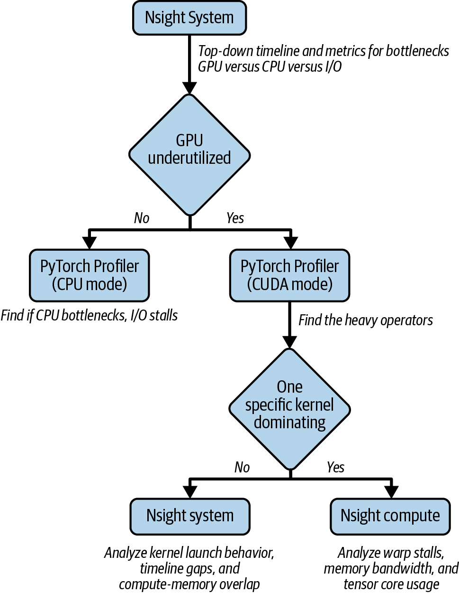
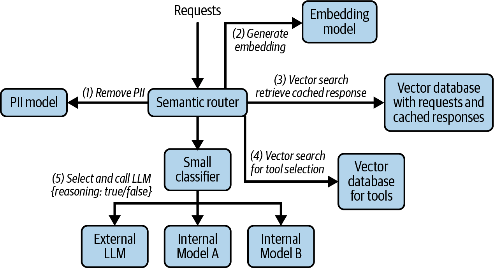
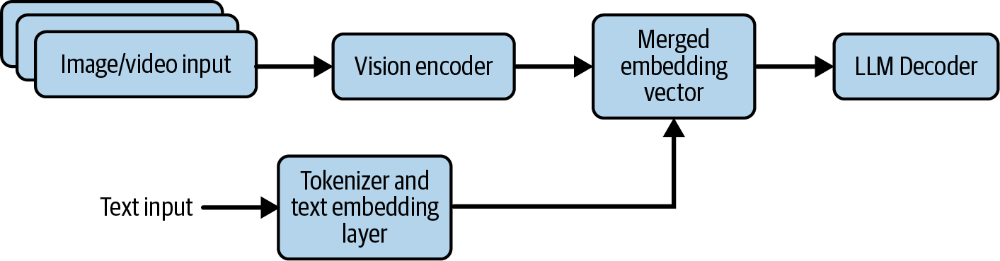
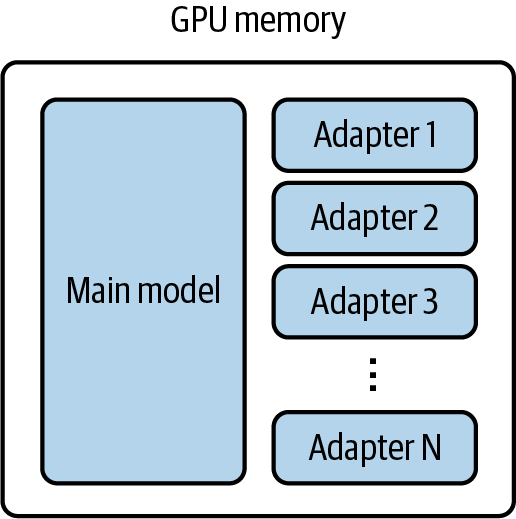
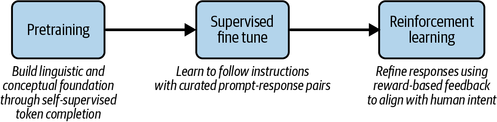

# 收官：一次完整的优化实战，以及下一站

这是「LLM服务和优化：从入门到优化实战」系列的第十篇，也是收官之作。前面九篇讲透了每一项优化技术，这一篇做两件事：第一，带你跑完Qwen3-14B在vLLM上的完整优化流程，从GPU规格到量化调参到分布式扩展，把前面所有知识串起来；第二，往前看LLM优化的下一站：语义路由、多模态、Multi-LoRA、Edge AI、RL推理闭环。读完带走的不是"最佳实践清单"，而是一套可以自己迭代的心智模型。

---

# 一、端到端优化实战：Qwen3-14B on vLLM

这是《Hands-On LLM Serving and Optimization》中的一个完整优化案例研究。书选择的场景是：在NVIDIA GPU上用vLLM推理Qwen3-14B模型，目标是在满足延迟SLA的前提下最大化吞吐。下面是完整的八步流程。

## Step 1: 检查硬件

首先，确认GPU的真实规格。实验使用了AWS EC2 g6e.2xlarge实例，搭载一块 **NVIDIA L40S GPU**（48 GB显存）。使用 `nvidia-smi` 检查：

```bash
nvidia-smi --query-gpu=name,compute_cap,memory.free,memory.used,memory.total --format=csv
```

三个核心数字决定了优化方向：**HBM容量（48 GB）、HBM带宽（~0.86 TB/s）、FP16 Tensor Core TFLOPS（~362）。** 如果模型权重 + KV Cache超过显存容量，量化或TP是必须的；如果Decode太慢，提高HBM利用率是关键。

## Step 2: 生成基准流量

不要用均匀分布的人造数据做benchmark。实验使用了两个互补的数据集：**ShareGPT**（真实对话数据，覆盖多样化的prompt长度和回复风格）和 **Prefix Repetition**（合成数据集，测试前缀重复模式下的缓存表现）。真实流量的特征（长短序列混合、有无重复前缀）对优化结论影响很大。

## Step 3: 定义评估指标

区分你关心的指标：

- **Total Token Throughput（TPS）**：整体吞吐。优化方向：增大batch size、Continuous Batching。
- **Output Token Throughput（TPS）**：输出token吞吐，LLM成本的主要驱动。
- **Mean TTFT**（Time To First Token）：平均首token延迟，反映prefill效率。
- **Mean ITL**（Inter-Token Latency）：平均token间延迟，影响流式输出的用户体验。

## Step 4: 部署基准模型

```bash
vllm serve Qwen/Qwen3-14B
```

先跑baseline，记录所有指标作为优化基准。从服务日志看到，模型权重占 27.5 GB，KV Cache分配了 11 GB（72,064 tokens）。

## Step 5: 基准测试

用Step 2 的流量跑基准。用ShareGPT数据集（2000条prompts，10 req/s）得到基线：总吞吐 474 TPS，Mean TTFT 104 ms，Mean ITL 43 ms。再用Prefix Repetition数据集测试缓存表现。这是你的"优化前"参照系。

## Step 6: 量化

先用默认配置测试量化模型。启动AWQ量化版：`vllm serve Qwen/Qwen3-14B-AWQ`。量化效果立竿见影：模型从 27.5 GB降到 9.4 GB，KV Cache内存从 11 GB扩到 29 GB（token容量从 72,064 翻到 191,056）。ShareGPT流量下，总吞吐从 474 TPS提升到 1280 TPS（2.7 倍），平均TTFT从 104 ms降到 59 ms。

量化确认有效后，再进一步细调。一个典型的调参后的启动脚本长这样：

```bash
vllm serve Qwen/Qwen3-14B-AWQ \
    --quantization awq \
    --gpu-memory-utilization 0.95 \
    --max-model-len 1024 \
    --block-size 16 \
    --enable-prefix-caching \
    --max-num-seqs 8 \
    --max-num-batched-tokens 8192 \
    --enable-chunked-prefill
```

每个参数的作用：
- `--gpu-memory-utilization 0.95`：量化后模型小了，允许vLLM使用高达 95% 的HBM，给KV Cache更多空间
- `--max-model-len 1024`：根据业务场景限制最大序列长度，控制KV Cache上限
- `--block-size 16`：KV Cache的块大小。较小的块减少碎片但增加管理开销，16 是常见折中
- `--enable-prefix-caching`：开启自动前缀缓存
- `--max-num-seqs 8`：控制并发请求数。调大了吞吐高但延迟可能上升
- `--max-num-batched-tokens 8192`：每次batch的token上限。太大 → 延迟不可控；太小 → GPU利用不充分
- `--enable-chunked-prefill`：防止长prefill阻塞decode

与Step 5 的基准结果对比，记录每个改动对指标的影响。

## Step 7: 更多优化

根据Step 6 的结果，进一步尝试：

- 增加batch size（如果GPU利用不足）
- 调整 `max_num_seqs`（如果延迟可接受但吞吐不达标）
- 尝试 **LMCache**（长上下文/prefill-heavy场景）和 **Speculative Decoding**（长输出/decode-heavy场景）

## Step 8: 分布式推理

如果单卡不够，使用Tensor Parallelism：

```bash
vllm serve Qwen/Qwen3-14B-AWQ --tensor-parallel-size 2
```

使用量化模型做分布式推理，分别在g6e.12xlarge（4×L40S）和p4d.24xlarge（8×A100）上做了对比。

**不要过度调参。** 现代推理框架越来越智能，很多参数在启动时会根据硬件自动推断合理值。作者的经验是："我们把大部分精力花在决定'该用哪些优化技术'，而不是'把某个参数调到完美'。"

---

# 二、LLM推理的边界在扩张：四条前沿路线

八步优化围绕着"让一个模型在一张GPU上跑得更快更省"这个核心命题展开。但LLM推理的边界远不止于此。四个方向正在延伸这个边界：

- **从服务层到底层**：八步优化是服务层的配置调优。如果想继续往下挖，还有框架层和运行时层的性能分析。
- **从缓存到路由**：Prefix Caching只认精确前缀。换成看"意思"而不是看"字面"，命中率大幅提升。再往前走一步——不只是缓存答案，还能根据问题复杂度自动选模型、配工具。
- **从文本到多模态到边缘**：输入从纯文字扩展到图片/视频/音频，模型变体（LoRA）需要并发服务，运行环境从数据中心GPU下沉到手机端。
- **从推理到训练**：RL在推理阶段采样reward并回传训练，推理不再是单向的终点，而是训练闭环的一部分。

## 2.1 路线一：从服务层到底层 —— 性能分析

八步走完，如果还想再挤出几个百分点的性能，在大规模部署下，一个百分点可能省下百万美元，就需要进入性能分析的领域。性能分析分三层，从上到下越来越底层：

1. **服务层**：最顶层，收集吞吐、TTFT、ITL、GPU利用率、内存使用等指标，做配置调优。这一步八步优化已经覆盖了。
2. **框架层**：使用PyTorch Profiler等工具，看模型的计算图里到底是哪个算子（matmul、attention、layernorm）在吃时间。比如attention的softmax kernel可能反复从HBM加载大张量而不是留在SRAM里，找到后可以替换成更高效的kernel实现。
3. **运行时层**：当框架层定位到某个kernel是瓶颈后，用NVIDIA Nsight Systems看系统级timeline——GPU看起来利用率高，但kernel之间有没有大的空闲间隙？是不是CPU喂数据太慢？再用Nsight Compute深入到单个kernel内部——warp占用率够不够？是不是频繁的memory stall？这些都是微架构级别的细节。

<center>



图1 端到端性能分析决策流程图</center>

决策逻辑很简单：先看GPU忙不忙。不忙→从框架层找CPU侧的瓶颈。忙但延迟仍然高→找到最耗时的算子。单个kernel占时间→Nsight Compute钻进去。没有单个kernel占时间→回到Nsight Systems看kernel间的启动开销和同步问题。

## 2.2 路线二：从缓存到路由 —— 语义缓存与智能路由

Prefix Caching的核心局限是：它匹配的是**tokens**，不是**意思**。"How long is the flight from Seattle to Hawaii?"和"Tell me how many hours it takes to fly from Seattle to Hawaii."问的是同一件事，但因为token序列完全不同，前缀缓存对此无能为力。

语义缓存的起点很简单：**用embedding模型把请求转为向量，匹配语义相似的请求**。上面这两个问法，向量距离很近，缓存命中。

<center>



图2 一个带有语义路由器的示例系统，将请求路由到多个LLM</center>

但这只是个起点。顺着这个方向往前推一步，如果同样的问题不应该重复算，那简单的问题为什么非要调用最大的模型？一套完整的语义路由系统可以做四件事：

- **语义缓存**：用embedding向量匹配历史请求，相似度过阈值则直接返回缓存响应，省掉LLM调用，延迟趋近于零。
- **智能模型选择**：缓存没命中时，不是所有问题都需要最大模型。用轻量分类器（如ModernBERT）根据embedding向量判断问题复杂度：简单问候走小模型，复杂推理走大模型，甚至决定是否开启推理模式。很多企业正在转向 8B-32B 的 task-specific 小模型，在这些场景下的性能和可靠性不输甚至超过通用大模型。
- **工具过滤**：在Agent场景中，可用工具可能几十上百个。把所有工具描述都发给LLM会撑爆context。语义路由用向量搜索筛选出最相关的几个工具，在Model Context Protocol（MCP）框架下越来越常见。
- **PII掩码**：路由层在处理请求的第一步先做隐私检测，用轻量NER模型将姓名、邮箱等敏感信息替换为占位符。下游日志、缓存和路由决策永远不会暴露原始隐私数据。

这四项能力从同一个出发点自然延伸出来：**让系统学会"看懂"请求，不再盲目地调最大模型。**

## 2.3 路线三：从文本到多模态到边缘 —— 推理场景的横向扩展

### 2.3.1 多模态推理：不只是文本

**LLM推理正在从纯文本扩展为多模态**：接受图片、视频、音频输入，但仍生成文本token。讨论范围明确限定为接受多模态输入但仍用标准自回归解码器生成文本的语言模型，不涉及Midjourney/Sora等生成图像/视频的扩散模型。

<center>



图3 VLM中文本和视觉输入的双流处理</center>

一个简单的多模态输入示例——传一张图片加一段文字：

```python
messages = [{
    "role": "user",
    "content": [
        {"type": "image", "image": image},
        {"type": "text", "text": "Describe this image."},
    ],
}]
```

经过prompt模板处理后，文本token被映射为文本embedding，图像placeholder被Vision Encoder处理后的embedding替换。Vision Encoder将图片切成小块（patch），每个patch投影到LLM的隐藏维度，让patches之间互相attend并编码全局的空间和语义关系。

对推理框架的影响：
- **异构模型流水线**：不同的模态需要不同的模型架构和硬件资源
- **预处理成为瓶颈**：图像token的裁剪、缩放、张量变换都在CPU上顺序完成，请求速率上升时CPU先成为瓶颈，GPU反而空闲等待
- **带宽需求激增**：图像和视频帧的token数远超文本

vLLM v0 → v1的架构演进提供了一个直观的解法。v0中多模态预处理和API server开销经常阻塞CPU操作，导致GPU空闲。v1将预处理卸到独立的CPU进程，与GPU推理循环并行运行——GPU持续被喂数据，利用率接近满载，文本和多模态工作负载的吞吐都大幅提升。

### 2.3.2 Multi-LoRA：一个基础模型，多个适配器

LoRA（Low-Rank Adaptation）是一种参数高效的微调方法：不修改原始模型权重，只训练少量的低秩适配器矩阵，但能让同一个基础模型表现出不同的行为。

Multi-LoRA推理意味着：**同一个GPU上的同一个基础模型，可以同时服务多个不同的LoRA适配器**。用户A的请求走"客服适配器"，用户B的请求走"代码适配器"，共享同一个base model的权重，只在推理时挂不同的LoRA矩阵。重点讨论了SGLang的multi-LoRA batching和Punica kernel。

<center>



图4 多个LoRA适配器与主模型共存于GPU内存中</center>

### 2.3.3 Edge AI：LLM走向边缘设备

在前面的文章里，我们讨论的LLM推理基本都在数据中心GPU上。但边缘设备上的LLM推理（手机、IoT、车载系统）正在成为一个独立而有活力的方向。

边缘推理的独特约束：
- **功耗**：手机的功耗预算远低于数据中心。持续跑LLM会迅速耗尽电池。
- **模型尺寸**：边缘设备的计算和存储资源有限，需要专门的轻量模型。提到了专门为边缘设备训练的模型（如Gemma 3 270M）。
- **异构计算**：现代手机有CPU、GPU、NPU三种计算资源，需要智能调度（讨论了NPU和热感知调度）。
- **混合推理（Edge-Cloud）**：简单请求在本地处理，复杂请求转发到云端。

---

## 2.4 路线四：从推理到训练——RL推理闭环

RLHF（人类反馈强化学习）等在线RL方法，需要在推理过程中不断采样模型输出、评估奖励、更新策略。**推理不再是单向的"输入→输出"，推理和训练之间形成了一个闭环。**

<center>



图5 LLM训练的阶段：从构建基础，到遵循指令，再到与人类对齐</center>

这对推理服务的影响集中在两个点上。第一个是**确定性要求**：RL训练需要可复现的推理结果（deterministic inference）。如果同样的prompt两次推理输出不同token，对应的reward就会不一致——这个噪声直接污染训练信号，影响模型收敛。所以RL场景下的推理引擎必须支持确定性推理模式，关闭sampling的随机性。

第二个是**推理与训练的高效协同**：推理服务需要快速将生成结果和对应的reward信号反馈给训练管线。传统上推理和训练是两套独立系统，但在RL闭环中它们的交互频率和延迟要求完全不同。

---

# 三、这个系列的终场思考

九篇文章，从Transformer的一个token是怎么生成的，讲到一家公司的LLM推理基础设施该怎么搭。如果有一条线索贯穿始终，那就是：

**LLM推理不是一个"部署"问题，它是一个"系统工程"问题。**

它不是关于"怎么把模型跑起来"，而是关于"怎么在给定的硬件、预算、延迟SLA下，最大化吞吐、最小化成本、保证可靠性"。这些问题彼此牵制，没有一个全局最优解，只有适合你当下业务场景的平衡点。

《Hands-On LLM Serving and Optimization》这本书的价值在于：它不是给你一个"最佳实践清单"，而是给你一个**关于LLM推理如何工作的完整心智模型。** 有了这个模型，以后出现新的模型架构、新的硬件、新的优化技术，你都能用自己的理解去判断：它攻击的是哪个瓶颈？为什么可能有效？适不适合我的场景？

希望这九篇文章帮你建立起了这个心智模型。

---

**「LLLM服务和优化：从入门到优化实战」系列共 10 篇文章，基于《Hands-On LLM Serving and Optimization》(O'Reilly 2026, Chi Wang & Peiheng Hu)：**

- 【第 1 篇】01-模型服务基础认知：从训练完的模型到可用的服务
- 【第 2 篇】02-LLM推理的内核与部署：从Token生成机制到vLLM实战
- 【第 3 篇】03-从零搭建LLM推理服务：Batching、Streaming与多模型架构
- 【第 4 篇】04-Agent时代的LLM服务架构：RAG、企业部署与Build-or-Buy
- 【第 5 篇】05-LLM推理瓶颈：GPU内存墙、算术强度与模型加载拆解
- 【第 6 篇】06-推理效率三件套：Continuous Batching、注意力内核优化与Prefix Caching
- 【第 7 篇】07-模型压缩实战：量化、蒸馏与剪枝
- 【第 8 篇】08-进阶优化：Speculative Decoding、多GPU并行与Prefill-Decode分离
- 【第 9 篇】09-四大框架深度对比：vLLM、TensorRT-LLM、SGLang、Llama.cpp
- **【第 10 篇】10-收官：一次完整的优化实战，以及下一站**

---

**参考资料**：《Hands-On LLM Serving and Optimization》, Chi Wang & Peiheng Hu, O'Reilly 2026
