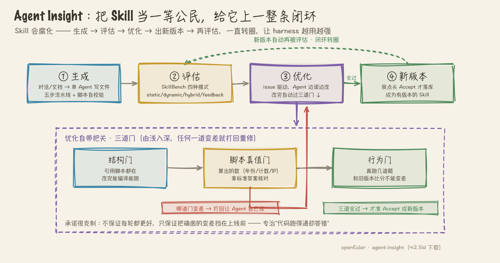

# 如何评价当前 AI Agent 落地效果普遍不佳的问题？

> 平台：知乎回答 | 状态：**已发布**（2026-08-08）
> 发布地址：https://www.zhihu.com/question/13476251758/answer/2036579853189764616
> 差异化角度：一片"唱衰/病因诊断"里，给出「建设性 + 生产实证」的视角——落地不佳不是
> 模型不行、不是 Agent 是伪概念，而是大多数人只做了"模型层"、没做"工程层(harness)"。

---

落地不佳，这判断没错，我不洗。但底下不少高赞把锅甩给"Agent 是伪概念""大模型先天不行"，这我不同意。

我这两年一直在把 Agent 往真实生产里推：openEuler 上的操作系统故障诊断（witty-diagnosis-agent，社区官方，下载约 1W）、给 Agent 能力做全生命周期管理的平台（agent-insight，约 2.5W 下载）。踩了两年坑，我的判断很简单：

**大多数 Agent 落地不佳，不是模型不行，是只做了"模型层"，没做"工程层"。**

有个高赞说 Agent 是"缺啥给装啥"的缝合怪。我一半同意——只在模型外面挂点工具、加点记忆，确实撑不起生产。但问题不在"缝"，在缝得太浅。真正能落地的那层工程，业界现在叫它 harness：不是给模型打补丁，而是把概率性的模型，裹成一个能交付的系统。

落地翻车，基本翻在下面两个地方，都是我真踩过的。

## 一、翻在"时间"上

很多 Agent 的落地印象是被 demo 骗的：演示里跑得漂亮，一上真实长流程就散架。

一个数字：超过 4-8 小时的 AI 任务，失败率过半，挂了还得从头再来。原因不玄——单步再准，几百上千步累下来，"总有一步会崩"几乎是必然。demo 只有三五步，你看不到这层。

这不是模型的错，是没人给它做"可恢复"。我们在多 Agent 流水线里做断点恢复：每阶段状态存快照，挂了从最近断点接着跑，产物固化成文件直接喂给下一阶段。就这一层工程，长任务的存活率立刻不一样。

第一个真相：不是 Agent 走不远，是没人给它修一条摔倒能爬起来的路。

## 二、翻在"腐化"上

有个回答标题很扎心——"客户花 50 万搞了个 AI Agent，上线一周就关了"。这种我见太多：上线那天效果最好，然后一天天变差，最后变摆设。

因为 **Agent 的能力本身会腐化**。它靠一个个 Skill 干活，可模型在换、场景在变、需求在漂，昨天好用的今天就悄悄失效。没人持续盯着、评着、改着，系统会自然变钝。

所以我做了 agent-insight，把 Skill 当成要长期养的资产：生成、评估、优化、出新版本、再评估，转圈。两个关键——评估不能只看"跑没跑通"（生产里最坑的是"跑完了但结果是错的"），优化改完必须自动过几道关，比旧版本差就打回重修，全过了才准上线。

第二个真相：很多系统不是没做出来，是做出来没人养——而 Agent 是"不养就死"的东西。

## 所以该怪谁

结论不性感：这大概率不是模型的死刑，也不是概念的破产，而是大部分团队只做完了一半——接进模型、挂上工具就上线，缺了后面那半工程。

那半工程全是脏活：划边界、做验证、存快照、搭评测、防腐化。不炫，但它决定了一个 Agent 是能上生产，还是只能上 demo。

我不是说 Agent 现在已经很行了。我是说，骂它不行之前，先看一眼：你是给它做了一套工程，还是只给它套了个壳。这俩的落地效果，差得不是一点。

---

文中项目都是 openEuler 社区开源：

- witty-diagnosis-agent（生产级智能诊断）：https://atomgit.com/openeuler/witty-diagnosis-agent
- agent-insight（Agent/Skill 全生命周期观测·评测·优化）：https://atomgit.com/openeuler/agent-insight
- AET（全流程 AI 辅助研发底座）：https://atomgit.com/openeuler/agentic-engineering-team
