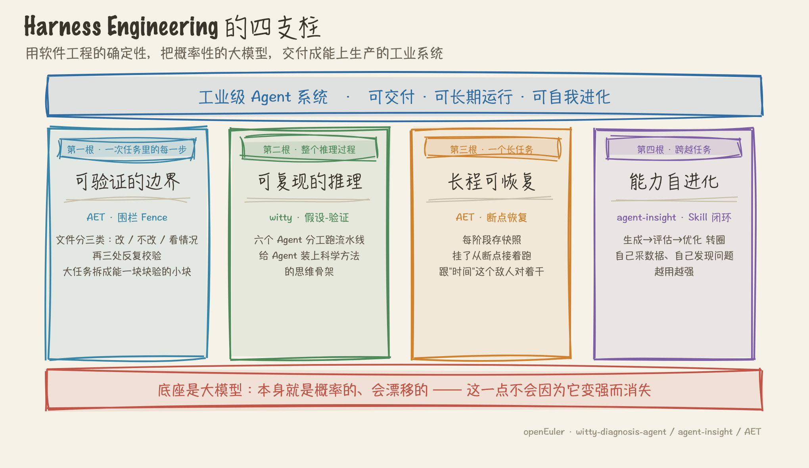
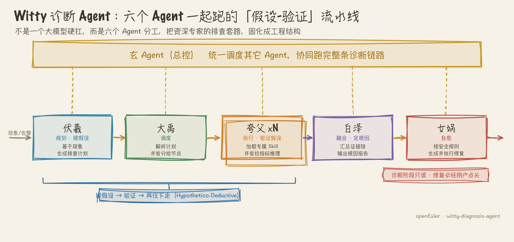

# Harness Engineering 的本质是什么？

> 平台：知乎回答 | 状态：**已发布**（2026-08-08）
> 发布地址：https://www.zhihu.com/question/2016648624256340425/answer/2037953527507629953
> 差异化角度：生产级 Multi-Agent 系统里的 Harness（现有高赞答案全在 AI 编程语境）

---

这个问题下的高赞回答，大多是从 AI 编程的角度谈的：模型会犯错，所以在外面套一层软件工程的壳子去约束它、纠正它。这个说法没错，但我想补一个大家还没怎么讲的视角。

我这两年的主业不是拿 Agent 写代码，而是让 Agent 去干几件更"要命"的活：让 Agent 做 openEuler 上的操作系统故障诊断（witty-diagnosis-agent，社区官方项目，累计下载约 1W），出问题的是别人生产环境的内核、硬件、服务；给 Agent 的能力做全生命周期管理（agent-insight，我下载量最大的项目，约 2.5W）；以及让一支 Agent 团队跑完从需求到发布的完整研发流程（AET）。这几个场景有个共同点——**错误的代价是真实的，而且回路里没有一个人类随时纠偏**。

正是在这种场景里，我对 Harness 的本质有了一个和"套壳纠错"不太一样的理解：

**Harness Engineering 的本质，是把一个概率系统，改造成一个可交付的工业系统。**

模型永远是概率性的、会漂移的，这一点不会因为它变强就消失。你要的不是一个"更聪明的模型"，而是一套让不确定的东西产出确定结果的工程装置。这件事在写代码时还能靠人肉 review 兜底，但在生产级 Multi-Agent 系统里，兜底的人不在了，Harness 就成了系统能不能上生产的唯一分界线。

这四根支柱，是按"管的范围"从小到大排的：第一根管一次任务里的每一步做得对不对，第二根管整个推理过程走得对不对，第三根管一个长任务能不能从头撑到尾，第四根管这整套能力会不会随时间退化。下面我拿自己踩过的坑一根一根讲。

## 一、边界与验证：不是限制 Agent，是给它划出"可验证"的作业面

很多人把 harness 理解成"给模型加约束"，我觉得这话说反了。约束只是手段，真正要的是让每一步都能被验证。

我在 AET 里做过一个叫"围栏（Fence）"的机制。Agent 一上来写代码，最容易出的事不是写错逻辑，而是"手伸太长"——你让它改 A 模块，它顺手把 B 模块的依赖也动了，整个跑起来才发现崩了，而且不知道崩在哪。所以我们在开发计划生成的第一步，就把所有文件强制分成三类：允许改、禁止改、条件改。然后在三个点反复校验：生成计划时、写代码时、提 PR 前。

这背后的思路，就是把一个大任务拆成一堆刚性的、能各自验证的小块（有的框架叫 AC，接受标准）。每一块都有明确的边界和判据，Agent 做完一块就能验一块，错了当场暴露在那一块里，而不是攒到最后一起爆。

Harness 的第一层，是"可验证性"这个词，不是"约束"这个词。

## 二、假设-验证：给 Agent 一套可复现的推理骨架

第二根支柱，是我做故障诊断时体会最深的。

诊断这活儿，最怕 Agent "一条路走到黑"——抓到一个现象就咬死一个结论，或者反过来，漫无目的地把所有命令跑一遍。人类专家不是这么排查的。资深 SRE 的做法是：看现象→提假设→设计验证→证伪或坐实→再往下走。这套东西在科学哲学里有个名字，叫"假设-验证"（Hypothetico-Deductive）。

witty-diagnosis-agent 整个就是围着这套范式搭的。它不是一个大模型硬扛，而是六个 Agent 分工跑一条流水线：一个总控调度，一个基于现象生成结构化排查计划，一个把计划拆开并发调度，一批执行节点各自加载专属技能去拉指标、做推理，最后一个把所有证据链汇总成根因报告。整条链是"提假设→并发验证→汇总证据"的形状。

所以 harness 干的事，比"约束模型别犯错"要多一层：它是在给 Agent 装一套它自己没有的思维骨架。模型有推理能力，但没有方法论。方法论得你用 harness 喂给它——哪一步该干什么、上一步的结论怎么传给下一步、什么时候该停下来回头，这些靠 prompt 是稳不住的，只能靠工程结构固定下来。

## 三、长程可恢复：让系统扛得住"时间"

前两根支柱管"一次任务做对"，但真实任务是有长度的，而时间是 Agent 的敌人。

有个数字我印象很深：超过 4-8 小时的 AI 研发任务，失败率超过 50%，而且一旦挂了，重试基本得从头来，算力全白烧。这在 demo 里看不出来，一到真实的长任务就是致命的——因为单步再稳，几百上千步累积下来，"总有一步会崩"几乎是必然事件。

我们在 AET 里做断点恢复（Checkpoint）来对冲这件事：每个阶段的完整状态都存快照，挂了从最近的断点接着跑，不用回到起点。配合前面说的四层架构（命令→编排 Skill→Agent→原子 Skill），每一阶段的产物（设计文档、开发计划、验证报告）都以 Markdown 固化下来，直接当作下一阶段的输入。

这一层 harness 本质是在对抗时间：任务越长，出错概率越逼近 100%，没有恢复机制的系统根本活不到终点。

## 四、能力的自我进化：让 harness 自己越用越强

到这里还差最后一层，也是我认为最容易被忽略、但决定 harness 生死的一层——**harness 里那些"能力"本身，会腐化。**

Agent 干活靠的是一个个 Skill（能力单元）。但 Skill 不是写完就一劳永逸：模型换了、场景变了、需求漂了，它就慢慢失效。你要是没有一套机制持续盯着它、评它、改它，harness 会一天天变钝。所以我专门做了 agent-insight（这也是我下载量最大的项目，约 2.5W，多少说明大家是真被这问题扎到了），把 Skill 当成一等公民对待，给它上一整条全生命周期的闭环：生成、评估、优化、出新版本，然后新版本再回去被评估，一直转圈。

这条闭环里有两件事，是我踩了坑才想明白该怎么做的。

第一件，评估不能只看"跑没跑通"。我在配套的 SkillBench 里做了四种评测模式（static / dynamic / hybrid / feedback），拿真实任务去跑，采集 token、成本、耗时、成功率，把优化前后的版本放一起打分对比。较真到这个程度，是因为"代码跑得通"和"答得对"根本是两码事——生产里最坑的事故，往往就是脚本顺顺当当跑完了，结果是错的，还没人发现。

第二件，优化不能改完就算数，得自带把关。优化 Agent 改完 Skill，会自动过三道门：结构门（引用的脚本都在、能编译）、脚本真值门（算出来的数拿标准答案核对）、行为门（拿几道题真跑一遍，和旧版本比分）。任何一道发现变差，就打回让它自己修（repair），三道全过了才轮到我拍板确认成新版本。这条闭环我给的承诺很克制：它不保证每轮都更好，只保证把确凿的变差挡在上线之前。

到这一层，harness 就不再是包在模型外面的一层死壳子了，它会自己采数据、自己发现问题、自己迭代——跑得越多，越知道什么有效。这就是我说的数据飞轮。

## 所以，回到那个问题

如果一定要我用一句话概括 Harness Engineering 的本质：

**它是用软件工程的确定性，去驯服大模型的不确定性，最终把一个概率系统交付成一个可上生产、可长期运行、还能自我进化的工业系统。**

"套壳纠错"是它最表层的样子。往下四层，是可验证的作业边界、可复现的推理骨架、扛得住时间的长程恢复、以及会自我进化的能力资产。在 AI 编程里，你可能只需要第一层就够用了，因为有人兜底。但当你真的要把 Agent 放进生产环境、让它独立干活、还得对结果负责的时候，你会发现这四层一个都不能少。

这也是我认为 Harness Engineering 不是过渡形态、不会随模型变强而消失的原因——模型再强，也改变不了"它是概率的"这个前提，而工业生产要的是确定性。这中间的鸿沟，就是 harness 存在的地方。

---

文中三个项目都是 openEuler 社区开源，感兴趣可以去翻源码、提 issue，也欢迎在评论区聊：

- witty-diagnosis-agent（智能诊断，假设-验证 + 六 Agent 协同）：https://atomgit.com/openeuler/witty-diagnosis-agent
- agent-insight（Agent/Skill 全生命周期观测·评测·优化）：https://atomgit.com/openeuler/agent-insight
- AET / agentic-engineering-team（全流程 AI 辅助研发底座）：https://atomgit.com/openeuler/agentic-engineering-team
