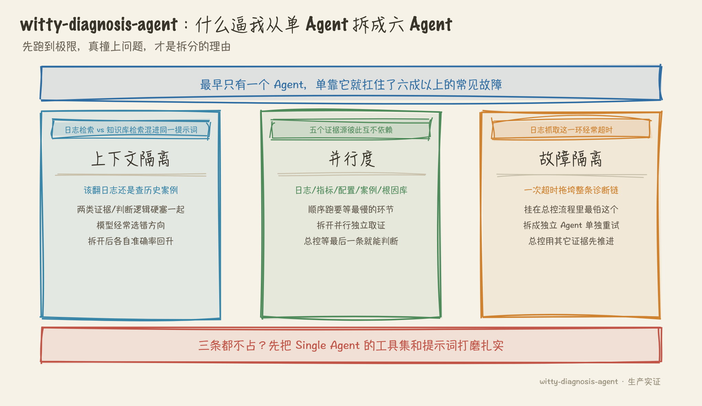

# 标题占位

> 平台：知乎回答 | 状态：**已发布**
> 发布地址：https://www.zhihu.com/question/2030332404074858123

---

---
status: awaiting_confirmation
question_id: 2030332404074858123
word_count: 1630
humanizer: passed
generated_at: 2026-08-15T06:37:03Z
---

# Multi-Agent 是否真的必要，Single-Agent 做好后能否覆盖绝大多数场景？

> qid: 2030332404074858123
> slug: 2026-08-14-multi-agent-necessity

---

先说结论：大部分场景里，一个把工具调用和上下文管理做扎实的 Single Agent，能覆盖的范围比大家想象的大得多。我在生产里两套系统都跑过（witty-diagnosis-agent 故障诊断、AET 全流程研发底座），真正需要拆成 Multi-Agent 的场景，其实是可以列清楚的。

---

## Single Agent 先跑到极限，是更划算的第一步

witty-diagnosis-agent 最早就是单 Agent：一个"假设-验证"循环，拿到故障现象后自己列可能原因、自己选诊断工具、自己判断要不要继续深挖。这一版扛住了生产环境里六成以上的常见故障类型，没有拆过一次 Agent。

单 Agent 能扛住，是因为它避免了 Multi-Agent 真正的成本：**通信开销**。两个 Agent 协作，中间隔着一层自然语言或结构化消息的翻译，信息会丢、会失真，还要处理谁先谁后的时序问题。这些成本在任务边界清晰、上下文能装进一个窗口时，纯粹是浪费。

判断要不要拆，我现在只看一条：单个 Agent 的 system prompt 和工具集是不是已经开始互相打架。故障诊断和知识库检索用同一套工具描述，模型经常选错；这时候拆，不是因为"任务复杂"，是因为职责边界模糊到模型自己分不清。

## witty-diagnosis-agent 是怎么从单 Agent 变成六 Agent 的

它现在的结构是一个总控加五个专职验证 Agent（伏羲、大禹、夸父、白泽、女娲），各自负责一类诊断工具。但最早只有一个 Agent，逼我拆开的是三件具体的事，不是抽象的"任务变复杂了"。

**上下文隔离**：日志检索和知识库检索这两类工具混进同一个 system prompt 之后，模型开始在"该去翻日志"还是"该去查历史案例"之间选错——两边要装的证据和判断逻辑完全不同，硬塞进一份提示词里，模型两头都做不利索。拆成两个 Agent 后，各自的上下文只装自己那类证据，工具描述不用再互相迁就，选错的情况明显少了。

**并行度**：五个验证 Agent 本来就是从不同证据源独立取证——日志、指标、配置、历史案例、根因库，彼此互不依赖。单 Agent 顺序跑一遍要等最慢的那个环节，拆开并行后，总控只要等最后一条证据回来就能综合判断，端到端时间明显缩短。

**故障隔离**：日志检索这个环节经常超时。挂在总控流程里，一次超时能拖垮整条诊断链；拆成独立 Agent 之后，超时只影响它自己，总控可以先用其它证据继续推进，不用干等它。

这三件事合起来才是我实际的拆分标准：不是看任务"复杂"不复杂，而是看某个职责是不是已经在拖累其它职责的准确率、能不能真的并行取证、或者某个环节的失败模式会不会顺着链条往上传染。三条都不占，先把 Single Agent 的工具集和提示词打磨扎实，比急着拆划算。

## 拆完之后，别忘了这笔账

Multi-Agent 系统的运维成本经常被低估。拆开之后才会发现，得专门给 Agent 间通信加 Trace、加超时熔断、加降级到单 Agent 模式的兜底——这些在单 Agent 阶段完全不需要考虑。

所以我现在给团队的建议是：先把 Single Agent 的工具集和 Prompt 打磨到位，真撞上上下文隔离、并行度、故障隔离这三堵墙里的一堵，再拆不迟。

---

**延伸阅读**

- tech-blog《Agent综述》03-基于大型语言模型的多Agent：进展与挑战综述
- tech-blog《Agent实践》05-构建多Agent系统的8个最佳实践